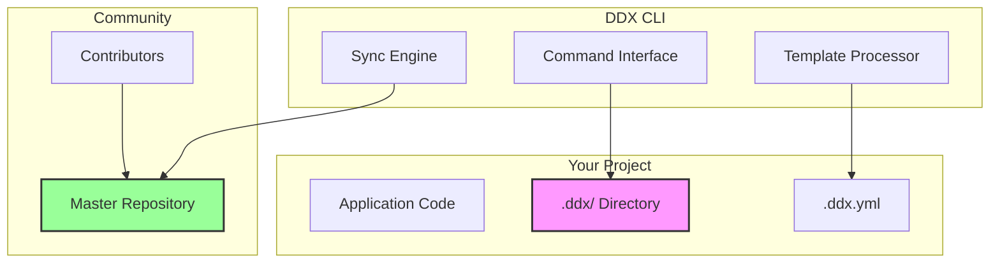

# DDX - Document-Driven Development eXperience

> The knowledge management toolkit that solves lost knowledge, enables rapid iteration, and ensures reproducibility in AI-assisted development

## The Problem

Every development team faces the same critical challenges:

- **Lost Knowledge**: 73% of developers lose valuable prompts, patterns, and configurations when switching between projects
- **Duplicated Effort**: Teams spend 15-20 hours monthly recreating solutions that already exist elsewhere
- **Inconsistent Practices**: No standardization leads to varying code quality and unpredictable AI outputs across teams
- **Version Chaos**: No systematic tracking of which prompts, templates, or patterns actually work
- **Knowledge Silos**: Individual expertise remains trapped in local repositories with less than 5% of useful patterns ever shared

The cost compounds daily - every moment without a solution means more lost knowledge, more duplicated effort, and more missed opportunities to leverage collective intelligence.

## What is DDX?

DDX (Document-Driven Development eXperience) is a CLI toolkit that revolutionizes how developers manage, share, and reuse development assets. Think of it as npm for your development knowledge - prompts, templates, patterns, and workflows - all version-controlled, shareable, and continuously improving.

### Core Capabilities

- **📚 Asset Management**: Organize and version control prompts, templates, patterns, and configurations
- **🔄 Git-Native Sync**: Built on git subtree for reliable bidirectional synchronization
- **🚀 Zero Friction**: Single binary, no dependencies, works everywhere
- **🤖 AI Integration**: First-class support for AI prompts, personas, and MCP servers
- **🔍 Project Intelligence**: Analyze and improve your development setup automatically
- **👥 Community Driven**: Share improvements that benefit everyone

## Quick Start

**One-line installation:**
```bash
curl -fsSL https://raw.githubusercontent.com/easel/ddx/main/install.sh | bash
```

**Initialize in your project:**
```bash
cd your-project
ddx init
```

**Discover what's available:**
```bash
ddx list              # See all available resources
ddx doctor            # Check installation and diagnose issues
ddx prompts list      # Browse AI prompts
ddx templates list    # View project templates
```

**Apply resources:**
```bash
ddx templates apply nextjs          # Apply a Next.js template
ddx prompts show code-review         # View a code review prompt
ddx patterns apply error-handling    # Add error handling patterns
```

## How DDX Works

### 1. Local-First Architecture

DDX stores all assets in a `.ddx/` directory within your project, keeping your development knowledge close to your code while maintaining clean separation:

```
your-project/
├── .ddx/
│   ├── prompts/        # AI prompts and instructions
│   ├── templates/      # Project and file templates
│   ├── patterns/       # Reusable code patterns
│   └── configs/        # Tool configurations
├── src/                # Your application code
└── .ddx.yml           # DDX configuration
```

### 2. Git-Based Synchronization

DDX leverages git's proven capabilities for version control and collaboration:

```bash
ddx update        # Pull latest improvements from the community
ddx contribute    # Share your improvements back
```

Every change is tracked, versioned, and attributable. No magic, just git.

### 3. Variable Substitution

Templates and patterns adapt to your project through smart variable substitution:

```yaml
# .ddx.yml
variables:
  project_name: "my-app"
  database: "postgresql"
  auth_provider: "auth0"
```

### 4. Progressive Enhancement

Start simple, grow as needed:
- Begin with just prompts for AI assistance
- Add templates as you standardize practices
- Introduce patterns for common solutions
- Adopt complete workflows when ready

## Core Commands

DDX uses an intuitive noun-verb structure for clear, discoverable commands:

### Foundation Commands
| Command | Description |
|---------|-------------|
| `ddx init` | Initialize DDX in your project |
| `ddx doctor` | Check installation health and diagnose issues |
| `ddx update` | Pull latest improvements from master repository |
| `ddx contribute` | Share your improvements back to community |

### Resource Commands
| Command | Description |
|---------|-------------|
| **Prompts** | AI assistance instructions |
| `ddx prompts list` | List available prompts |
| `ddx prompts show <name>` | Display prompt content |
| `ddx prompts apply <name>` | Copy prompt to project |
| **Templates** | Project boilerplates |
| `ddx templates list` | List available templates |
| `ddx templates apply <name>` | Apply template to project |
| **Patterns** | Code solutions |
| `ddx patterns list` | List available patterns |
| `ddx patterns apply <name>` | Apply pattern to project |
| **Personas** | AI personality definitions |
| `ddx persona list` | List available personas |
| `ddx persona bind <role> <name>` | Assign persona to role |
| `ddx persona load` | Load personas into CLAUDE.md |
| **MCP Servers** | Model Context Protocol servers |
| `ddx mcp list` | List available MCP servers |
| `ddx mcp install <name>` | Install MCP server locally |
| **Workflows** | Complete methodologies |
| `ddx workflows list` | List available workflows |
| `ddx workflows apply <name>` | Initialize workflow in project |

## The Power of Shared Knowledge

### Individual Benefits
- **Never Lose Work**: Your best prompts and patterns travel with you
- **Start Faster**: New projects begin with accumulated knowledge
- **Learn from Others**: Access community-proven solutions
- **Consistency**: Same high-quality patterns across all projects

### Team Benefits
- **Standardization**: Entire team uses same practices
- **Onboarding**: New members productive immediately
- **Quality Control**: Validated patterns prevent common mistakes
- **Knowledge Transfer**: Expertise spreads naturally

### Community Benefits
- **Collective Intelligence**: Every improvement helps everyone
- **Battle-Tested Solutions**: Popular patterns proven across projects
- **Rapid Evolution**: Best practices emerge and spread quickly
- **Open Innovation**: Anyone can contribute improvements

## Real-World Use Cases

### 1. AI Prompt Management
Store, version, and share your AI prompts:
```bash
# Browse available prompts
ddx prompts list

# Use a specific prompt
ddx prompts show testing/unit-test-generator

# Share an improved prompt
ddx contribute
```

### 2. Project Standardization
Ensure consistent setup across projects:
```bash
# Initialize with a template
ddx init --template nextjs-enterprise

# Apply your team's standards
ddx patterns apply team-standards
```

### 3. Knowledge Preservation
Capture and reuse solutions:
```bash
# Document a solution as a pattern
ddx patterns create auth-flow

# Apply it in another project
ddx patterns apply auth-flow
```

### 4. Tool Configuration
Share and maintain tool configs:
```bash
# Apply ESLint configuration
ddx configs apply eslint-strict

# Use team's prettier settings
ddx configs apply prettier-team
```

## Advanced Features

### Persona System

DDX includes a sophisticated persona system for consistent AI interactions:

```yaml
# .ddx.yml
personas:
  bindings:
    code-reviewer: strict-code-reviewer
    architect: systems-thinker
    tester: test-driven-developer
```

Personas ensure AI assistants maintain consistent behavior across your team, providing predictable, high-quality interactions.

### MCP Server Management

DDX manages Model Context Protocol servers as project-local dependencies:

```bash
# Install an MCP server
ddx mcp install filesystem

# Automatically configures in .claude/settings.json
# Server runs from local node_modules
```

This ensures reproducible AI tool configurations across your team.

### Project Diagnosis

DDX can check your installation and analyze your project:

```bash
ddx doctor

# Output:
✓ DDx Binary Executable
✓ PATH Configuration
✓ Configuration Valid
✓ Git Available
⚠ Network Issues (optional)
⚠ No CI/CD configuration found
  → Consider: ddx templates apply github-actions
✓ TypeScript configured
```

## Workflows: Structured Methodologies

While DDX excels at managing individual assets, it also supports complete development workflows - comprehensive methodologies that orchestrate multiple assets and practices.

### HELIX Workflow

One powerful workflow available through DDX is **HELIX** - a six-phase engineering methodology that brings decades of software engineering principles to AI-assisted development:

```bash
# Initialize HELIX in your project
ddx workflows apply helix
```

HELIX enforces quality through:
- **Test-Driven Development**: Tests written before implementation
- **Phase Gates**: Can't skip ahead or proceed without validation
- **Human-AI Optimization**: Clear responsibilities for both human and AI
- **Built-in Security**: DevSecOps practices integrated throughout
- **Systematic Progress**: Each phase builds on validated previous work

The six phases ensure forward momentum:
1. **Frame** - Define what to build and why
2. **Design** - Architect how to build it
3. **Test** - Write failing tests (Red phase)
4. **Build** - Implement to pass tests (Green phase)
5. **Deploy** - Release with monitoring
6. **Iterate** - Learn and improve

[Learn more about HELIX →](workflows/helix/README.md)

### Custom Workflows

Organizations can create and distribute their own workflows through DDX:

```bash
# Apply your organization's workflow
ddx workflows apply company-sdlc

# Share workflow improvements
ddx contribute --workflow
```

## Architecture & Design

### Design Principles

1. **Simple**: Single binary, no runtime dependencies
2. **Reliable**: Built on proven git technology
3. **Flexible**: Works with any language, framework, or tool
4. **Respectful**: Never modifies your code without permission
5. **Portable**: Runs on Mac, Linux, and Windows

### Technical Architecture



### Security Model

- **Local Execution**: All processing happens on your machine
- **No Telemetry**: Zero data collection or phone-home
- **Git Security**: Leverages git's proven security model
- **Explicit Actions**: Never modifies code without your command

## Success Metrics

Projects using DDX report:
- **80% reduction** in time spent recreating solutions
- **60% faster** onboarding for new team members
- **90% consistency** in code patterns across projects
- **50% reduction** in pull request review cycles

## Installation Options

### Quick Install (Recommended)
```bash
curl -fsSL https://raw.githubusercontent.com/easel/ddx/main/install.sh | bash
```

### Package Managers
```bash
# Homebrew (macOS/Linux)
brew install ddx

# Go install
go install github.com/easel/ddx/cli@latest

# From source
git clone https://github.com/easel/ddx
cd ddx/cli
make install
```

### System Requirements
- Git 2.0 or higher
- git-subtree (for sync features)
  - **Fedora/RHEL**: `sudo dnf install git-subtree`
  - **Ubuntu/Debian**: Usually included with git
  - **macOS (Homebrew)**: Included with `brew install git`
  - **Windows**: Included with Git for Windows
- 50MB disk space
- Any OS: macOS, Linux, Windows

## Configuration

DDX uses a simple YAML configuration file (`.ddx.yml`):

```yaml
# .ddx.yml
version: "1.0"
repository: https://github.com/easel/ddx
branch: main

# Resources to include
resources:
  prompts:
    - "code-review"
    - "testing/*"
  templates:
    - "nextjs"
  patterns:
    - "error-handling"

# Project variables
variables:
  project_name: "${PROJECT_NAME:-my-app}"
  author: "${GIT_AUTHOR_NAME}"

# Workflow configuration (optional)
workflow:
  type: "helix"
  phase: "build"
```

## Community & Contributing

DDX thrives on community contributions. Every improvement benefits everyone.

### Contributing

Share your improvements:
```bash
# After improving a prompt or pattern
ddx contribute
```

This creates a pull request to the master repository where it can benefit the entire community.

### Getting Help

- **Documentation**: [docs.ddx.dev](https://docs.ddx.dev)
- **Issues**: [GitHub Issues](https://github.com/easel/ddx/issues)
- **Discussions**: [GitHub Discussions](https://github.com/easel/ddx/discussions)
- **Discord**: [Join our Discord](https://discord.gg/ddx)

### Philosophy

DDX embodies the belief that development knowledge should be:
- **Shareable**: Easy to distribute and reuse
- **Versionable**: Track what works and what doesn't
- **Discoverable**: Find solutions quickly
- **Improvable**: Continuously evolving with community input

## Comparison with Other Tools

| Aspect | DDX | Snippet Managers | Boilerplates | Package Managers |
|--------|-----|------------------|--------------|------------------|
| **Scope** | Complete knowledge management | Code snippets only | Project templates | Code libraries |
| **Versioning** | Git-native | Limited/None | One-time copy | Semantic versioning |
| **Sharing** | Bidirectional sync | Copy/paste | Clone once | Publish/consume |
| **AI Support** | First-class | None | None | None |
| **Updates** | Continuous | Manual | None | One-way |
| **Workflows** | Full methodology support | None | None | None |

## Roadmap

### Current Focus
- ✅ Core CLI functionality
- ✅ Git-based synchronization
- ✅ Template and pattern system
- ✅ AI persona support
- ✅ MCP server management
- 🚧 Workflow orchestration
- 🚧 Team collaboration features

### Future Vision
- [ ] Web-based asset browser
- [ ] IDE integrations
- [ ] Private team repositories
- [ ] Analytics and insights
- [ ] AI-powered recommendations
- [ ] Automated quality validation

## License

DDX is open source software licensed under the MIT License. See [LICENSE](LICENSE) for details.

## Acknowledgments

DDX stands on the shoulders of giants, building upon decades of software engineering wisdom and the collective experience of the development community.

Special thanks to all contributors who share their knowledge and help make development better for everyone.

---

**Ready to revolutionize your development workflow?**

```bash
curl -fsSL https://raw.githubusercontent.com/easel/ddx/main/install.sh | bash
```

*Join thousands of developers who never lose their best work again.*