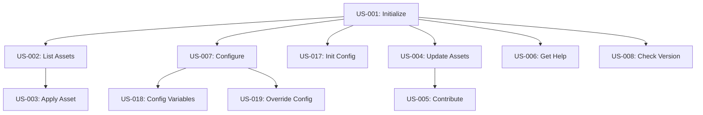

# User Stories for FEAT-001 - Core CLI Framework

**Feature**: FEAT-001
**Document Type**: User Stories Collection
**Status**: Draft
**Created**: 2025-01-14
**Updated**: 2025-01-14

## Story Format
Each story follows the format:
- **As a** [type of user]
- **I want** [goal/desire]
- **So that** [benefit/value]

## Primary User Stories

### Epic: Basic CLI Operations
*Core command-line functionality for DDX interaction*

#### Stories in this Epic:
1. **US-001**: Initialize DDX in Project - Enable DDX in existing projects
2. **US-002**: List Available Assets - Discover what assets are available
3. **US-003**: Apply Asset to Project - Incorporate assets into current project
4. **US-006**: Get Command Help - Access documentation and examples
7. **US-008**: Check DDX Version - Verify installed version and updates

#### Epic-Level Acceptance Criteria:
- [ ] End-to-end workflow from initialization to asset application working
- [ ] All commands provide consistent user experience and feedback
- [ ] Help system enables self-service problem resolution

### Epic: Configuration Management
*Settings and preferences management for DDX*

#### Stories in this Epic:
1. **US-007**: Configure DDX Settings - Manage user preferences and options
2. **US-017**: Initialize Configuration - Set up initial project configuration
3. **US-018**: Configure Variables - Set template and pattern variables
4. **US-019**: Override Configuration - Handle environment-specific settings
5. **US-022**: Validate Configuration - Ensure configuration integrity
6. **US-023**: Export Import Configuration - Share configurations across projects
7. **US-024**: View Effective Configuration - Understand current settings

#### Epic-Level Acceptance Criteria:
- [ ] Hierarchical configuration working (global, project, environment)
- [ ] Configuration validation prevents invalid states
- [ ] Configuration portability enables team collaboration

### Epic: Repository Integration
*Connection and synchronization with master DDX repository*

#### Stories in this Epic:
1. **US-004**: Update Assets from Master - Keep local assets current
2. **US-005**: Contribute Improvements - Share enhancements back to community
3. **US-009**: Pull Updates from Upstream - Synchronize with latest changes
4. **US-011**: Contribute Changes Upstream - Submit improvements to master
5. **US-014**: Initialize Synchronization - Set up connection to master repo

#### Epic-Level Acceptance Criteria:
- [ ] Bidirectional synchronization with master repository working
- [ ] Conflict resolution for updates and contributions
- [ ] Version tracking and rollback capabilities

## User Personas

### Persona 1: New DDX User
- **Role**: Developer new to DDX ecosystem
- **Goals**: Quickly get started with DDX, understand available assets
- **Pain Points**: Complex setup, unclear documentation, too many options
- **Technical Level**: Comfortable with CLI tools but new to DDX

### Persona 2: Experienced DDX User
- **Role**: Developer familiar with DDX workflows
- **Goals**: Efficiently manage multiple projects, contribute back improvements
- **Pain Points**: Repetitive configuration, slow operations, conflicts during updates
- **Technical Level**: Expert CLI user, understands DDX patterns and concepts

### Persona 3: Team Lead
- **Role**: Development team leader managing DDX adoption
- **Goals**: Standardize team workflows, ensure consistent asset usage
- **Pain Points**: Team members using different configurations, hard to track asset usage
- **Technical Level**: Strong technical background, focused on team productivity

## Story Prioritization

### Must Have (P0)
- [ ] US-001: Initialize DDX in Project - Required for any DDX usage
- [ ] US-002: List Available Assets - Essential for asset discovery
- [ ] US-003: Apply Asset to Project - Core value proposition
- [ ] US-006: Get Command Help - Critical for user adoption
- [ ] US-008: Check DDX Version - Required for support and troubleshooting

### Should Have (P1)
- [ ] US-007: Configure DDX Settings - Important for customization
- [ ] US-004: Update Assets from Master - Keeps assets current
- [ ] US-005: Contribute Improvements - Community growth
- [ ] US-017: Initialize Configuration - Project setup automation

### Nice to Have (P2)
- [ ] US-018: Configure Variables - Advanced customization
- [ ] US-019: Override Configuration - Environment flexibility
- [ ] US-022: Validate Configuration - Error prevention
- [ ] US-023: Export Import Configuration - Team collaboration
- [ ] US-024: View Effective Configuration - Debugging aid

## Story Dependencies

## Feature Traceability

### Parent Feature
- **Feature Specification**: `docs/01-frame/features/FEAT-001-core-cli-framework.md`

### Related Design Artifacts
- **Contracts**: [To be created for CLI command interfaces]
- **Test Suites**: `tests/FEAT-001/acceptance/`

### Individual Story Files
- **US-001**: `docs/01-frame/user-stories/US-001-initialize-ddx-in-project.md`
- **US-002**: `docs/01-frame/user-stories/US-002-list-available-assets.md`
- **US-003**: `docs/01-frame/user-stories/US-003-apply-asset-to-project.md`
- **US-004**: `docs/01-frame/user-stories/US-004-update-assets-from-master.md`
- **US-005**: `docs/01-frame/user-stories/US-005-contribute-improvements.md`
- **US-006**: `docs/01-frame/user-stories/US-006-get-command-help.md`
- **US-007**: `docs/01-frame/user-stories/US-007-configure-ddx-settings.md`
- **US-008**: `docs/01-frame/user-stories/US-008-check-ddx-version.md`
- **US-017**: `docs/01-frame/user-stories/US-017-initialize-configuration.md`
- **US-018**: `docs/01-frame/user-stories/US-018-configure-variables.md`
- **US-019**: `docs/01-frame/user-stories/US-019-override-configuration.md`
- **US-022**: `docs/01-frame/user-stories/US-022-validate-configuration.md`
- **US-023**: `docs/01-frame/user-stories/US-023-export-import-configuration.md`
- **US-024**: `docs/01-frame/user-stories/US-024-view-effective-configuration.md`

### Story Naming Convention
- Format: `US-[3-digit-number]`
- Example: `US-001`, `US-002`
- Stories are numbered sequentially across the project
- Each story ID is unique and permanent

---
*Note: This collection organizes user stories for FEAT-001 by epics and priorities.*
*Individual story files contain detailed acceptance criteria and validation scenarios.*