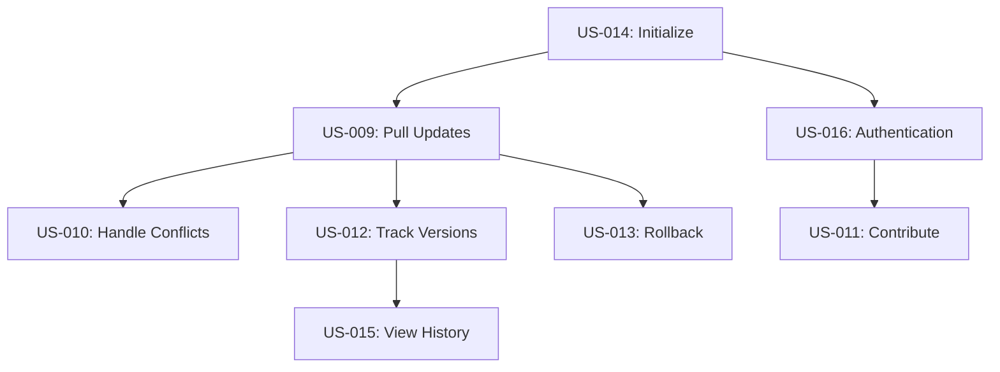

# User Stories Collection for FEAT-002 - Upstream Synchronization System

**Feature**: FEAT-002
**Document Type**: User Stories Collection
**Status**: Draft
**Created**: 2025-01-14
**Updated**: 2025-01-14

## Overview

This document collects and organizes all user stories related to the Upstream Synchronization System (FEAT-002). These stories define how users will interact with the synchronization features to pull updates, handle conflicts, contribute changes, and manage their DDX resources.

## Epic: Core Synchronization

The fundamental capability to synchronize resources between local projects and upstream repository.

### Stories in this Epic:
1. **US-009**: Pull Updates from Upstream - Core update mechanism
2. **US-010**: Handle Update Conflicts - Conflict resolution during sync
3. **US-014**: Initialize Synchronization - Setup and configuration

### Epic-Level Acceptance Criteria:
- [ ] Users can reliably pull updates without data loss
- [ ] Conflicts are handled gracefully with clear guidance
- [ ] Synchronization works across all supported platforms
- [ ] Performance remains acceptable as repository grows

## Epic: Contribution Workflow

Enabling users to share their improvements with the community.

### Stories in this Epic:
1. **US-011**: Contribute Changes Upstream - Submit improvements
2. **US-016**: Manage Authentication - Secure access for contributions

### Epic-Level Acceptance Criteria:
- [ ] End-to-end contribution workflow functions smoothly
- [ ] Authentication is secure and user-friendly
- [ ] Contributions meet upstream standards automatically
- [ ] Clear feedback throughout the process

## Epic: Version Management

Tracking and managing the state of synchronized resources.

### Stories in this Epic:
1. **US-012**: Track Asset Versions - Version visibility
2. **US-013**: Rollback Problematic Updates - Recovery mechanism
3. **US-015**: View Change History - Historical context

### Epic-Level Acceptance Criteria:
- [ ] Complete visibility into resource versions
- [ ] Reliable rollback for any problematic updates
- [ ] Full history preserved and accessible
- [ ] Version information aids decision-making

## Story Dependencies

## User Personas

### Persona 1: Individual Developer
- **Role**: Full-stack developer on small team
- **Goals**: Stay current with best practices, share improvements
- **Pain Points**: Manual update process, losing customizations
- **Technical Level**: Intermediate
- **Primary Stories**: US-009, US-010, US-013

### Persona 2: Team Lead
- **Role**: Technical lead managing team standards
- **Goals**: Maintain consistency, enable contributions
- **Pain Points**: Version drift, onboarding complexity
- **Technical Level**: Expert
- **Primary Stories**: US-011, US-012, US-014

### Persona 3: Open Source Contributor
- **Role**: Active community member
- **Goals**: Share improvements, stay synchronized
- **Pain Points**: Complex contribution process
- **Technical Level**: Advanced
- **Primary Stories**: US-011, US-015, US-016

### Persona 4: Enterprise Developer
- **Role**: Developer in regulated environment
- **Goals**: Compliance, security, stability
- **Pain Points**: Security requirements, audit needs
- **Technical Level**: Varies
- **Primary Stories**: US-013, US-016, US-012

## Implementation Phases

### Phase 1: Foundation (P0 Stories)
1. US-014: Initialize Synchronization
2. US-016: Manage Authentication
3. US-009: Pull Updates from Upstream

### Phase 2: Robustness (P0 Stories)
1. US-010: Handle Update Conflicts
2. US-013: Rollback Problematic Updates

### Phase 3: Contribution (P0 Story)
1. US-011: Contribute Changes Upstream

### Phase 4: Visibility (P1 Stories)
1. US-012: Track Asset Versions
2. US-015: View Change History

## Validation Strategy

### Integration Testing
Test complete workflows across stories:
1. **Update Flow**: US-014 → US-009 → US-010
2. **Contribution Flow**: US-016 → US-011
3. **Recovery Flow**: US-009 → US-013
4. **Visibility Flow**: US-012 → US-015

### User Acceptance Testing
1. New user onboarding (US-014, US-009)
2. Conflict resolution scenarios (US-010)
3. Contribution submission (US-011, US-016)
4. Emergency rollback (US-013)

## Success Metrics

### Quantitative Metrics
- Setup time < 2 minutes (US-014)
- Update success rate > 95% (US-009)
- Conflict resolution time < 5 minutes average (US-010)
- Contribution submission < 3 minutes (US-011)
- Rollback execution < 30 seconds (US-013)

### Qualitative Metrics
- User confidence in update process
- Clarity of conflict resolution
- Ease of contribution workflow
- Trust in rollback mechanism

## Risk Analysis

### High-Risk Stories
1. **US-010** (Handle Conflicts): Complex UX, potential data loss
2. **US-013** (Rollback): Must be 100% reliable
3. **US-016** (Authentication): Security critical

### Mitigation Strategies
- Extensive testing of conflict scenarios
- Multiple backup strategies for rollback
- Security review of authentication

## Cross-Feature Dependencies

- **FEAT-001** (Core CLI): All stories depend on CLI framework
- **FEAT-003** (Configuration): US-014 depends on config system
- **FEAT-004** (Installation): Must include sync setup

## Notes

### Design Considerations
- Synchronization approach to be determined in Design phase
- Must support offline workflows
- Consider progressive disclosure for complex features
- Optimize for the common case (clean updates)

### Future Enhancements
- Automated conflict resolution
- Scheduled synchronization
- Sync status dashboard
- Multi-repository synchronization

---
*This collection organizes all user stories for FEAT-002. Individual stories contain detailed acceptance criteria and implementation notes.*