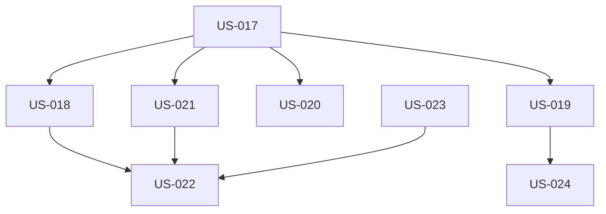

# User Stories for [FEAT-003] - Configuration Management

**Feature**: FEAT-003
**Document Type**: User Stories Collection
**Status**: Draft

## Story Format
Each story follows the format:
- **As a** [type of user]
- **I want** [goal/desire]
- **So that** [benefit/value]

## Primary User Stories

### Story US-017: Initialize Configuration [FEAT-003]
**Story ID**: US-017
**Feature**: FEAT-003
**Priority**: P0

**As a** developer
**I want** to initialize DDX configuration for my project
**So that** I can customize DDX behavior for my specific needs

**Acceptance Criteria:**
- [ ] Given a project without DDX, when I run `ddx init`, then `.ddx.yml` is created with sensible defaults
- [ ] Given initialization process, when prompted, then interactive prompts guide configuration setup
- [ ] Given a project type, when detected, then appropriate configuration is suggested
- [ ] Given configuration values, when entered, then validation occurs during creation
- [ ] Given a new config, when created, then example variable definitions are included
- [ ] Given configuration file, when generated, then available options are documented in comments
- [ ] Given `--template` flag, when provided, then specified template is used for initialization
- [ ] Given existing configuration, when present, then backup is created before overwriting

**Definition of Done:**
- [ ] Feature implemented and code reviewed
- [ ] Tests written and passing (unit, integration)
- [ ] Documentation updated
- [ ] Acceptance criteria verified

---

### Story US-018: Configure Variables [FEAT-003]
**Story ID**: US-018
**Feature**: FEAT-003
**Priority**: P0

**As a** developer
**I want** to define variables for substitution
**So that** I can customize templates for my project without manual editing

**Acceptance Criteria:**
- [ ] Given `.ddx.yml`, when variables defined, then string, number, boolean types are supported
- [ ] Given variable definition, when referencing environment, then environment variables are accessible
- [ ] Given templates, when processed, then variables are substituted using `${VAR_NAME}` syntax
- [ ] Given undefined variables, when referenced, then default values are used
- [ ] Given variable values, when provided, then validation rules are applied
- [ ] Given complex data, when needed, then nested variable structures are supported
- [ ] Given collections, when required, then array and map variables work correctly

**Definition of Done:**
- [ ] Feature implemented and code reviewed
- [ ] Tests written and passing
- [ ] Documentation updated
- [ ] Acceptance criteria verified

---

### Story US-019: Override Configuration [FEAT-003]
**Story ID**: US-019
**Feature**: FEAT-003
**Priority**: P0

**As a** developer
**I want** to override configuration for specific environments
**So that** I can have different settings for dev/staging/prod

**Acceptance Criteria:**
- [ ] Given environment configs, when present, then `.ddx.dev.yml`, `.ddx.staging.yml` are supported
- [ ] Given `DDX_ENV` variable, when set, then appropriate override file is selected
- [ ] Given overrides, when loaded, then they merge correctly with base configuration
- [ ] Given any config value, when overridden, then override takes precedence
- [ ] Given command-line flags, when provided, then they override all file configs
- [ ] Given merged config, when requested, then effective configuration is displayed
- [ ] Given override values, when loaded, then compatibility is validated
- [ ] Given partial configs, when used as overrides, then only specified values are changed

**Definition of Done:**
- [ ] Feature implemented and code reviewed
- [ ] Tests written and passing
- [ ] Documentation updated
- [ ] Acceptance criteria verified

---

### Story US-020: Configure Resource Selection [FEAT-003]
**Story ID**: US-020
**Feature**: FEAT-003
**Priority**: P1

**As a** developer
**I want** to specify which resources to include
**So that** I only get relevant assets for my project

**Acceptance Criteria:**
- [ ] Given configuration, when resources specified, then selection is honored during operations
- [ ] Given patterns, when used, then wildcards work for resource selection
- [ ] Given resources, when configured, then include/exclude rules are applied correctly
- [ ] Given resource types, when organized, then grouping by category is supported
- [ ] Given resource dependencies, when present, then they are automatically included
- [ ] Given resource config, when complete, then preview of selection is available
- [ ] Given resource paths, when specified, then availability is validated
- [ ] Given resources, when listed, then tree view shows structure

**Definition of Done:**
- [ ] Feature implemented and code reviewed
- [ ] Tests written and passing
- [ ] Documentation updated
- [ ] Acceptance criteria verified

---

### Story US-021: Configure Repository Connection [FEAT-003]
**Story ID**: US-021
**Feature**: FEAT-003
**Priority**: P0

**As a** developer
**I want** to configure the master repository connection
**So that** I can sync with the correct source

**Acceptance Criteria:**
- [ ] Given config file, when repository URL specified, then connection uses that URL
- [ ] Given repository config, when branch specified, then that branch is tracked
- [ ] Given sync settings, when configured, then frequency preferences are honored
- [ ] Given authentication needs, when required, then auth method is configurable
- [ ] Given multiple sources, when needed, then multiple remotes are supported
- [ ] Given network restrictions, when present, then proxy configuration works
- [ ] Given protocol preference, when set, then SSH vs HTTPS is respected
- [ ] Given remote naming, when customized, then custom names are used

**Definition of Done:**
- [ ] Feature implemented and code reviewed
- [ ] Tests written and passing
- [ ] Documentation updated
- [ ] Acceptance criteria verified

---

### Story US-022: Validate Configuration [FEAT-003]
**Story ID**: US-022
**Feature**: FEAT-003
**Priority**: P0

**As a** developer
**I want** to validate my configuration
**So that** I catch errors before execution

**Acceptance Criteria:**
- [ ] Given `ddx config validate` command, when run, then configuration is thoroughly checked
- [ ] Given config structure, when validated, then schema compliance is verified
- [ ] Given config values, when checked, then content validation is performed
- [ ] Given variable references, when present, then they are verified to exist
- [ ] Given resource paths, when specified, then they are verified as valid
- [ ] Given repository config, when present, then connectivity is tested
- [ ] Given validation errors, when found, then clear messages are reported
- [ ] Given common issues, when detected, then fix suggestions are provided

**Definition of Done:**
- [ ] Feature implemented and code reviewed
- [ ] Tests written and passing
- [ ] Documentation updated
- [ ] Acceptance criteria verified

---

### Story US-023: Export/Import Configuration [FEAT-003]
**Story ID**: US-023
**Feature**: FEAT-003
**Priority**: P1

**As a** developer
**I want** to share configuration with my team
**So that** we maintain consistency across our development environment

**Acceptance Criteria:**
- [ ] Given `ddx config export`, when run, then shareable configuration is created
- [ ] Given `ddx config import`, when run with file, then external config is loaded
- [ ] Given sensitive values, when exported, then they are properly masked
- [ ] Given imported config, when loaded, then validation is performed
- [ ] Given existing config, when importing, then merge behavior is predictable
- [ ] Given import operation, when initiated, then diff is shown before applying
- [ ] Given export/import, when performed, then various formats are supported
- [ ] Given different versions, when importing, then compatibility is checked

**Definition of Done:**
- [ ] Feature implemented and code reviewed
- [ ] Tests written and passing
- [ ] Documentation updated
- [ ] Acceptance criteria verified

---

### Story US-024: View Effective Configuration [FEAT-003]
**Story ID**: US-024
**Feature**: FEAT-003
**Priority**: P1

**As a** developer
**I want** to see the final configuration after all overrides
**So that** I understand what settings are active

**Acceptance Criteria:**
- [ ] Given `ddx config show`, when run, then current configuration is displayed
- [ ] Given each value, when displayed, then source (file/env/default) is shown
- [ ] Given overridden values, when present, then they are highlighted
- [ ] Given large configs, when viewed, then filtering by section is supported
- [ ] Given output needs, when specified, then JSON/YAML formats are available
- [ ] Given variables, when computed, then resolved values are shown
- [ ] Given default values, when used, then they are clearly indicated
- [ ] Given multiple sources, when values come from different places, then color-coding distinguishes them

**Definition of Done:**
- [ ] Feature implemented and code reviewed
- [ ] Tests written and passing
- [ ] Documentation updated
- [ ] Acceptance criteria verified

---

## Epic: Configuration Management System

*A complete configuration management solution for DDX*

### Stories in this Epic:
1. US-017: Initialize Configuration
2. US-018: Configure Variables
3. US-019: Override Configuration
4. US-020: Configure Resource Selection
5. US-021: Configure Repository Connection
6. US-022: Validate Configuration
7. US-023: Export/Import Configuration
8. US-024: View Effective Configuration

### Epic-Level Acceptance Criteria:
- [ ] End-to-end configuration workflow functional
- [ ] Performance requirements met (< 100ms load time)
- [ ] Security requirements satisfied (no plaintext secrets)
- [ ] All stories integrated and working together
- [ ] Documentation complete for all configuration features

---

## User Personas

### Persona 1: Individual Developer
- **Role**: Software developer working on personal or small team projects
- **Goals**: Quickly configure DDX for their project needs
- **Pain Points**: Manual customization of templates, managing different configs for environments
- **Technical Level**: Intermediate to advanced

### Persona 2: Team Lead
- **Role**: Technical lead managing team development standards
- **Goals**: Ensure consistent configuration across team members
- **Pain Points**: Configuration drift, onboarding new developers
- **Technical Level**: Advanced

### Persona 3: DevOps Engineer
- **Role**: Infrastructure and deployment specialist
- **Goals**: Automate configuration for CI/CD pipelines
- **Pain Points**: Environment-specific configurations, secret management
- **Technical Level**: Advanced

---

## Story Prioritization

### Must Have (P0)
- [x] US-017: Initialize Configuration [FEAT-003] - Foundation for all configuration
- [x] US-018: Configure Variables [FEAT-003] - Core customization capability
- [x] US-019: Override Configuration [FEAT-003] - Essential for multi-environment
- [x] US-021: Configure Repository Connection [FEAT-003] - Required for sync
- [x] US-022: Validate Configuration [FEAT-003] - Prevents runtime errors

### Should Have (P1)
- [x] US-020: Configure Resource Selection [FEAT-003] - Improves efficiency
- [x] US-023: Export/Import Configuration [FEAT-003] - Team collaboration
- [x] US-024: View Effective Configuration [FEAT-003] - Debugging and transparency

---

## Story Dependencies

---

## Validation Scenarios

### Story US-017: Initialize Configuration
**Validation Approach:**
1. Run `ddx init` in empty project
2. Verify `.ddx.yml` created with correct structure
3. Confirm interactive prompts work as expected

### Story US-018: Configure Variables
**Validation Approach:**
1. Define variables in configuration
2. Apply template with variable references
3. Verify correct substitution in output

### Story US-019: Override Configuration
**Validation Approach:**
1. Create base and environment configs
2. Set DDX_ENV to different values
3. Verify correct override behavior

---

## Feature Traceability

### Parent Feature
- **Feature Specification**: `docs/01-frame/features/FEAT-003-configuration-management.md`

### Related Design Artifacts
- **Architecture**: [To be created - Configuration system architecture]
- **Data Design**: [To be created - Configuration schema and structure]
- **Contracts**: [To be created - Configuration API contracts]
- **Test Suites**: `tests/FEAT-003/acceptance/`

### Story Naming Convention
- Format: `US-[3-digit-number]`
- Stories US-017 through US-024 are assigned to FEAT-003
- Each story ID is unique and permanent

---
*Note: This collection groups all user stories related to the Configuration Management feature (FEAT-003).*