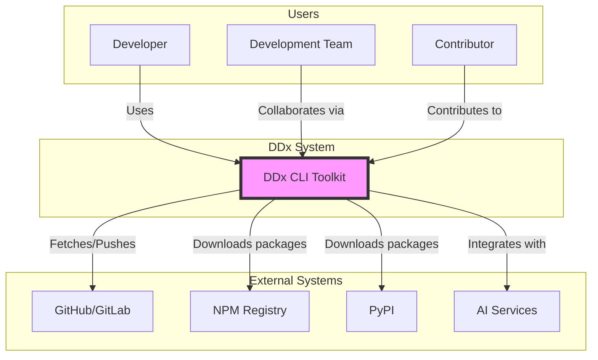
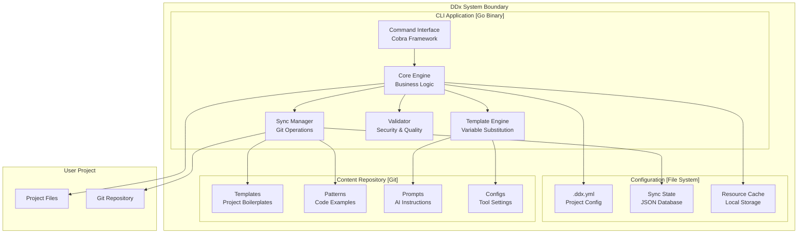
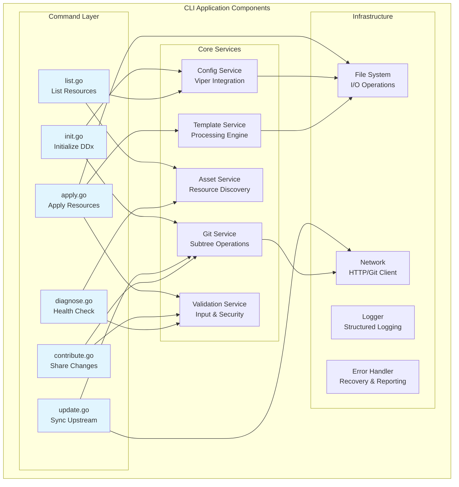
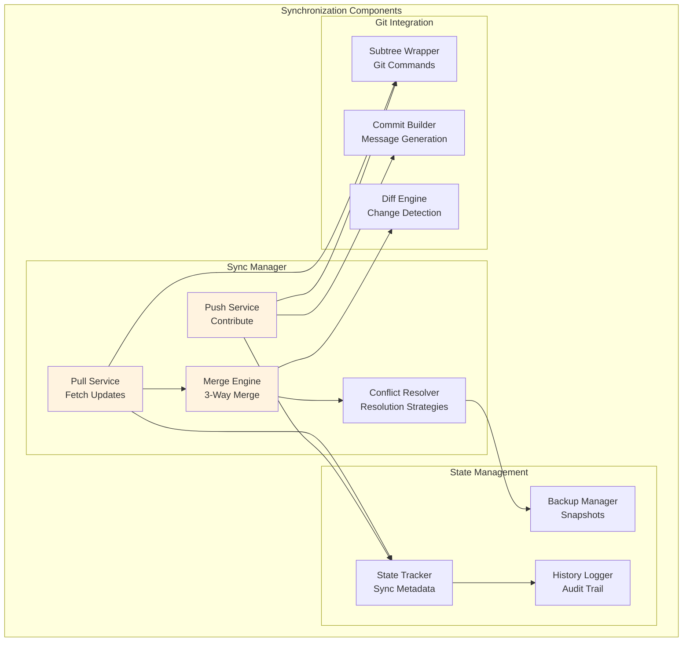
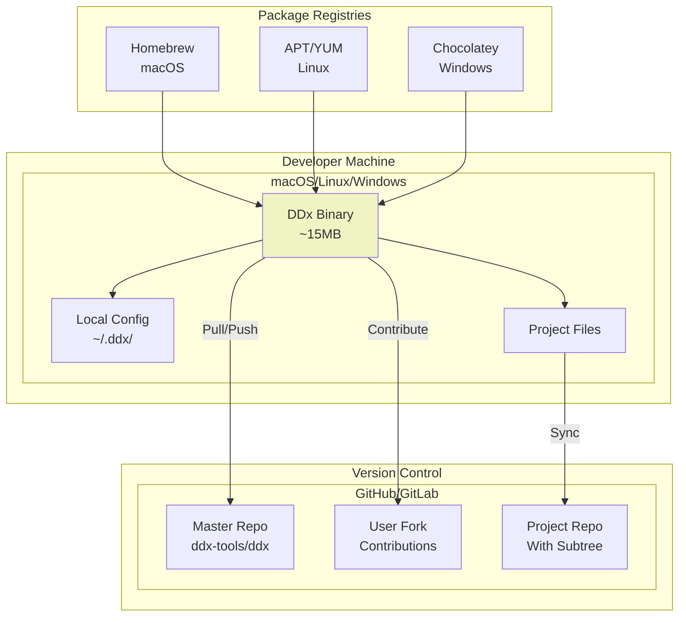
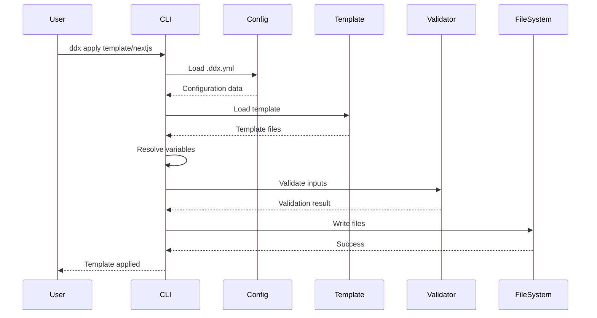
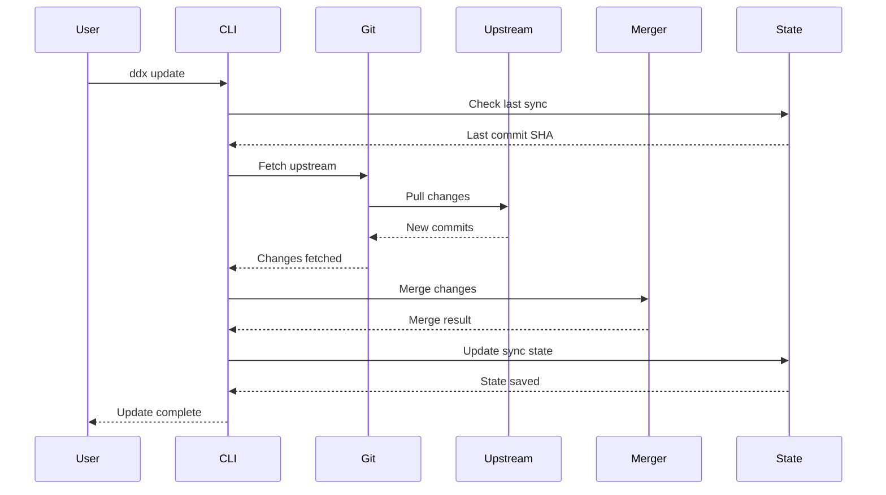
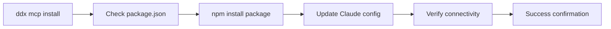

# DDx Architecture Overview

> **Last Updated**: 2025-01-15
> **Status**: Active
> **Owner**: DDx Team

## Overview

DDx follows a modular, extensible architecture designed to support document-driven development workflows across diverse project types. This document presents the architecture using the C4 model (Context, Container, Component, Code) for clear visualization at different abstraction levels.

## C4 Model Architecture

### Level 1: System Context Diagram

The highest level view showing DDx in the context of external systems and users.



### Level 2: Container Diagram

Shows the high-level shape of the software architecture and how responsibilities are distributed.



### Level 3: Component Diagram - CLI Application

Zooms into the CLI application container to show its internal components.



### Level 3: Component Diagram - Sync System

Details of the synchronization subsystem.



### Level 4: Deployment Diagram

Shows how DDx is deployed across different platforms.



## Data Flow Diagrams

### Resource Application Flow



### Synchronization Flow



## Component Interaction Matrix

| Component | Interacts With | Protocol | Purpose |
|-----------|---------------|----------|---------|
| CLI Commands | Core Services | Function calls | Execute business logic |
| Core Services | File System | OS APIs | Read/write files |
| Git Service | Remote Repos | Git protocol | Sync operations |
| Template Engine | Variables | In-memory | Substitution |
| Validator | Security Rules | Pattern matching | Input validation |
| Config Service | YAML Parser | Viper library | Configuration management |
| Network Client | GitHub API | HTTPS | PR creation |
| Logger | Output Stream | stdout/stderr | User feedback |

## Core Components

### 1. CLI Application (`/cli/`)

The command-line interface built with Go and Cobra framework.

**Key Components:**
- **Command Layer** (`/cli/cmd/`) - Command implementations
- **Internal Packages** (`/cli/internal/`) - Core business logic
- **Configuration** (`/cli/internal/config/`) - Viper-based configuration

**Commands:**
- `init` - Initialize DDx in a project
- `list` - Display available resources
- `apply` - Apply templates/patterns
- `diagnose` - Analyze project health
- `update` - Update toolkit resources
- `contribute` - Share improvements

### 2. Content Repository

Centralized repository of reusable resources.

**Structure:**
- **Templates** (`/templates/`) - Project boilerplates
- **Patterns** (`/patterns/`) - Code patterns and examples
- **Prompts** (`/prompts/`) - AI assistance prompts
- **Configs** (`/configs/`) - Tool configurations

### 3. Project Integration

How DDx integrates with user projects.

**Integration Methods:**
- **Git Subtree** - Primary method for syncing resources
- **Direct Copy** - Alternative for simple resource application
- **Symlinks** - Development mode for local testing

## Data Flow

1. **Initialization**
   - User runs `ddx init`
   - Creates `.ddx.yml` configuration
   - Sets up git subtree (optional)

2. **Resource Application**
   - User runs `ddx apply <resource>`
   - CLI reads configuration
   - Fetches resource from repository
   - Applies with variable substitution
   - Updates project files

3. **Contribution Flow**
   - User modifies resources
   - Runs `ddx contribute`
   - Changes pushed to subtree
   - PR created to master repository

## Design Principles

### 1. Modularity
- Loosely coupled components
- Clear separation of concerns
- Plugin-based extensibility

### 2. Simplicity
- Minimal dependencies
- Clear, intuitive interfaces
- Convention over configuration

### 3. Portability
- Cross-platform support (macOS, Linux, Windows)
- No external runtime requirements
- Self-contained binaries

### 4. Version Control Integration
- Git-native workflows
- Subtree for reliable syncing
- Preserves project history

## Technology Stack

| Component | Technology | Rationale |
|-----------|------------|-----------|
| Language | Go 1.21+ | Performance, portability, single binary |
| CLI Framework | Cobra | Industry standard, feature-rich |
| Configuration | Viper | Flexible configuration management |
| Version Control | Git | Universal adoption, subtree support |
| Build System | Make | Simple, cross-platform |
| Testing | Go testing | Built-in, comprehensive |

## Extension Points

### 1. Custom Templates
Users can create project-specific templates in `.ddx/templates/`.

### 2. Pattern Libraries
Organizations can maintain private pattern repositories.

### 3. Prompt Collections
Teams can develop domain-specific AI prompts.

### 4. Tool Configurations
Shareable configurations for linters, formatters, etc.

### 5. MCP Server Configuration
Project-local MCP server definitions for Claude Code integration.

## MCP Server Management Architecture

### MCP Installation Strategy

DDx implements a **project-local, dependency-managed** approach for MCP (Model Context Protocol) servers:

#### 1. Local Dependency Management

**Package Manager Abstraction:**
DDx supports multiple package managers through intelligent detection and abstraction:

- **Auto-Detection**: Automatically detects package manager from lock files
  - `pnpm-lock.yaml` → pnpm (recommended for efficiency)
  - `yarn.lock` → yarn
  - `bun.lockb` → bun
  - `package-lock.json` or none → npm (default)
- **Configuration Override**: Can be specified in `.ddx.yml`
- **Unified Interface**: Same DDx commands work with any package manager

**Package Installation Strategy:**
- **Local Dependencies**: MCP servers installed as project-local packages in `node_modules/`
- **Package.json Management**: Automatic `package.json` creation/update for MCP dependencies
- **Version Locking**: Specific versions pinned for reproducible environments
- **Team Synchronization**: Dependencies and lock files committed to version control

**Installation Flow:**
```
ddx mcp install <server> → Detect PM → [npm/pnpm/yarn/bun] install → Update Claude config → Verify
```

#### 2. Configuration Hierarchy Design

DDx implements a **local-first** configuration strategy for MCP servers:

1. **Project-Local** (Primary): `.claude/settings.local.json`
   - Project-specific MCP server definitions
   - References local `node_modules/` installations
   - Version-controlled with project code
   - Shared across team members
   - Isolated from other projects

2. **Global** (Secondary): `~/.claude/settings.local.json`
   - User-wide MCP server definitions
   - Uses global npm packages or system installations
   - Personal development preferences
   - Available across all projects

#### 3. MCP Server Lifecycle Management

**Installation Phase:**


**Configuration Generation:**
- **Command Path Resolution**: Resolves to local `node_modules/.bin/` executables
- **Environment Setup**: Configures project-specific environment variables
- **Path Variables**: Substitutes `$PWD` with actual project directory
- **Validation**: Ensures all required dependencies are available

#### 4. Dependency Architecture

**Package Management:**
```json
{
  "devDependencies": {
    "@modelcontextprotocol/server-filesystem": "^1.0.0",
    "@modelcontextprotocol/server-sequential-thinking": "^1.0.0",
    "@playwright/mcp": "^1.0.0"
  }
}
```

**Generated Configuration (adapts to package manager):**
```json
// npm/pnpm:
{
  "mcpServers": {
    "filesystem": {
      "command": "npx",  // or "pnpx" for pnpm
      "args": ["@modelcontextprotocol/server-filesystem", "$PWD"],
      "env": {}
    }
  }
}

// yarn:
{
  "mcpServers": {
    "filesystem": {
      "command": "yarn",
      "args": ["dlx", "@modelcontextprotocol/server-filesystem", "$PWD"],
      "env": {}
    }
  }
}

// bun:
{
  "mcpServers": {
    "filesystem": {
      "command": "bunx",
      "args": ["@modelcontextprotocol/server-filesystem", "$PWD"],
      "env": {}
    }
  }
}
```

#### 5. Design Principles

- **Project Isolation**: Each project manages its own MCP dependencies and versions
- **Team Consistency**: `package.json` and `.claude/` configs ensure identical AI tooling across team
- **Reproducible Environments**: Locked dependency versions prevent drift
- **Graceful Degradation**: Falls back to global configuration when local not available
- **Zero-Config Defaults**: Projects work without explicit MCP configuration
- **Dependency Transparency**: All MCP requirements visible in `package.json`

#### 6. Security & Isolation Model

**Dependency Isolation:**
- Each project maintains separate MCP server versions
- No cross-project MCP server interference
- Local installations prevent version conflicts

**Path Security:**
- All file paths resolved relative to project root
- `$PWD` substitution ensures proper sandboxing
- No access to parent directories without explicit configuration

## Security Considerations

- **No Network Dependencies** - Works offline after initial setup
- **Local Execution** - All processing happens locally
- **Git Security** - Leverages git's security model
- **No Telemetry** - No data collection or phone-home

## Performance Characteristics

- **Startup Time** - < 100ms typical
- **Resource Application** - < 1s for most operations
- **Memory Usage** - < 50MB typical
- **Binary Size** - ~15MB compressed

## Related Documentation

- [[architecture/cli-architecture]] - Detailed CLI architecture
- [[architecture/decisions/]] - Architecture decision records
- [[implementation/setup/installation]] - Installation guide
- [[development/contributing/architecture]] - Contributing to architecture