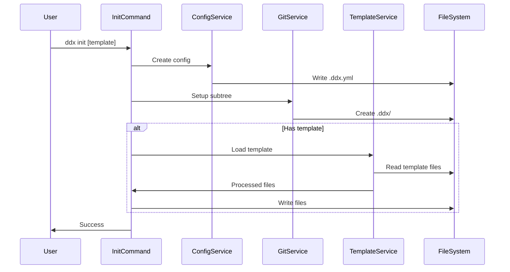
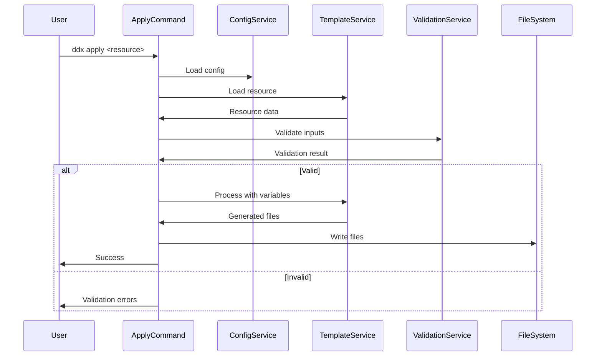
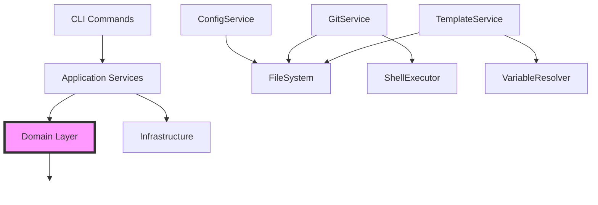

# DDx Component Structure Design

> **Last Updated**: 2025-01-20
> **Status**: Active
> **Phase**: Design

## Overview

This document defines the component structure of the DDx system, detailing the responsibilities, interfaces, and interactions of each component. Components are organized following Domain-Driven Design principles with clear boundaries and dependencies.

## Component Hierarchy

```
DDx System
├── CLI Layer (Presentation)
│   ├── Command Handlers
│   ├── Input Validators
│   └── Output Formatters
├── Application Layer
│   ├── Use Cases
│   ├── Service Orchestration
│   └── Workflow Coordination
├── Domain Layer
│   ├── Core Entities
│   ├── Business Rules
│   └── Domain Services
└── Infrastructure Layer
    ├── File System
    ├── Git Integration
    ├── Network Services
    └── Cache Management
```

## Core Components

### 1. Command Handler Components

Located in `/cli/cmd/`, these components handle user interactions.

#### InitCommand
**Purpose**: Initialize DDx in a project
**Responsibilities**:
- Parse command arguments
- Validate project state
- Coordinate initialization workflow
- Apply optional templates

**Interfaces**:
```go
type InitCommand interface {
    Execute(args []string, opts InitOptions) error
    ValidateEnvironment() error
    ApplyTemplate(name string) error
}
```

#### ListCommand
**Purpose**: Display available resources
**Responsibilities**:
- Query resource registry
- Filter by type/tags
- Format output for display

**Interfaces**:
```go
type ListCommand interface {
    Execute(resourceType string, filters []Filter) error
    GetResources() ([]Resource, error)
    FormatOutput(resources []Resource) string
}
```

#### ApplyCommand
**Purpose**: Apply resources to project
**Responsibilities**:
- Load resource from library
- Process variable substitution
- Write files to project
- Execute post-apply hooks

**Interfaces**:
```go
type ApplyCommand interface {
    Execute(resourcePath string, vars Variables) error
    Preview() ([]FileChange, error)
    Rollback() error
}
```

### 2. Service Components

Located in `/cli/internal/`, these provide core business logic.

#### ConfigService
**Purpose**: Manage configuration at all levels
**Responsibilities**:
- Load/save configuration files
- Merge configuration hierarchy
- Validate configuration schema
- Provide configuration queries

**Dependencies**:
- FileSystem component
- Schema validator

**Interfaces**:
```go
type ConfigService interface {
    Load(path string) (*Config, error)
    Save(config *Config, path string) error
    Get(key string) (interface{}, error)
    Set(key string, value interface{}) error
    Validate() []ValidationError
}
```

#### GitService
**Purpose**: Handle git operations
**Responsibilities**:
- Subtree management
- Commit operations
- Branch management
- Conflict resolution

**Dependencies**:
- Shell executor
- FileSystem component

**Interfaces**:
```go
type GitService interface {
    InitSubtree(remote, branch, prefix string) error
    Pull() (*PullResult, error)
    Push(message string) error
    GetStatus() (*GitStatus, error)
    ResolveConflicts(strategy ConflictStrategy) error
}
```

#### TemplateService
**Purpose**: Process templates and patterns
**Responsibilities**:
- Load template definitions
- Variable substitution
- File generation
- Validation

**Dependencies**:
- FileSystem component
- Variable resolver

**Interfaces**:
```go
type TemplateService interface {
    Load(name string) (*Template, error)
    Process(template *Template, vars Variables) ([]File, error)
    Validate(template *Template) []ValidationError
    GetRequiredVariables() []Variable
}
```

### 3. Domain Components

Core business entities and rules.

#### Resource Entity
**Purpose**: Represent DDx resources
**Attributes**:
- Name
- Type (template/pattern/prompt/config)
- Version
- Metadata
- Content

**Business Rules**:
- Names must be unique within type
- Versions follow semantic versioning
- Required metadata must be present

#### Project Entity
**Purpose**: Represent a DDx-enabled project
**Attributes**:
- Configuration
- State
- Resources
- History

**Business Rules**:
- Must have valid .ddx.yml
- State transitions follow workflow rules
- Resource applications are tracked

#### Workflow Entity
**Purpose**: Manage workflow progression
**Attributes**:
- Type (HELIX)
- Current phase
- Completed phases
- Active features
- Tasks

**Business Rules**:
- Phases progress sequentially
- Gate criteria must be met
- Rollback not allowed across phases

### 4. Infrastructure Components

Low-level system interactions.

#### FileSystemAdapter
**Purpose**: Abstract file operations
**Responsibilities**:
- Read/write files
- Directory operations
- Permission management
- Path resolution

**Interfaces**:
```go
type FileSystemAdapter interface {
    ReadFile(path string) ([]byte, error)
    WriteFile(path string, data []byte, perm os.FileMode) error
    CreateDirectory(path string, perm os.FileMode) error
    Exists(path string) bool
    Walk(root string, fn WalkFunc) error
}
```

#### NetworkClient
**Purpose**: Handle network operations
**Responsibilities**:
- HTTP requests
- Git remote operations
- Registry queries
- Download management

**Interfaces**:
```go
type NetworkClient interface {
    Get(url string) (*Response, error)
    Download(url string, dest string) error
    CheckConnectivity() error
}
```

#### CacheManager
**Purpose**: Manage local caches
**Responsibilities**:
- Registry caching
- Resource caching
- Cache invalidation
- Size management

**Interfaces**:
```go
type CacheManager interface {
    Get(key string) (interface{}, bool)
    Set(key string, value interface{}, ttl time.Duration) error
    Invalidate(pattern string) error
    Clear() error
}
```

## Component Interactions

### Initialization Flow


### Resource Application Flow


## Component Dependencies

### Dependency Rules
1. **Layered Architecture**: Dependencies flow downward only
2. **Interface Segregation**: Components depend on interfaces, not implementations
3. **Domain Isolation**: Domain layer has no external dependencies
4. **Infrastructure Abstraction**: Business logic doesn't depend on infrastructure details

### Dependency Graph


## Component Testing Strategy

### Unit Testing
- Test components in isolation
- Mock dependencies via interfaces
- Focus on business logic
- Minimum 80% coverage

### Integration Testing
- Test component interactions
- Use test fixtures
- Verify data flow
- Test error propagation

### Contract Testing
- Verify interface contracts
- Test API boundaries
- Validate schema compliance
- Ensure backward compatibility

## Component Evolution

### Extension Points
1. **New Commands**: Add to `/cli/cmd/`
2. **New Services**: Implement service interfaces
3. **New Resource Types**: Extend Resource entity
4. **New Workflows**: Implement Workflow interface

### Refactoring Guidelines
1. **Extract Interface**: When component has multiple clients
2. **Split Component**: When responsibilities exceed 3-5
3. **Merge Components**: When coupling is high
4. **Add Adapter**: When integrating new external systems

## Performance Considerations

### Component Optimization
- **Lazy Loading**: Load resources on demand
- **Caching**: Cache expensive operations
- **Parallelization**: Process independent operations concurrently
- **Streaming**: Process large files in chunks

### Resource Limits
- Maximum file size: 100MB
- Maximum template variables: 1000
- Maximum concurrent operations: 10
- Cache size limit: 500MB

## Security Boundaries

### Component Security
1. **Input Validation**: All user inputs validated at boundaries
2. **Path Traversal Prevention**: File paths sanitized
3. **Command Injection Prevention**: Shell commands escaped
4. **Secret Management**: Secrets never logged or cached

### Trust Boundaries
- User Input → CLI Layer (untrusted → validate)
- CLI Layer → Application Layer (semi-trusted → verify)
- Application → Domain (trusted)
- Application → Infrastructure (trusted → audit)

## Related Documentation

- [[architecture]] - System architecture overview
- [[contracts/CLI-001-core-commands]] - Command contracts
- [[schema]] - Data schema definitions
- [[security-architecture]] - Security design