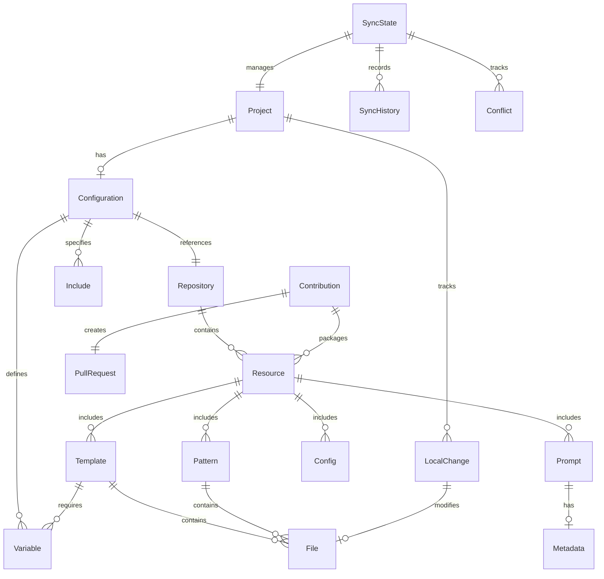

# Data Design: DDx Configuration and Metadata

**Document Type**: Data Design
**Status**: Approved
**Created**: 2025-01-15
**Updated**: 2025-01-15

*Comprehensive data architecture for DDx configuration, metadata, and resource management*

## Conceptual Model



## Core Data Structures

### 1. Configuration Schema (.ddx.yml)

```yaml
# DDx Configuration Schema v1.0.0
version: "1.0.0"  # Configuration schema version

# Project metadata
project:
  name: string           # Project name (required)
  description: string    # Project description
  type: string          # Project type (web, cli, library, service)
  language: string      # Primary language
  created: datetime     # Creation timestamp
  modified: datetime    # Last modification

# Repository configuration
repository:
  url: string           # Master repository URL (required)
  branch: string        # Branch to track (default: main)
  subtree:
    path: string        # Local subtree path (default: .ddx)
    prefix: string      # Remote prefix for subtree
    squash: boolean     # Squash commits on pull (default: false)
  fork:
    url: string         # Fork URL for contributions
    branch: string      # Fork branch

# Resource includes
includes:
  templates:
    - name: string      # Template name
      version: string   # Specific version
      active: boolean   # Currently active
  patterns:
    - name: string      # Pattern name
      paths: [string]   # Applied paths
  prompts:
    - name: string      # Prompt collection
      tags: [string]    # Filter tags
  configs:
    - name: string      # Config name
      merge: boolean    # Merge with existing

# Variable definitions
variables:
  # Global variables
  global:
    key: value          # Any key-value pairs

  # Environment-specific
  environments:
    development:
      key: value
    staging:
      key: value
    production:
      key: value

  # Template-specific
  templates:
    template_name:
      key: value

# Synchronization state
sync:
  last_update: datetime     # Last sync timestamp
  upstream_commit: string   # Last known upstream commit
  sync_strategy: string     # merge|rebase|theirs|ours
  auto_sync: boolean        # Auto-sync on operations

  # Local modifications tracking
  local_changes:
    - path: string
      type: string          # added|modified|deleted
      hash: string          # File hash
      timestamp: datetime

  # Contribution history
  contributions:
    - id: string
      timestamp: datetime
      pr_number: integer
      status: string        # pending|merged|rejected
      description: string

# Settings
settings:
  # Output preferences
  output:
    format: string          # text|json|yaml
    color: boolean          # Colored output
    verbose: boolean        # Verbose logging
    quiet: boolean          # Suppress non-errors

  # Behavior settings
  behavior:
    auto_update: boolean    # Auto-update on init
    backup: boolean         # Create backups
    confirm: boolean        # Require confirmations
    interactive: boolean    # Interactive mode

  # Performance settings
  performance:
    parallel: boolean       # Parallel operations
    cache: boolean          # Enable caching
    cache_ttl: integer      # Cache TTL in seconds

  # Security settings
  security:
    verify_signatures: boolean
    scan_secrets: boolean
    allowed_domains: [string]
    blocked_patterns: [string]

# Hooks (optional)
hooks:
  pre_update: string        # Command to run before update
  post_update: string       # Command to run after update
  pre_apply: string         # Command to run before apply
  post_apply: string        # Command to run after apply
  pre_contribute: string    # Command to run before contribute

# Metadata
metadata:
  schema_version: string    # Schema version
  ddx_version: string       # DDx version that created this
  created_by: string        # User who initialized
  team: string              # Team identifier
  tags: [string]            # Project tags
```

### 2. Resource Metadata Structure

```yaml
# Resource Metadata Schema
type: string                # template|pattern|prompt|config
name: string                # Resource name
version: string             # Semantic version
description: string         # Brief description
long_description: string    # Detailed description

# Categorization
category: string            # Primary category
tags: [string]              # Searchable tags
keywords: [string]          # Search keywords

# Requirements
requirements:
  ddx_version: string       # Minimum DDx version
  dependencies:
    - name: string
      version: string
      type: string          # npm|pip|gem|go|system

  # System requirements
  system:
    os: [string]            # Compatible OS
    arch: [string]          # Compatible architectures
    commands: [string]      # Required commands

# Files and structure
files:
  manifest:                 # File manifest
    - path: string
      type: string          # file|directory|symlink
      size: integer
      hash: string
      permissions: string

  # Entry points
  entry:
    main: string            # Main file
    readme: string          # README file
    docs: string            # Documentation directory
    tests: string           # Tests directory

# Variables
variables:
  - name: string
    type: string            # string|number|boolean|array|object
    required: boolean
    default: any
    description: string
    validation:
      pattern: string       # Regex pattern
      min: number
      max: number
      enum: [any]
    prompt:
      message: string
      help: string

# Application rules
apply:
  target: string            # Target directory
  strategy: string          # copy|merge|overlay
  preserve: [string]        # Files to preserve
  ignore: [string]          # Files to ignore

  # Transforms
  transforms:
    - type: string          # template|rename|chmod
      pattern: string
      value: string

# Maintenance
maintenance:
  author: string
  maintainers: [string]
  created: datetime
  updated: datetime
  deprecated: boolean
  replacement: string       # If deprecated

  # Links
  links:
    repository: string
    documentation: string
    issues: string
    changelog: string

# Usage tracking
usage:
  install_count: integer
  last_used: datetime
  rating: number
  feedback_count: integer
```

### 3. Sync State Database

```json
{
  "version": "1.0.0",
  "sync_state": {
    "project_id": "uuid",
    "last_sync": "2025-01-15T10:00:00Z",
    "sync_direction": "pull|push|both",
    "status": "synced|pending|conflict",

    "upstream": {
      "url": "https://github.com/ddx-tools/ddx",
      "branch": "main",
      "commit": "abc123def",
      "last_fetch": "2025-01-15T09:00:00Z"
    },

    "local": {
      "branch": "main",
      "commit": "xyz789abc",
      "modified_files": [
        {
          "path": "templates/custom/package.json",
          "status": "modified",
          "hash_before": "sha256:aaa",
          "hash_after": "sha256:bbb",
          "timestamp": "2025-01-14T15:00:00Z"
        }
      ],
      "untracked_files": [
        "patterns/experimental/new-pattern.js"
      ]
    },

    "conflicts": [
      {
        "file": "templates/nextjs/config.js",
        "type": "merge_conflict",
        "local_change": "const PORT = 3001",
        "remote_change": "const PORT = 8080",
        "base_content": "const PORT = 3000",
        "resolution": "pending|local|remote|manual",
        "resolved_at": null
      }
    ],

    "history": [
      {
        "id": "sync_001",
        "timestamp": "2025-01-10T10:00:00Z",
        "action": "pull",
        "from_commit": "aaa111",
        "to_commit": "bbb222",
        "files_changed": 15,
        "conflicts": 0,
        "duration_ms": 2500,
        "status": "success"
      }
    ]
  }
}
```

### 4. Variable Substitution Patterns

```yaml
# Variable Definition Format
variables:
  # Simple variables
  project_name: "my-app"
  port: 3000
  enable_auth: true

  # Nested variables
  database:
    host: "localhost"
    port: 5432
    name: "myapp_db"

  # Array variables
  allowed_origins:
    - "http://localhost:3000"
    - "https://app.example.com"

  # Computed variables
  api_url: "http://{{api_host}}:{{api_port}}"
  full_name: "{{first_name}} {{last_name}}"

  # Environment interpolation
  secret_key: "${SECRET_KEY}"
  database_url: "${DATABASE_URL:-postgresql://localhost/dev}"
```

Template variable usage:
```javascript
// Template file with variables
const config = {
  appName: "{{project_name}}",
  port: {{port || 3000}},
  api: {
    url: "{{api.url}}",
    timeout: {{api.timeout | default(5000)}}
  },
  features: {
    auth: {{enable_auth | bool}},
    analytics: {{features.analytics | default(false)}}
  }
};

// After substitution
const config = {
  appName: "my-app",
  port: 3000,
  api: {
    url: "https://api.example.com",
    timeout: 5000
  },
  features: {
    auth: true,
    analytics: false
  }
};
```

### 5. Contribution Package Format

```yaml
# Contribution Package Schema
package:
  version: "1.0.0"
  id: "contrib_uuid"
  type: "feature|fix|improvement"

  # Metadata
  metadata:
    title: "Add Vue 3 Composition API template"
    description: "Complete template for Vue 3 with TypeScript"
    author:
      name: "Jane Developer"
      email: "jane@example.com"
      github: "@janedev"
    created: "2025-01-15T10:00:00Z"
    issue: 123
    pr: 456

  # Changes
  changes:
    added:
      - type: "template"
        name: "vue-composition"
        path: "templates/vue-composition/"
        files: 25
        size: 45678

    modified:
      - type: "pattern"
        name: "auth-jwt"
        path: "patterns/auth/jwt.js"
        diff: "+15 -8"

    removed: []

  # Validation results
  validation:
    status: "passed"
    checks:
      - name: "structure"
        status: "passed"
      - name: "documentation"
        status: "passed"
      - name: "security"
        status: "passed"
      - name: "tests"
        status: "passed"

  # Files
  files:
    manifest:
      - path: "templates/vue-composition/package.json"
        hash: "sha256:abc123"
        size: 1234
      - path: "templates/vue-composition/README.md"
        hash: "sha256:def456"
        size: 5678
```

## Data Access Patterns

### 1. Configuration Loading

```go
type ConfigLoader struct {
    paths []string  // Search paths for config
}

func (c *ConfigLoader) Load() (*Config, error) {
    // 1. Search for config file
    configPath := c.findConfig()

    // 2. Load and parse YAML
    data, err := os.ReadFile(configPath)
    if err != nil {
        return nil, err
    }

    // 3. Unmarshal with validation
    var config Config
    if err := yaml.UnmarshalStrict(data, &config); err != nil {
        return nil, err
    }

    // 4. Apply defaults
    c.applyDefaults(&config)

    // 5. Validate against schema
    if err := c.validate(&config); err != nil {
        return nil, err
    }

    // 6. Resolve variables
    if err := c.resolveVariables(&config); err != nil {
        return nil, err
    }

    return &config, nil
}
```

### 2. Resource Discovery

```go
type ResourceIndex struct {
    templates map[string]*Template
    patterns  map[string]*Pattern
    prompts   map[string]*Prompt
    configs   map[string]*Config
}

func (r *ResourceIndex) Scan(basePath string) error {
    // 1. Walk directory tree
    err := filepath.Walk(basePath, func(path string, info os.FileInfo, err error) error {
        if err != nil {
            return err
        }

        // 2. Identify resource type
        resourceType := r.identifyType(path)
        if resourceType == "" {
            return nil
        }

        // 3. Load metadata
        metadata, err := r.loadMetadata(path)
        if err != nil {
            return err
        }

        // 4. Index resource
        r.addToIndex(resourceType, metadata)

        return nil
    })

    return err
}
```

### 3. Variable Resolution

```go
type VariableResolver struct {
    variables map[string]interface{}
    env       map[string]string
}

func (v *VariableResolver) Resolve(template string) (string, error) {
    // 1. Parse template for variables
    vars := v.parseVariables(template)

    // 2. Resolve each variable
    for _, varName := range vars {
        value, err := v.resolveVariable(varName)
        if err != nil {
            return "", err
        }

        // 3. Replace in template
        template = strings.Replace(template,
            fmt.Sprintf("{{%s}}", varName),
            fmt.Sprintf("%v", value),
            -1)
    }

    return template, nil
}
```

## Data Validation Rules

### Schema Validation

```yaml
# JSON Schema for .ddx.yml validation
{
  "$schema": "http://json-schema.org/draft-07/schema#",
  "type": "object",
  "required": ["version", "repository"],
  "properties": {
    "version": {
      "type": "string",
      "pattern": "^\\d+\\.\\d+\\.\\d+$"
    },
    "repository": {
      "type": "object",
      "required": ["url"],
      "properties": {
        "url": {
          "type": "string",
          "format": "uri"
        },
        "branch": {
          "type": "string",
          "default": "main"
        }
      }
    },
    "variables": {
      "type": "object",
      "additionalProperties": true
    }
  }
}
```

### Business Rules

1. **Variable Names**: Must match pattern `[a-zA-Z_][a-zA-Z0-9_]*`
2. **Resource Paths**: No path traversal (../)
3. **Version Format**: Semantic versioning (X.Y.Z)
4. **File Sizes**: Templates < 10MB, Patterns < 1MB
5. **Circular References**: Detect and prevent in variables
6. **Required Fields**: Enforce based on resource type

## Data Migration Strategy

### Version Migration

```go
type MigrationManager struct {
    migrations map[string]Migration
}

func (m *MigrationManager) Migrate(config *Config) error {
    currentVersion := config.Version
    targetVersion := LatestVersion

    // Find migration path
    path := m.findMigrationPath(currentVersion, targetVersion)

    // Apply migrations in sequence
    for _, migration := range path {
        if err := migration.Apply(config); err != nil {
            return fmt.Errorf("migration %s failed: %w", migration.Version, err)
        }
    }

    config.Version = targetVersion
    return nil
}
```

### Backward Compatibility

- Maintain schema versions
- Support reading old formats
- Provide migration tools
- Deprecation warnings
- Graceful degradation

## Performance Optimization

### Caching Strategy

```go
type Cache struct {
    data map[string]CacheEntry
    ttl  time.Duration
}

type CacheEntry struct {
    Value     interface{}
    ExpiresAt time.Time
}

func (c *Cache) Get(key string) (interface{}, bool) {
    entry, exists := c.data[key]
    if !exists || time.Now().After(entry.ExpiresAt) {
        return nil, false
    }
    return entry.Value, true
}
```

### Indexing

- Pre-compute resource indices
- Maintain search indices
- Use bloom filters for existence checks
- Implement lazy loading for large resources

## Security Considerations

### Data Sanitization

- Validate all inputs against schema
- Escape special characters in templates
- Prevent code injection in variables
- Sanitize file paths
- Check for secrets in configurations

### Access Control

```yaml
# Access control in .ddx.yml
security:
  access_control:
    read:
      - "templates/**"
      - "patterns/**"
    write:
      - "templates/custom/**"
    deny:
      - "**/.git/**"
      - "**/node_modules/**"
```

## Audit and Compliance

### Audit Log Format

```json
{
  "timestamp": "2025-01-15T10:00:00Z",
  "user": "jane@example.com",
  "action": "apply_template",
  "resource": "templates/nextjs",
  "target": "/projects/my-app",
  "status": "success",
  "metadata": {
    "variables_used": ["project_name", "port"],
    "files_created": 15,
    "duration_ms": 1250
  }
}
```

### Compliance Tracking

- Record all configuration changes
- Track resource usage
- Monitor contribution history
- Maintain sync audit trail
- Generate compliance reports