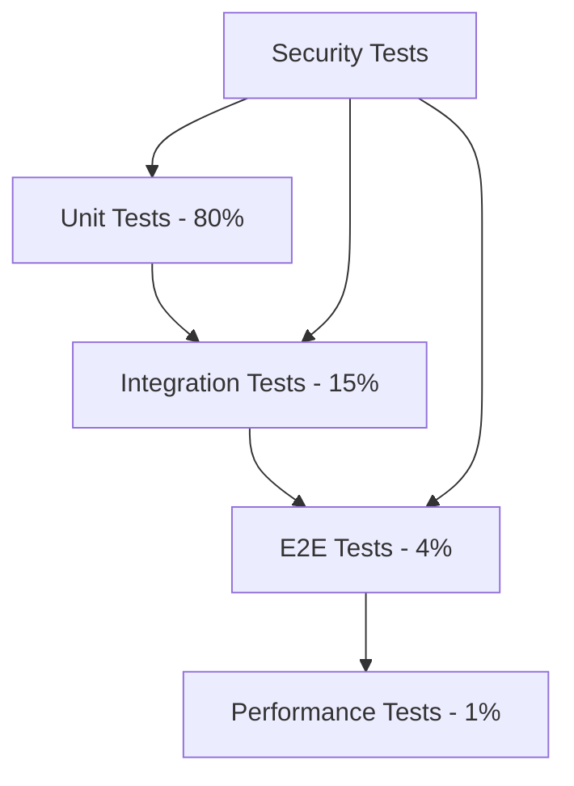

# MCP Server Management Test Plan

## Test Plan Overview

**Document ID**: TP-MCP-001  
**Feature**: FEAT-001 (MCP Server Management)  
**Version**: 1.0.0  
**Author**: DDx QA Team  
**Created**: 2025-01-15  

## Test Objectives

1. **Functional Validation**: Verify all MCP commands work as specified
2. **Security Validation**: Ensure credential protection and input validation
3. **Integration Testing**: Validate Claude Code/Desktop integration
4. **Performance Testing**: Verify response time requirements
5. **Cross-Platform Testing**: Ensure functionality across OS platforms
6. **Error Handling**: Validate graceful error handling and recovery

## Test Scope

### In Scope
- MCP CLI commands (list, install, configure, remove, status, update)
- Registry management and caching
- Configuration file manipulation
- Security controls and validation
- Error handling and recovery
- Cross-platform compatibility

### Out of Scope
- MCP server functionality itself
- Claude Code/Desktop internals
- NPM package management
- Network infrastructure

## Test Strategy

### Testing Levels



### Test Types

1. **Unit Tests**: Individual component testing
   - Registry parser
   - Configuration manager
   - Validator functions
   - CLI command handlers

2. **Integration Tests**: Component interaction
   - Registry + Installer
   - Config Manager + File System
   - CLI + Core Components

3. **Contract Tests**: API compliance
   - CLI command structure
   - Output format validation
   - Exit code verification

4. **E2E Tests**: Complete workflows
   - Install server flow
   - Update configuration flow
   - Remove server flow

5. **Security Tests**: Security validation
   - Credential masking
   - Input sanitization
   - Path traversal prevention

6. **Performance Tests**: Speed validation
   - Registry loading time
   - Search performance
   - Configuration update speed

## Test Environment

### Platform Matrix

| Platform | Version | Architecture | Priority |
|----------|---------|--------------|----------|
| macOS | 12+ | arm64, x86_64 | P0 |
| Ubuntu | 20.04+ | x86_64 | P0 |
| Windows | 10+ | x86_64 | P0 |
| Alpine Linux | 3.14+ | x86_64 | P1 |

### Test Data

#### Mock Registry
```yaml
# test/fixtures/registry.yml
servers:
  - name: test-server
    description: Test server for validation
    command:
      executable: echo
      args: ["test"]
    environment:
      - name: TEST_TOKEN
        required: true
        sensitive: true
```

#### Mock Claude Config
```json
{
  "mcpServers": {
    "existing-server": {
      "command": "npx",
      "args": ["existing"]
    }
  }
}
```

## Test Cases

### Unit Test Cases

#### UT-001: Registry Loading
```go
func TestLoadRegistry(t *testing.T) {
    registry, err := LoadRegistry("fixtures/registry.yml")
    assert.NoError(t, err)
    assert.Len(t, registry.Servers, 5)
}
```

#### UT-002: YAML Validation
```go
func TestValidateServerYAML(t *testing.T) {
    tests := []struct {
        name    string
        yaml    string
        wantErr bool
    }{
        {"valid", validYAML, false},
        {"missing required", missingName, true},
        {"invalid format", malformed, true},
    }
    // ...
}
```

#### UT-003: Credential Masking
```go
func TestMaskSensitiveValue(t *testing.T) {
    masked := MaskValue("secret123")
    assert.Equal(t, "***", masked)
    assert.NotContains(t, masked, "secret")
}
```

#### UT-004: Path Expansion
```go
func TestExpandPath(t *testing.T) {
    home, _ := os.UserHomeDir()
    path := ExpandPath("~/.claude/config.json")
    assert.Contains(t, path, home)
}
```

### Integration Test Cases

#### IT-001: Install Server Flow
```go
func TestInstallServerIntegration(t *testing.T) {
    // Setup mock Claude config
    setupMockConfig(t)
    
    // Install server
    err := InstallServer("github", map[string]string{
        "GITHUB_TOKEN": "test_token",
    })
    assert.NoError(t, err)
    
    // Verify configuration
    config := readConfig(t)
    assert.Contains(t, config.MCPServers, "github")
}
```

#### IT-002: Configuration Update
```go
func TestUpdateConfiguration(t *testing.T) {
    // Install server first
    installTestServer(t)
    
    // Update configuration
    err := ConfigureServer("test-server", map[string]string{
        "NEW_VAR": "new_value",
    })
    assert.NoError(t, err)
    
    // Verify update
    config := readConfig(t)
    assert.Equal(t, "new_value", config.MCPServers["test-server"].Env["NEW_VAR"])
}
```

### Contract Test Cases

#### CT-001: List Command Output
```go
func TestListCommandContract(t *testing.T) {
    output := runCommand("mcp", "list", "--format", "json")
    
    var result ListOutput
    err := json.Unmarshal(output, &result)
    assert.NoError(t, err)
    
    // Verify contract
    assert.NotNil(t, result.Total)
    assert.NotNil(t, result.Servers)
    assert.NotNil(t, result.Servers[0].Name)
}
```

#### CT-002: Exit Codes
```go
func TestCommandExitCodes(t *testing.T) {
    tests := []struct {
        args     []string
        wantCode int
    }{
        {[]string{"list"}, 0},
        {[]string{"install", "nonexistent"}, 1},
        {[]string{"list", "--invalid"}, 2},
    }
    // ...
}
```

### E2E Test Cases

#### E2E-001: Complete Installation Flow
```go
func TestCompleteInstallationFlow(t *testing.T) {
    // 1. List available servers
    runCommand("mcp", "list")
    
    // 2. Install server
    runCommand("mcp", "install", "github", 
        "--env", "GITHUB_TOKEN=test_token", "--yes")
    
    // 3. Check status
    output := runCommand("mcp", "status", "github")
    assert.Contains(t, output, "Configured")
    
    // 4. Update configuration
    runCommand("mcp", "configure", "github", 
        "--env", "GITHUB_TOKEN=new_token")
    
    // 5. Remove server
    runCommand("mcp", "remove", "github", "--yes")
    
    // 6. Verify removal
    output = runCommand("mcp", "status")
    assert.NotContains(t, output, "github")
}
```

### Security Test Cases

#### ST-001: Path Traversal Prevention
```go
func TestPathTraversalPrevention(t *testing.T) {
    attacks := []string{
        "../../../etc/passwd",
        "..\\..\\..\\windows\\system32",
        "/etc/passwd",
    }
    
    for _, attack := range attacks {
        err := ValidatePath(attack)
        assert.Error(t, err)
        assert.Contains(t, err.Error(), "invalid path")
    }
}
```

#### ST-002: Injection Prevention
```go
func TestInjectionPrevention(t *testing.T) {
    attacks := []string{
        "'; DROP TABLE servers; --",
        "${evil_command}",
        "$(rm -rf /)",
    }
    
    for _, attack := range attacks {
        err := ValidateServerName(attack)
        assert.Error(t, err)
    }
}
```

### Performance Test Cases

#### PT-001: Registry Load Time
```go
func BenchmarkRegistryLoad(b *testing.B) {
    for i := 0; i < b.N; i++ {
        registry, _ := LoadRegistry("registry.yml")
        assert.NotNil(b, registry)
    }
}

// Requirement: <50ms for 100 servers
```

#### PT-002: Search Performance
```go
func BenchmarkSearch(b *testing.B) {
    registry := loadLargeRegistry() // 1000 servers
    
    b.ResetTimer()
    for i := 0; i < b.N; i++ {
        results := registry.Search("github")
        assert.NotEmpty(b, results)
    }
}

// Requirement: <100ms for 1000 servers
```

## Test Execution

### Test Phases

1. **Phase 1: Unit Tests** (Day 1-2)
   - Run on every commit
   - Must pass before PR merge
   - Coverage target: 80%

2. **Phase 2: Integration Tests** (Day 3-4)
   - Run on PR creation
   - Test component interactions
   - Mock external dependencies

3. **Phase 3: E2E Tests** (Day 5)
   - Run before release
   - Test complete workflows
   - Use real Claude configs

4. **Phase 4: Security Tests** (Day 6)
   - Run weekly
   - Penetration testing
   - Vulnerability scanning

5. **Phase 5: Performance Tests** (Day 7)
   - Run before release
   - Benchmark critical paths
   - Load testing

### CI/CD Integration

```yaml
# .github/workflows/test-mcp.yml
name: MCP Tests

on:
  push:
    paths:
      - 'cli/cmd/mcp/**'
      - 'cli/internal/mcp/**'
      - 'mcp-servers/**'

jobs:
  test:
    strategy:
      matrix:
        os: [ubuntu-latest, macos-latest, windows-latest]
    runs-on: ${{ matrix.os }}
    steps:
      - uses: actions/checkout@v3
      - uses: actions/setup-go@v4
        with:
          go-version: '1.21'
      - run: make test-mcp
      - run: make test-mcp-integration
      - run: make test-mcp-security
```

## Test Coverage Requirements

### Code Coverage Targets

| Component | Target | Critical |
|-----------|--------|----------|
| Registry Manager | 85% | Yes |
| Installer | 80% | Yes |
| Config Manager | 90% | Yes |
| Validator | 95% | Yes |
| CLI Commands | 75% | No |
| Error Handlers | 80% | Yes |

### Feature Coverage Matrix

| Feature | Unit | Integration | E2E | Security |
|---------|------|-------------|-----|----------|
| List Servers | ✓ | ✓ | ✓ | - |
| Install Server | ✓ | ✓ | ✓ | ✓ |
| Configure | ✓ | ✓ | ✓ | ✓ |
| Remove | ✓ | ✓ | ✓ | - |
| Status | ✓ | ✓ | - | - |
| Update Registry | ✓ | ✓ | - | ✓ |

## Risk Assessment

### High Risk Areas

1. **Credential Handling**: Must never expose sensitive data
2. **File Permissions**: Incorrect permissions could expose configs
3. **JSON Manipulation**: Could corrupt Claude configuration
4. **Path Traversal**: Could access unauthorized files

### Mitigation Strategies

1. **Extensive Security Testing**: Focus on credential paths
2. **Backup/Restore Testing**: Verify rollback capabilities
3. **Chaos Testing**: Random failures and recovery
4. **Fuzz Testing**: Random input validation

## Test Data Management

### Test Fixtures

```
test/fixtures/
├── registry/
│   ├── valid.yml
│   ├── invalid.yml
│   └── large.yml (1000 servers)
├── configs/
│   ├── claude-code.json
│   ├── claude-desktop.json
│   └── corrupted.json
└── credentials/
    ├── valid-tokens.yml
    └── invalid-tokens.yml
```

### Test Cleanup

```go
func TestMain(m *testing.M) {
    // Setup
    setupTestEnvironment()
    
    // Run tests
    code := m.Run()
    
    // Cleanup
    cleanupTestFiles()
    restoreOriginalConfigs()
    
    os.Exit(code)
}
```

## Defect Management

### Severity Levels

1. **Critical**: Security vulnerabilities, data loss
2. **Major**: Feature doesn't work, crashes
3. **Minor**: Incorrect output, performance issues
4. **Trivial**: Typos, formatting issues

### Bug Report Template

```markdown
## Bug Report

**Severity**: Critical/Major/Minor/Trivial
**Component**: MCP/Registry/Installer/Config
**Platform**: macOS/Linux/Windows

### Description
[Clear description of the issue]

### Steps to Reproduce
1. Run command X
2. Enter value Y
3. Observe error Z

### Expected Behavior
[What should happen]

### Actual Behavior
[What actually happens]

### Logs/Screenshots
[Attach relevant logs or screenshots]
```

## Success Criteria

1. **All P0 tests pass**: 100% pass rate
2. **Code coverage met**: >80% overall
3. **No critical bugs**: Zero critical defects
4. **Performance targets met**: All operations within limits
5. **Security validation passed**: No vulnerabilities found
6. **Cross-platform verified**: Works on all target OS

## Test Sign-off

### Approval Checklist

- [ ] All test cases executed
- [ ] Coverage targets met
- [ ] No critical/major bugs open
- [ ] Performance requirements met
- [ ] Security scan passed
- [ ] Documentation updated
- [ ] Test report generated

### Approvers

- QA Lead: _______________
- Development Lead: _______________
- Security Lead: _______________
- Product Owner: _______________

---

*This test plan ensures comprehensive validation of the MCP server management feature.*