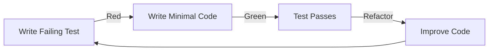

# MCP Build Procedures

## Document Overview

**Document ID**: BP-MCP-001  
**Feature**: FEAT-001 (MCP Server Management)  
**Version**: 1.0.0  
**Methodology**: Test-Driven Development (TDD)  

## TDD Implementation Guide

### Red-Green-Refactor Cycle



## Build Sequence

### Step 1: Registry Parser (Red Phase)

#### 1.1 Write Failing Test
```go
// cli/internal/mcp/registry_test.go
package mcp_test

import (
    "testing"
    "github.com/stretchr/testify/assert"
    "github.com/yourusername/ddx/cli/internal/mcp"
)

func TestLoadRegistry(t *testing.T) {
    // This test will fail - LoadRegistry doesn't exist yet
    registry, err := mcp.LoadRegistry("testdata/registry.yml")
    
    assert.NoError(t, err)
    assert.NotNil(t, registry)
    assert.Equal(t, "1.0.0", registry.Version)
    assert.Len(t, registry.Servers, 2)
}

func TestGetServer(t *testing.T) {
    registry, _ := mcp.LoadRegistry("testdata/registry.yml")
    
    server, err := registry.GetServer("github")
    
    assert.NoError(t, err)
    assert.Equal(t, "github", server.Name)
    assert.Equal(t, "development", server.Category)
}
```

#### 1.2 Run Test - Verify Failure
```bash
$ go test ./cli/internal/mcp/...
# github.com/yourusername/ddx/cli/internal/mcp
registry_test.go:10: undefined: mcp.LoadRegistry
FAIL
```

### Step 2: Registry Parser (Green Phase)

#### 2.1 Write Minimal Implementation
```go
// cli/internal/mcp/types.go
package mcp

type Server struct {
    Name        string `yaml:"name"`
    Description string `yaml:"description"`
    Category    string `yaml:"category"`
}

type Registry struct {
    Version string   `yaml:"version"`
    Servers []Server `yaml:"servers"`
}
```

```go
// cli/internal/mcp/registry.go
package mcp

import (
    "fmt"
    "os"
    "gopkg.in/yaml.v3"
)

func LoadRegistry(path string) (*Registry, error) {
    data, err := os.ReadFile(path)
    if err != nil {
        return nil, err
    }
    
    var registry Registry
    err = yaml.Unmarshal(data, &registry)
    if err != nil {
        return nil, err
    }
    
    return &registry, nil
}

func (r *Registry) GetServer(name string) (*Server, error) {
    for _, server := range r.Servers {
        if server.Name == name {
            return &server, nil
        }
    }
    return nil, fmt.Errorf("server not found: %s", name)
}
```

#### 2.2 Create Test Data
```yaml
# cli/internal/mcp/testdata/registry.yml
version: "1.0.0"
servers:
  - name: github
    description: GitHub integration
    category: development
  - name: postgres
    description: PostgreSQL integration
    category: database
```

#### 2.3 Run Test - Verify Pass
```bash
$ go test ./cli/internal/mcp/...
PASS
ok      github.com/yourusername/ddx/cli/internal/mcp   0.002s
```

### Step 3: Registry Parser (Refactor Phase)

#### 3.1 Improve Code Quality
```go
// cli/internal/mcp/registry.go (refactored)
package mcp

import (
    "fmt"
    "os"
    "strings"
    "sync"
    "time"
    "gopkg.in/yaml.v3"
)

type Registry struct {
    Version  string             `yaml:"version"`
    Updated  time.Time          `yaml:"updated"`
    Servers  []Server           `yaml:"servers"`
    
    // Private fields for caching
    mu       sync.RWMutex
    cache    map[string]*Server
    cacheTTL time.Time
}

// LoadRegistry loads and validates a registry file
func LoadRegistry(path string) (*Registry, error) {
    if path == "" {
        return nil, ErrInvalidPath
    }
    
    data, err := os.ReadFile(path)
    if err != nil {
        return nil, fmt.Errorf("reading registry: %w", err)
    }
    
    var registry Registry
    if err := yaml.Unmarshal(data, &registry); err != nil {
        return nil, fmt.Errorf("parsing registry: %w", err)
    }
    
    if err := registry.validate(); err != nil {
        return nil, fmt.Errorf("validating registry: %w", err)
    }
    
    registry.buildCache()
    return &registry, nil
}

// GetServer retrieves a server by name with caching
func (r *Registry) GetServer(name string) (*Server, error) {
    if name == "" {
        return nil, ErrEmptyServerName
    }
    
    r.mu.RLock()
    defer r.mu.RUnlock()
    
    if server, ok := r.cache[strings.ToLower(name)]; ok {
        return server, nil
    }
    
    return nil, fmt.Errorf("%w: %s", ErrServerNotFound, name)
}

// validate ensures registry data is valid
func (r *Registry) validate() error {
    if r.Version == "" {
        return ErrMissingVersion
    }
    
    seen := make(map[string]bool)
    for i, server := range r.Servers {
        if server.Name == "" {
            return fmt.Errorf("server %d: %w", i, ErrMissingName)
        }
        
        lower := strings.ToLower(server.Name)
        if seen[lower] {
            return fmt.Errorf("duplicate server: %s", server.Name)
        }
        seen[lower] = true
    }
    
    return nil
}

// buildCache creates an index for fast lookups
func (r *Registry) buildCache() {
    r.cache = make(map[string]*Server, len(r.Servers))
    
    for i := range r.Servers {
        server := &r.Servers[i]
        r.cache[strings.ToLower(server.Name)] = server
    }
    
    r.cacheTTL = time.Now().Add(15 * time.Minute)
}
```

#### 3.2 Add Error Types
```go
// cli/internal/mcp/errors.go
package mcp

import "errors"

var (
    ErrInvalidPath     = errors.New("invalid path")
    ErrEmptyServerName = errors.New("empty server name")
    ErrServerNotFound  = errors.New("server not found")
    ErrMissingVersion  = errors.New("missing registry version")
    ErrMissingName     = errors.New("missing server name")
)
```

#### 3.3 Verify Tests Still Pass
```bash
$ go test ./cli/internal/mcp/...
PASS
ok      github.com/yourusername/ddx/cli/internal/mcp   0.002s
```

### Step 4: CLI Command (Red Phase)

#### 4.1 Write Command Test
```go
// cli/cmd/mcp_test.go
package cmd_test

import (
    "bytes"
    "testing"
    "github.com/stretchr/testify/assert"
    "github.com/yourusername/ddx/cli/cmd"
)

func TestMCPListCommand(t *testing.T) {
    // This will fail - command doesn't exist
    cmd := cmd.NewMCPCommand()
    
    var out bytes.Buffer
    cmd.SetOut(&out)
    cmd.SetArgs([]string{"list"})
    
    err := cmd.Execute()
    
    assert.NoError(t, err)
    assert.Contains(t, out.String(), "Available MCP Servers")
}
```

### Step 5: CLI Command (Green Phase)

#### 5.1 Implement Command
```go
// cli/cmd/mcp.go
package cmd

import (
    "fmt"
    "github.com/spf13/cobra"
    "github.com/yourusername/ddx/cli/internal/mcp"
)

func NewMCPCommand() *cobra.Command {
    cmd := &cobra.Command{
        Use:   "mcp",
        Short: "Manage MCP servers",
    }
    
    cmd.AddCommand(newListCommand())
    return cmd
}

func newListCommand() *cobra.Command {
    return &cobra.Command{
        Use:   "list",
        Short: "List available MCP servers",
        RunE: func(cmd *cobra.Command, args []string) error {
            fmt.Fprintln(cmd.OutOrStdout(), "📋 Available MCP Servers")
            
            registry, err := mcp.LoadRegistry("mcp-servers/registry.yml")
            if err != nil {
                return err
            }
            
            for _, server := range registry.Servers {
                fmt.Fprintf(cmd.OutOrStdout(), "  - %s: %s\n", 
                    server.Name, server.Description)
            }
            
            return nil
        },
    }
}
```

### Step 6: Integration Test (Red Phase)

#### 6.1 Write Integration Test
```go
// cli/internal/mcp/installer_test.go
// +build integration

package mcp_test

func TestInstallServer(t *testing.T) {
    // Setup
    installer := mcp.NewInstaller()
    configPath := t.TempDir() + "/claude.json"
    
    // This will fail - Installer doesn't exist
    err := installer.Install("github", mcp.InstallOptions{
        ConfigPath: configPath,
        Environment: map[string]string{
            "GITHUB_TOKEN": "test_token",
        },
    })
    
    assert.NoError(t, err)
    
    // Verify config was written
    data, _ := os.ReadFile(configPath)
    assert.Contains(t, string(data), "github")
}
```

### Step 7: Installer (Green Phase)

#### 7.1 Implement Installer
```go
// cli/internal/mcp/installer.go
package mcp

import (
    "encoding/json"
    "fmt"
    "os"
)

type Installer struct {
    registry *Registry
    config   *ConfigManager
}

type InstallOptions struct {
    ConfigPath  string
    Environment map[string]string
    NoBackup    bool
}

func NewInstaller() *Installer {
    return &Installer{}
}

func (i *Installer) Install(serverName string, opts InstallOptions) error {
    // Load server definition
    registry, err := LoadRegistry("mcp-servers/registry.yml")
    if err != nil {
        return fmt.Errorf("loading registry: %w", err)
    }
    
    server, err := registry.GetServer(serverName)
    if err != nil {
        return fmt.Errorf("getting server: %w", err)
    }
    
    // Load existing config or create new
    config := make(map[string]interface{})
    if data, err := os.ReadFile(opts.ConfigPath); err == nil {
        json.Unmarshal(data, &config)
    }
    
    // Add MCP server
    if config["mcpServers"] == nil {
        config["mcpServers"] = make(map[string]interface{})
    }
    
    mcpServers := config["mcpServers"].(map[string]interface{})
    mcpServers[serverName] = map[string]interface{}{
        "command": "npx",
        "args":    []string{"-y", fmt.Sprintf("@modelcontextprotocol/server-%s", serverName)},
        "env":     opts.Environment,
    }
    
    // Save config
    data, err := json.MarshalIndent(config, "", "  ")
    if err != nil {
        return fmt.Errorf("marshaling config: %w", err)
    }
    
    return os.WriteFile(opts.ConfigPath, data, 0600)
}
```

## Incremental Build Process

### Day-by-Day Implementation

#### Day 1: Foundation
```bash
# Morning: Create structure and types
make test  # All fail (Red)

# Implement types.go
go test ./cli/internal/mcp -run TestTypes
# PASS (Green)

# Afternoon: Registry parser
go test ./cli/internal/mcp -run TestRegistry
# FAIL (Red)

# Implement registry.go
go test ./cli/internal/mcp -run TestRegistry  
# PASS (Green)

# End of day
make test-coverage
# Coverage: 45%
git commit -m "feat: add MCP registry parser"
```

#### Day 2: CLI Integration
```bash
# Morning: List command
go test ./cli/cmd -run TestMCPList
# FAIL (Red)

# Implement mcp.go
go test ./cli/cmd -run TestMCPList
# PASS (Green)

# Afternoon: Other commands
for cmd in install configure remove status; do
    # Write test
    go test ./cli/cmd -run TestMCP$cmd  # FAIL
    # Implement
    go test ./cli/cmd -run TestMCP$cmd  # PASS
done

# Coverage check
make test-coverage
# Coverage: 65%
```

#### Day 3: Configuration Management
```bash
# Test Claude detection
go test ./cli/internal/mcp -run TestDetectClaude
# Implement claude.go

# Test config management  
go test ./cli/internal/mcp -run TestConfigManager
# Implement config.go

# Integration test
go test -tags=integration ./cli/internal/mcp
# Coverage: 75%
```

## Quality Checkpoints

### After Each Implementation

1. **Run Tests**
```bash
go test ./cli/internal/mcp/...
```

2. **Check Coverage**
```bash
go test -cover ./cli/internal/mcp/...
```

3. **Run Linter**
```bash
golangci-lint run ./cli/internal/mcp/...
```

4. **Format Code**
```bash
go fmt ./cli/internal/mcp/...
```

5. **Security Scan**
```bash
gosec ./cli/internal/mcp/...
```

## Common Implementation Patterns

### Pattern: Error Wrapping
```go
func LoadRegistry(path string) (*Registry, error) {
    data, err := os.ReadFile(path)
    if err != nil {
        return nil, fmt.Errorf("reading registry file %q: %w", path, err)
    }
    // Provides context for debugging
}
```

### Pattern: Options Struct
```go
type InstallOptions struct {
    ConfigPath  string
    Environment map[string]string
    NoBackup    bool
    DryRun      bool
}

// Extensible without breaking API
func Install(name string, opts InstallOptions) error
```

### Pattern: Interface-Based Testing
```go
type RegistryLoader interface {
    Load(path string) (*Registry, error)
}

// Allows mocking in tests
type Installer struct {
    loader RegistryLoader
}
```

## Troubleshooting Build Issues

### Issue: Test Fails Unexpectedly
```bash
# Debug with verbose output
go test -v ./cli/internal/mcp/...

# Run specific test
go test -run TestRegistryLoad -v

# Check test data
cat cli/internal/mcp/testdata/registry.yml
```

### Issue: Import Cycle
```go
// Wrong: internal/mcp imports cmd
// Right: cmd imports internal/mcp

// Use interfaces to break cycles
type Commander interface {
    Execute() error
}
```

### Issue: Coverage Dropping
```bash
# Find uncovered lines
go test -coverprofile=coverage.out ./cli/internal/mcp/...
go tool cover -html=coverage.out

# Add tests for uncovered code
```

## Continuous Integration

### CI Build Script
```bash
#!/bin/bash
# scripts/ci-build-mcp.sh

set -e

echo "Building MCP feature..."

# Test
echo "Running tests..."
go test -race ./cli/internal/mcp/...
go test -race ./cli/cmd/... -run MCP

# Coverage
echo "Checking coverage..."
go test -cover ./cli/internal/mcp/... | grep -E "ok.*coverage: [8-9][0-9]\.[0-9]%|100\.0%"

# Lint
echo "Running linter..."
golangci-lint run ./cli/internal/mcp/...

# Security
echo "Security scan..."
gosec ./cli/internal/mcp/...

# Build
echo "Building binary..."
go build -o ddx ./cli/main.go

echo "Build successful!"
```

## Release Checklist

### Pre-Release
- [ ] All tests passing
- [ ] Coverage >80%
- [ ] No linter warnings
- [ ] Security scan clean
- [ ] Documentation updated
- [ ] CHANGELOG updated

### Build Release
```bash
# Tag version
git tag -a v0.2.0 -m "Add MCP server management"

# Build for all platforms
make build-all

# Create release archives
make package

# Generate checksums
sha256sum dist/* > checksums.txt
```

### Post-Release
- [ ] Update registry with new servers
- [ ] Announce in release notes
- [ ] Update documentation site
- [ ] Monitor for issues

---

*Follow these procedures for consistent, quality implementation of the MCP feature using TDD.*