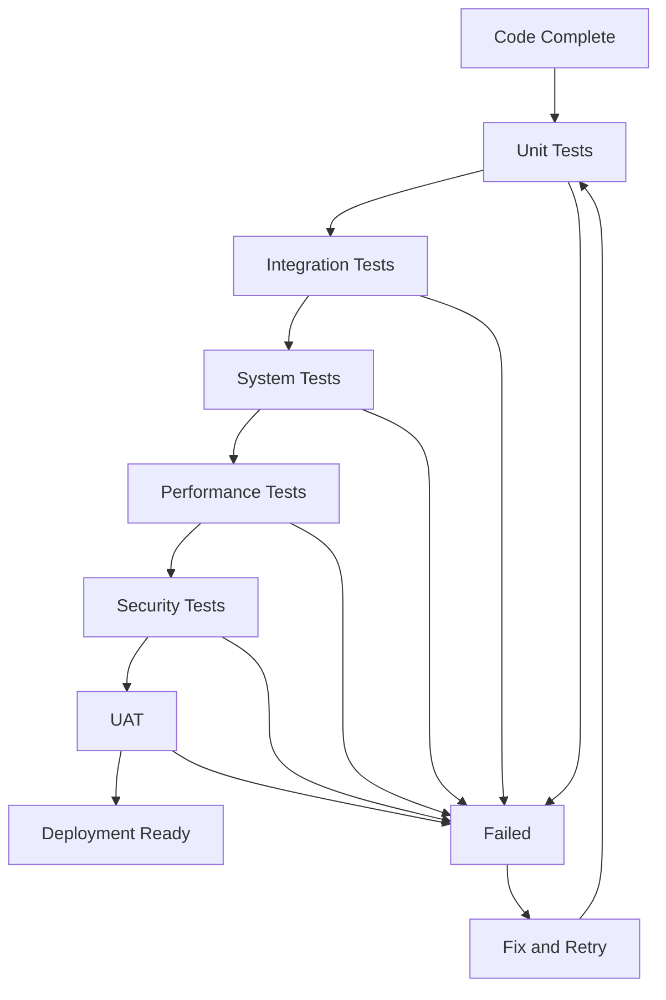

# CDP Principles in Detail

## The Three Immutable Laws

### 1. Specification Before Implementation

**Definition**: Every piece of functionality must be completely specified before any implementation work begins.

**Implementation**:
- **Requirements Documentation**: Clear, testable requirements written in plain language
- **Technical Specifications**: Detailed design documents including APIs, data models, and architectural decisions
- **Acceptance Criteria**: Specific, measurable conditions that define when work is complete
- **Interface Contracts**: Explicit definitions of all system boundaries and interactions

**Examples**:

```yaml
# Good: Complete specification
Feature: User Authentication
Requirements:
  - Users must be able to log in with email and password
  - Failed login attempts must be logged and rate-limited
  - Sessions must expire after 24 hours of inactivity
Acceptance Criteria:
  - Login form validates email format
  - Password must be at least 8 characters
  - Rate limiting: 5 failed attempts = 15 minute lockout
  - Session cookie has 24-hour sliding expiration
```

```yaml
# Bad: Incomplete specification
Feature: User Authentication
Requirements:
  - Add login functionality
  - Make it secure
```

**Validation Methods**:
- Specification reviews with stakeholders
- Walkthrough sessions with implementation teams
- Prototype validation where complexity is high
- Requirements traceability matrices

### 2. Validation Before Deployment

**Definition**: All code must pass comprehensive validation before deployment to any environment, including development branches.

**Validation Layers**:

1. **Unit Testing**: Individual component behavior validation
2. **Integration Testing**: Component interaction validation
3. **System Testing**: End-to-end functionality validation
4. **Performance Testing**: Non-functional requirement validation
5. **Security Testing**: Vulnerability and compliance validation
6. **User Acceptance Testing**: Stakeholder requirement validation

**Implementation Process**:



**Quality Gates**:
- 80% minimum test coverage
- Zero critical security vulnerabilities
- Performance within established SLAs
- All acceptance criteria validated
- Code review approval from at least 2 peers

**Examples**:

```bash
# Automated validation pipeline
make validate
├── lint-check       # Static analysis
├── unit-tests       # Component validation  
├── integration-tests # System interaction validation
├── security-scan    # Vulnerability assessment
├── performance-test # Load and stress testing
└── coverage-report  # Coverage analysis
```

### 3. Contracts Before Integration

**Definition**: All interfaces between system components must be explicitly defined and agreed upon before integration begins.

**Contract Types**:

1. **API Contracts**: REST, GraphQL, gRPC interface definitions
2. **Data Contracts**: Database schemas, message formats, data validation rules
3. **Service Contracts**: SLA definitions, error handling, retry policies
4. **Event Contracts**: Event schemas, delivery guarantees, ordering requirements

**Implementation Standards**:

```yaml
# API Contract Example
UserService:
  endpoints:
    - path: /api/v1/users/{id}
      method: GET
      parameters:
        id: 
          type: integer
          required: true
          validation: positive
      responses:
        200:
          schema: User
          description: User found
        404:
          schema: Error
          description: User not found
        500:
          schema: Error
          description: Server error
      sla:
        response_time: 200ms
        availability: 99.9%
```

```go
// Service Contract Example
type UserRepository interface {
    GetUser(ctx context.Context, id int) (*User, error)
    CreateUser(ctx context.Context, user *User) error
    UpdateUser(ctx context.Context, user *User) error
    DeleteUser(ctx context.Context, id int) error
}

// Error Contract
type UserError struct {
    Code    ErrorCode `json:"code"`
    Message string    `json:"message"`
    Details map[string]interface{} `json:"details,omitempty"`
}
```

**Contract Evolution**:
- Semantic versioning for all contracts
- Backward compatibility requirements
- Deprecation policies and timelines
- Migration strategies for breaking changes

## Development Values

### Agile Principles in Practice

**1. Individuals and Interactions Over Processes and Tools**
- Daily standups focused on problem-solving, not status reporting
- Pair programming and mob programming sessions
- Direct communication channels between team members
- Regular retrospectives with actionable improvements

**2. Working Software Over Comprehensive Documentation**
- Documentation serves the software, not vice versa
- Automated tests as living documentation
- Code that is self-documenting through clear naming and structure
- Just-enough documentation to enable understanding and maintenance

**3. Customer Collaboration Over Contract Negotiation**
- Regular stakeholder demos and feedback sessions
- User story writing workshops with business stakeholders
- Continuous user research and feedback integration
- Flexible scope management within sprint boundaries

**4. Responding to Change Over Following a Plan**
- Sprint planning that accounts for uncertainty
- Regular backlog refinement and priority adjustment
- Technical debt management as part of regular planning
- Architecture that supports changing requirements

### Engineering Principles Application

**SOLID Principles**:

```go
// Single Responsibility Principle
type UserValidator struct{}
func (v *UserValidator) ValidateEmail(email string) error { /* ... */ }

type UserRepository struct{}
func (r *UserRepository) Save(user User) error { /* ... */ }

// Open/Closed Principle
type PaymentProcessor interface {
    Process(payment Payment) error
}

type CreditCardProcessor struct{}
func (c *CreditCardProcessor) Process(payment Payment) error { /* ... */ }

type PayPalProcessor struct{}
func (p *PayPalProcessor) Process(payment Payment) error { /* ... */ }
```

**DRY (Don't Repeat Yourself)**:
- Shared utility functions and libraries
- Configuration management systems
- Template-based code generation
- Common error handling patterns

**YAGNI (You Aren't Gonna Need It)**:
- Feature flags for experimental functionality
- Minimal viable implementations
- Iterative enhancement over upfront complexity
- Regular architecture reviews to remove unused code

**KISS (Keep It Simple, Stupid)**:
- Prefer composition over inheritance
- Clear, descriptive naming over comments
- Simple algorithms over clever optimizations
- Explicit error handling over silent failures

## The Clinical Method in Software Development

### 1. Diagnose

**Process**:
- **Symptom Identification**: What problems are we observing?
- **Root Cause Analysis**: Why are these problems occurring?
- **Impact Assessment**: How severe are the problems?
- **Constraint Analysis**: What limitations do we face?

**Tools**:
- User research and feedback analysis
- System monitoring and alerting
- Performance profiling and analysis
- Technical debt assessment

**Deliverables**:
- Problem statement document
- Root cause analysis report
- Impact and risk assessment
- Constraint documentation

### 2. Prescribe

**Process**:
- **Solution Design**: How will we solve the identified problems?
- **Architecture Planning**: What components and interactions are needed?
- **Resource Allocation**: What time, people, and technology do we need?
- **Risk Mitigation**: How will we handle potential issues?

**Tools**:
- Architecture decision records (ADRs)
- Technical design documents
- Resource estimation and planning
- Risk registers and mitigation strategies

**Deliverables**:
- Technical specifications
- Architecture diagrams
- Implementation timeline
- Risk mitigation plan

### 3. Treat

**Process**:
- **Implementation**: Build according to specifications
- **Continuous Integration**: Integrate changes frequently
- **Progress Monitoring**: Track implementation against plan
- **Quality Assurance**: Validate work at each step

**Tools**:
- Version control systems
- Continuous integration pipelines
- Project tracking tools
- Automated testing frameworks

**Deliverables**:
- Working software increments
- Test results and coverage reports
- Integration documentation
- Progress reports

### 4. Monitor

**Process**:
- **Performance Tracking**: Monitor system behavior
- **Error Detection**: Identify and analyze failures
- **User Feedback**: Collect and analyze user experience data
- **Health Assessment**: Evaluate overall system health

**Tools**:
- Application performance monitoring
- Log aggregation and analysis
- User analytics and feedback systems
- Health check endpoints

**Deliverables**:
- Performance dashboards
- Error reports and analysis
- User feedback summaries
- Health status reports

### 5. Release

**Process**:
- **Deployment Planning**: Prepare for production release
- **Staged Rollout**: Deploy incrementally to reduce risk
- **Rollback Preparation**: Ensure ability to revert if needed
- **Communication**: Inform stakeholders of changes

**Tools**:
- Deployment automation
- Feature flags and traffic routing
- Monitoring and alerting systems
- Communication platforms

**Deliverables**:
- Deployment scripts and procedures
- Rollback plans
- Release notes and documentation
- Stakeholder communications

### 6. Follow-up

**Process**:
- **Outcome Assessment**: Did we solve the original problems?
- **Learning Capture**: What did we learn from this process?
- **Process Improvement**: How can we do better next time?
- **Knowledge Sharing**: How do we spread learnings across teams?

**Tools**:
- Retrospective meetings
- Post-mortem analysis
- Knowledge management systems
- Training and documentation platforms

**Deliverables**:
- Retrospective reports
- Process improvement recommendations
- Updated documentation and training materials
- Knowledge sharing presentations