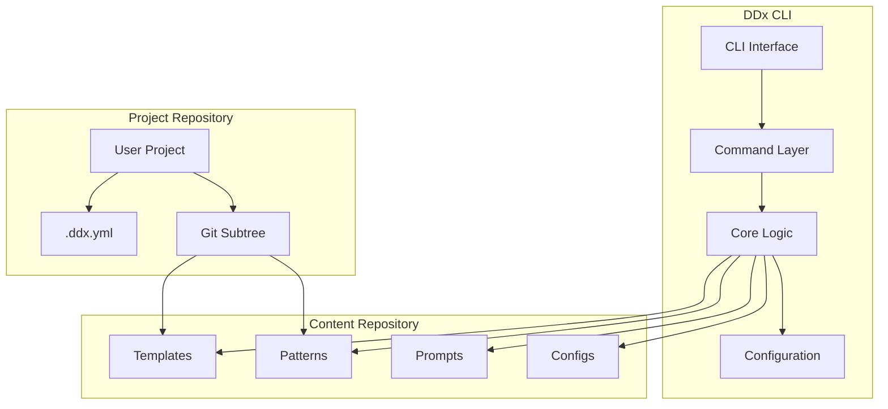

# DDx Architecture Overview

> **Last Updated**: 2025-09-11
> **Status**: Active
> **Owner**: DDx Team

## Overview

DDx follows a modular, extensible architecture designed to support document-driven development workflows across diverse project types.

## Context

This document provides a high-level view of the DDx system architecture. For detailed component specifications, see the individual component documentation in [[architecture/components/]].

## System Architecture

## Core Components

### 1. CLI Application (`/cli/`)

The command-line interface built with Go and Cobra framework.

**Key Components:**
- **Command Layer** (`/cli/cmd/`) - Command implementations
- **Internal Packages** (`/cli/internal/`) - Core business logic
- **Configuration** (`/cli/internal/config/`) - Viper-based configuration

**Commands:**
- `init` - Initialize DDx in a project
- `list` - Display available resources
- `apply` - Apply templates/patterns
- `diagnose` - Analyze project health
- `update` - Update toolkit resources
- `contribute` - Share improvements

### 2. Content Repository

Centralized repository of reusable resources.

**Structure:**
- **Templates** (`/templates/`) - Project boilerplates
- **Patterns** (`/patterns/`) - Code patterns and examples
- **Prompts** (`/prompts/`) - AI assistance prompts
- **Configs** (`/configs/`) - Tool configurations

### 3. Project Integration

How DDx integrates with user projects.

**Integration Methods:**
- **Git Subtree** - Primary method for syncing resources
- **Direct Copy** - Alternative for simple resource application
- **Symlinks** - Development mode for local testing

## Data Flow

1. **Initialization**
   - User runs `ddx init`
   - Creates `.ddx.yml` configuration
   - Sets up git subtree (optional)

2. **Resource Application**
   - User runs `ddx apply <resource>`
   - CLI reads configuration
   - Fetches resource from repository
   - Applies with variable substitution
   - Updates project files

3. **Contribution Flow**
   - User modifies resources
   - Runs `ddx contribute`
   - Changes pushed to subtree
   - PR created to master repository

## Design Principles

### 1. Modularity
- Loosely coupled components
- Clear separation of concerns
- Plugin-based extensibility

### 2. Simplicity
- Minimal dependencies
- Clear, intuitive interfaces
- Convention over configuration

### 3. Portability
- Cross-platform support (macOS, Linux, Windows)
- No external runtime requirements
- Self-contained binaries

### 4. Version Control Integration
- Git-native workflows
- Subtree for reliable syncing
- Preserves project history

## Technology Stack

| Component | Technology | Rationale |
|-----------|------------|-----------|
| Language | Go 1.21+ | Performance, portability, single binary |
| CLI Framework | Cobra | Industry standard, feature-rich |
| Configuration | Viper | Flexible configuration management |
| Version Control | Git | Universal adoption, subtree support |
| Build System | Make | Simple, cross-platform |
| Testing | Go testing | Built-in, comprehensive |

## Extension Points

### 1. Custom Templates
Users can create project-specific templates in `.ddx/templates/`.

### 2. Pattern Libraries
Organizations can maintain private pattern repositories.

### 3. Prompt Collections
Teams can develop domain-specific AI prompts.

### 4. Tool Configurations
Shareable configurations for linters, formatters, etc.

## Security Considerations

- **No Network Dependencies** - Works offline after initial setup
- **Local Execution** - All processing happens locally
- **Git Security** - Leverages git's security model
- **No Telemetry** - No data collection or phone-home

## Performance Characteristics

- **Startup Time** - < 100ms typical
- **Resource Application** - < 1s for most operations
- **Memory Usage** - < 50MB typical
- **Binary Size** - ~15MB compressed

## Related Documentation

- [[architecture/cli-architecture]] - Detailed CLI architecture
- [[architecture/decisions/]] - Architecture decision records
- [[implementation/setup/installation]] - Installation guide
- [[development/contributing/architecture]] - Contributing to architecture