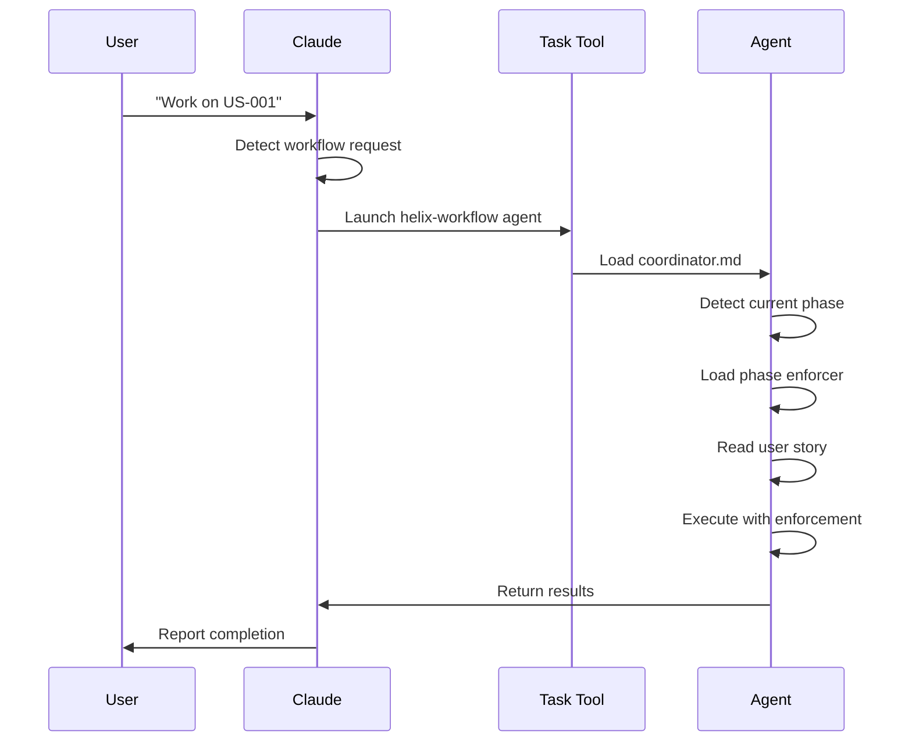

# FEAT-014: Agent-Based Workflow Enforcement

**Feature ID**: FEAT-014
**Feature Name**: Agent-Based Workflow Enforcement
**Status**: Specified
**Priority**: P1
**Created**: 2025-01-20
**Updated**: 2025-01-20
**Owner**: Core Team

## Executive Summary

Refactor HELIX workflow enforcement from passive CLAUDE.md instructions (~150 lines) to an active agent system, reducing token usage by 45% while improving enforcement effectiveness. Also clean up library path references to use `.ddx/library` consistently now that library content has moved to the separate ddx-library repository.

## Problem Statement

### Current Issues

1. **Token Waste**: CLAUDE.md contains ~150 lines of workflow enforcement instructions parsed on every message
2. **Passive Enforcement**: Instructions sit in context whether needed or not
3. **Path Confusion**: References to `library/` should be `.ddx/library/` since library split into separate repo
4. **Maintenance Burden**: Logic scattered across documentation instead of centralized
5. **Poor Separation**: Workflow enforcement mixed with general project instructions

### Impact

- **Performance**: ~9,000 tokens wasted per message when not doing workflow tasks
- **Maintainability**: Changes require editing bloated CLAUDE.md
- **Clarity**: Hard to find non-workflow project info in CLAUDE.md
- **Consistency**: Library path references are inconsistent (some `library/`, some `.ddx/library/`)

## Goals & Non-Goals

### Goals

1. **Reduce Token Usage**: Cut base context by 45% (from ~400 to ~220 lines in CLAUDE.md)
2. **Reactive Enforcement**: Activate workflow agent only when workflow tasks occur
3. **Path Consistency**: All references use `.ddx/library/*` after library split
4. **Maintain Functionality**: All workflow commands continue working identically
5. **Clean Architecture**: Clear separation between project info and workflow enforcement

### Non-Goals

1. Not changing workflow functionality or commands
2. Not modifying workflow action behavior
3. Not affecting user experience (transparent refactoring)
4. Not removing `./library` content yet (that's a separate cleanup task)

## User Stories

- **US-044**: Developer Using Workflow Enforcer Agent

## Solution Overview

### Architecture Changes

```
BEFORE:
CLAUDE.md (400 lines)
├── Project info (50 lines)
├── Architecture (50 lines)
├── Commands (50 lines)
├── Workflow Enforcement (150 lines) ← REMOVE
├── Auto-prompts (30 lines) ← REMOVE
├── Workflow actions (20 lines)
└── Principles (50 lines)

AFTER:
CLAUDE.md (220 lines)
├── Project info (50 lines)
├── Architecture (50 lines)
├── Commands (50 lines)
├── Workflow Reference (20 lines) ← SIMPLE POINTER
└── Principles (50 lines)

Workflow Agent (Activated on demand)
├── coordinator.md (as agent prompt)
├── Phase enforcers (loaded dynamically)
└── Action prompts (build-story, continue, etc.)
```

### Agent Activation Pattern

```bash
# User request
User: "Work on US-001"

# Claude Code behavior
Claude: [Detects workflow request]
        [Launches Task tool with helix-workflow agent]
        [Agent loads coordinator.md as system prompt]
        [Agent detects phase, loads enforcer]
        [Agent executes work with enforcement]
```

### Path Standardization

All library references updated to `.ddx/library/*`:
- `library/workflows/helix/coordinator.md` → `.ddx/library/workflows/helix/coordinator.md`
- `library/prompts/claude/` → `.ddx/library/prompts/claude/`
- `library/templates/` → `.ddx/library/templates/`

**Note**: The master ddx repo will have `./library/` temporarily until cleanup, but all references in CLAUDE.md point to `.ddx/library/` which is where library content lives in user projects (via subtree from ddx-library repo).

## Technical Architecture

### Components

#### 1. Minimal CLAUDE.md
**Purpose**: Essential project context only
**Size**: ~220 lines (down from ~400)
**Content**:
- Project overview and architecture
- Development commands
- Brief workflow pointer (~20 lines)
- Architectural principles
- Testing requirements

#### 2. Workflow Agent System
**Location**: `.ddx/library/workflows/helix/`
**Components**:
- `coordinator.md` - Agent system prompt (already exists)
- `phases/*/enforcer.md` - Phase-specific enforcers (already exist)
- `actions/*.md` - Action prompts (already exist)

**Activation**: Via Task tool when workflow requests detected

#### 3. Path References
**Standard**: All paths use `.ddx/library/*` format
**Rationale**: Library content is in ddx-library repo, synced via subtree to `.ddx/library/`

### Agent Workflow



## Implementation Plan

### Phase 1: Frame (Current)
- [x] Create US-044
- [x] Create FEAT-014 (this document)
- [ ] Update feature registry
- [ ] Review and approve requirements

### Phase 2: Design
- [ ] Create SD-014 solution design
- [ ] Define agent activation patterns
- [ ] Specify CLAUDE.md refactoring details
- [ ] Document path migration strategy

### Phase 3: Test
- [ ] Write tests for minimal CLAUDE.md structure
- [ ] Write tests for agent activation patterns
- [ ] Write tests for workflow command functionality
- [ ] Create token usage measurement tests

### Phase 4: Build
- [ ] Refactor CLAUDE.md to minimal form
- [ ] Update all library path references
- [ ] Validate coordinator.md as agent prompt
- [ ] Test all workflow commands
- [ ] Measure token savings

### Phase 5: Deploy
- [ ] Update documentation
- [ ] Communicate changes to users
- [ ] Monitor for issues

### Phase 6: Iterate
- [ ] Gather token usage metrics
- [ ] Collect feedback
- [ ] Optimize further if needed

## Success Metrics

### Primary Metrics
- **Token Reduction**: 45% reduction in base context (measured)
- **Functionality**: 100% of workflow commands work identically
- **Agent Activation**: 100% success rate when workflow tasks requested
- **Enforcement**: Phase violations detected at same rate

### Secondary Metrics
- **Maintainability**: Easier to update workflow enforcement (subjective)
- **Clarity**: CLAUDE.md easier to read (subjective)
- **Path Consistency**: Zero references to `library/` without `.ddx/` prefix

## Risks & Mitigation

### Risk 1: Agent Activation Failures
**Likelihood**: Medium
**Impact**: High
**Mitigation**:
- Document clear activation triggers
- Test extensively
- Provide fallback instructions

### Risk 2: Functionality Regression
**Likelihood**: Low
**Impact**: High
**Mitigation**:
- Comprehensive testing before/after
- Maintain backward compatibility
- Quick rollback plan

### Risk 3: Token Savings Not Achieved
**Likelihood**: Low
**Impact**: Medium
**Mitigation**:
- Measure actual token usage
- Optimize agent prompts
- Iterate based on data

## Dependencies

### Internal
- Existing coordinator.md (already exists)
- Existing phase enforcers (already exist)
- Existing workflow action prompts (already exist)
- Task tool for agent activation (already exists)

### External
- None

## Open Questions

1. **Q**: Should we remove `./library` from main ddx repo immediately?
   **A**: No, that's a separate cleanup task. This feature just standardizes references.

2. **Q**: Do workflow action prompts need updates?
   **A**: TBD during design phase.

3. **Q**: How to measure token usage accurately?
   **A**: TBD during test phase.

## Related Features

- **FEAT-005**: Workflow Execution Engine (uses this enforcement)
- **FEAT-012**: Library Management System (path references)

## Documentation Requirements

- Update README with agent activation info
- Document token optimization benefits
- Update contributing guide if needed
- Add architecture decision record (ADR)

## Acceptance Criteria Summary

From US-044:
- [ ] CLAUDE.md reduced to ~220 lines
- [ ] Workflow enforcement sections removed
- [ ] All library paths use `.ddx/library/*` format
- [ ] Workflow agent activates when commands run
- [ ] All workflow commands continue working
- [ ] Token usage reduced by ~45%

## Notes

This is primarily an architectural refactoring that improves efficiency without changing user-facing functionality. The key insight is that workflow enforcement is only needed during workflow tasks, not during general development work.

---
*Status: Awaiting design phase*