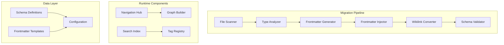

# Technical Design: [[FEAT-014]] Obsidian Integration

## Architecture Overview

### Component Structure


## Implementation Modules

### 1. Schema Definition Module

#### Location: `/workflows/helix/obsidian/schemas/`

```yaml
# base-schema.yaml
base:
  required:
    - title
    - type
    - tags
    - created
    - updated
  optional:
    - aliases
    - related
    - status
    - version

# type-specific schemas extend base
phase:
  extends: base
  required:
    - phase_id
    - phase_number
    - gates
    - artifacts
  optional:
    - next_phase
    - previous_phase

artifact:
  extends: base
  required:
    - artifact_category
    - phase
    - complexity
  optional:
    - prerequisites
    - outputs
    - time_estimate
    - skills_required
```

### 2. File Type Detection

```go
// cli/internal/obsidian/detector.go

type FileType string

const (
    FileTypePhase       FileType = "phase"
    FileTypeArtifact    FileType = "artifact"
    FileTypeCoordinator FileType = "coordinator"
    FileTypeExample     FileType = "example"
    FileTypeTemplate    FileType = "template"
    FileTypePrompt      FileType = "prompt"
)

func DetectFileType(path string) (FileType, error) {
    // Detection logic based on:
    // 1. Directory structure
    // 2. Filename patterns
    // 3. Content analysis
}
```

### 3. Frontmatter Generation

```go
// cli/internal/obsidian/frontmatter.go

type FrontmatterGenerator struct {
    schemas map[FileType]Schema
    config  *Config
}

func (g *FrontmatterGenerator) Generate(
    file *MarkdownFile,
    fileType FileType,
) (*Frontmatter, error) {
    schema := g.schemas[fileType]

    fm := &Frontmatter{
        Title: extractTitle(file),
        Type:  string(fileType),
        Tags:  generateTags(file, fileType),
        Created: time.Now(),
        Updated: time.Now(),
    }

    // Type-specific generation
    switch fileType {
    case FileTypePhase:
        addPhaseMetadata(fm, file)
    case FileTypeArtifact:
        addArtifactMetadata(fm, file)
    }

    return fm, nil
}
```

### 4. Wikilink Conversion

```go
// cli/internal/obsidian/links.go

type LinkConverter struct {
    fileIndex map[string]*MarkdownFile
    aliases   map[string]string
}

func (c *LinkConverter) ConvertToWikilinks(content string) string {
    // Pattern matching for various link types:
    // 1. Relative markdown links: [text](../path/file.md)
    // 2. Anchor links: [text](#section)
    // 3. External links: [text](https://...)

    patterns := []LinkPattern{
        RelativeMarkdownLink,
        AnchorLink,
        PhaseReference,
        ArtifactReference,
    }

    for _, pattern := range patterns {
        content = pattern.Convert(content, c.fileIndex)
    }

    return content
}
```

### 5. Navigation Hub Generator

```go
// cli/internal/obsidian/navigation.go

type NavigationHub struct {
    Phases    []*PhaseInfo
    Artifacts map[string][]*ArtifactInfo
    Tags      *TagTree
}

func GenerateNavigationHub(files []*MarkdownFile) (*NavigationHub, error) {
    hub := &NavigationHub{
        Artifacts: make(map[string][]*ArtifactInfo),
        Tags:      NewTagTree(),
    }

    for _, file := range files {
        // Extract and organize information
        if file.IsPhase() {
            hub.Phases = append(hub.Phases, extractPhaseInfo(file))
        }
        if file.IsArtifact() {
            category := file.GetArtifactCategory()
            hub.Artifacts[category] = append(
                hub.Artifacts[category],
                extractArtifactInfo(file),
            )
        }
        hub.Tags.Add(file.GetTags()...)
    }

    return hub, nil
}
```

## Migration Strategy

### Phase 1: Analysis & Backup
```bash
#!/bin/bash
# 1. Create backup
cp -r workflows/helix workflows/helix.backup

# 2. Analyze file structure
find workflows/helix -name "*.md" | \
  xargs -I {} echo "Analyzing: {}" | \
  tee migration-analysis.log
```

### Phase 2: Automated Migration
```go
// cli/cmd/obsidian.go

var obsidianMigrateCmd = &cobra.Command{
    Use:   "migrate",
    Short: "Migrate HELIX workflow to Obsidian format",
    RunE: func(cmd *cobra.Command, args []string) error {
        migrator := obsidian.NewMigrator()

        // Step 1: Scan files
        files, err := migrator.ScanFiles("workflows/helix")

        // Step 2: Generate frontmatter
        for _, file := range files {
            fm, err := migrator.GenerateFrontmatter(file)
            file.SetFrontmatter(fm)
        }

        // Step 3: Convert links
        for _, file := range files {
            content := migrator.ConvertLinks(file.Content)
            file.SetContent(content)
        }

        // Step 4: Write files
        for _, file := range files {
            err := file.Save()
        }

        // Step 5: Generate navigation
        hub := migrator.GenerateNavigationHub(files)
        hub.Save("workflows/helix/NAVIGATOR.md")

        return nil
    },
}
```

### Phase 3: Validation
```go
// cli/internal/obsidian/validator.go

type Validator struct {
    schemas map[FileType]Schema
    rules   []ValidationRule
}

func (v *Validator) ValidateFile(file *MarkdownFile) []ValidationError {
    errors := []ValidationError{}

    // Check frontmatter schema
    if !v.validateSchema(file.Frontmatter, file.Type) {
        errors = append(errors, SchemaValidationError{})
    }

    // Check wikilinks resolve
    for _, link := range file.ExtractWikilinks() {
        if !v.linkExists(link) {
            errors = append(errors, BrokenLinkError{link})
        }
    }

    // Check tag format
    for _, tag := range file.Frontmatter.Tags {
        if !v.isValidTag(tag) {
            errors = append(errors, InvalidTagError{tag})
        }
    }

    return errors
}
```

## API Contracts

### CLI Commands
```bash
# Migrate HELIX to Obsidian format
ddx obsidian migrate [--dry-run] [--validate-only]

# Validate Obsidian format
ddx obsidian validate [path]

# Generate navigation hub
ddx obsidian nav generate

# Update frontmatter
ddx obsidian frontmatter update [file]

# Convert links in file
ddx obsidian links convert [file]
```

### Configuration Schema
```yaml
# .ddx-obsidian.yml
obsidian:
  enabled: true
  features:
    frontmatter: true
    wikilinks: true
    tags: true
    navigation_hub: true

  schemas:
    custom_fields:
      - name: project_id
        type: string
        required: false

  link_conversion:
    preserve_external: true
    use_aliases: true

  tag_format:
    separator: "/"
    prefix: "helix"
    hierarchical: true

  navigation:
    auto_generate: true
    location: "NAVIGATOR.md"
    include_dataview: true
```

## Data Models

### Frontmatter Structure
```typescript
interface Frontmatter {
  // Required base fields
  title: string;
  type: string;
  tags: string[];
  created: Date;
  updated: Date;

  // Optional base fields
  aliases?: string[];
  related?: string[];
  status?: string;
  version?: string;

  // Type-specific fields
  [key: string]: any;
}

interface PhaseFrontmatter extends Frontmatter {
  phase_id: string;
  phase_number: number;
  next_phase?: string;
  previous_phase?: string;
  gates: {
    entry: string[];
    exit: string[];
  };
  artifacts: {
    required: string[];
    optional: string[];
  };
}

interface ArtifactFrontmatter extends Frontmatter {
  artifact_category: string;
  phase: string;
  complexity: 'simple' | 'moderate' | 'complex';
  prerequisites?: string[];
  outputs?: string[];
  time_estimate?: string;
  skills_required?: string[];
}
```

### Link Types
```typescript
enum LinkType {
  WIKILINK = 'wikilink',           // [[Page Name]]
  ALIASED = 'aliased',              // [[Page|Alias]]
  HEADING = 'heading',              // [[Page#Heading]]
  BLOCK = 'block',                  // [[Page^block-id]]
  EMBED = 'embed',                  // ![[Page]]
}

interface ParsedLink {
  type: LinkType;
  target: string;
  alias?: string;
  heading?: string;
  blockId?: string;
  isEmbed: boolean;
}
```

## Testing Strategy

### Unit Tests
```go
// cli/internal/obsidian/frontmatter_test.go

func TestFrontmatterGeneration(t *testing.T) {
    tests := []struct {
        name     string
        file     *MarkdownFile
        fileType FileType
        want     *Frontmatter
    }{
        {
            name: "Phase README generates correct frontmatter",
            file: loadTestFile("phase-readme.md"),
            fileType: FileTypePhase,
            want: &Frontmatter{
                Title: "Frame Phase",
                Type: "phase",
                // ... expected fields
            },
        },
    }
}

func TestWikilinkConversion(t *testing.T) {
    tests := []struct {
        input    string
        expected string
    }{
        {
            input:    "[Design Phase](../02-design/README.md)",
            expected: "[[Design Phase]]",
        },
        {
            input:    "[feature spec](./artifacts/feature-specification/template.md)",
            expected: "[[Feature Specification Template|feature spec]]",
        },
    }
}
```

### Integration Tests
```go
func TestEndToEndMigration(t *testing.T) {
    // 1. Set up test directory with sample files
    // 2. Run migration
    // 3. Validate all files have frontmatter
    // 4. Validate all links converted
    // 5. Validate navigation hub generated
    // 6. Validate graph connectivity
}
```

### Validation Tests
- Schema compliance for all file types
- Wikilink resolution (no broken links)
- Tag hierarchy correctness
- Navigation hub completeness
- Backward compatibility with standard markdown

## Rollback Plan

```bash
#!/bin/bash
# rollback-obsidian.sh

# 1. Restore from backup
if [ -d "workflows/helix.backup" ]; then
    rm -rf workflows/helix
    mv workflows/helix.backup workflows/helix
    echo "Rollback complete"
else
    echo "No backup found"
    exit 1
fi

# 2. Alternative: Strip frontmatter only
find workflows/helix -name "*.md" -exec sed -i '/^---$/,/^---$/d' {} \;

# 3. Alternative: Convert wikilinks back
ddx obsidian links revert --format markdown
```

## Performance Considerations

- File scanning: Use goroutines for parallel processing
- Frontmatter generation: Cache schemas in memory
- Link conversion: Build file index once, reuse for all files
- Validation: Batch validation with progress reporting
- Large repositories: Process in chunks of 100 files

## Security Considerations

- Validate YAML to prevent injection
- Sanitize file paths
- Limit file system access to project directory
- Validate external links before conversion
- Preserve file permissions during migration

## Monitoring & Metrics

Track migration success:
- Files processed
- Frontmatter added
- Links converted
- Validation errors
- Processing time

Post-migration metrics:
- Navigation speed improvement
- Search effectiveness
- User adoption rate
- Error rate reduction