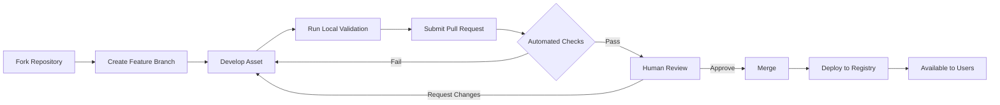

# ADR-008: Community Contribution and Review Process

**Date**: 2025-01-14
**Status**: Proposed
**Deciders**: DDX Development Team
**Technical Story**: Design the architecture for community contributions, quality assurance, and the review process for shared assets

## Context

### Problem Statement
DDX needs a robust contribution system that:
- Enables easy sharing of templates, patterns, and improvements
- Maintains quality standards across contributions
- Provides clear attribution and licensing
- Supports automated validation and testing
- Facilitates collaborative review and iteration
- Scales from individual contributors to organizations
- Prevents malicious or low-quality content

### Forces at Play
- **Ease of Contribution**: Low friction for sharing improvements
- **Quality Control**: Maintain high standards for shared assets
- **Attribution**: Proper credit for contributors
- **Security**: Prevent malicious contributions
- **Scalability**: Handle growth from 10 to 10,000 contributors
- **Discovery**: Make contributions easily findable
- **Versioning**: Track changes and enable rollbacks

### Constraints
- Must work with git-based workflows
- Cannot require specialized infrastructure
- Should support offline contribution preparation
- Must handle intellectual property concerns
- Need to support private/organizational contributions
- Must integrate with existing CI/CD systems

## Decision

### Chosen Approach
Implement a multi-tier contribution architecture:
1. **Git-based contribution flow** using pull requests
2. **Automated quality gates** with CI/CD validation
3. **Tiered review process** based on contribution scope
4. **Reputation system** for trusted contributors
5. **Modular asset structure** for composability

### Contribution Tiers

```
┌─────────────────────────────────────┐
│         Tier 3: Core                │
│    (Core team, major features)      │
├─────────────────────────────────────┤
│         Tier 2: Trusted             │
│    (Verified contributors)          │
├─────────────────────────────────────┤
│         Tier 1: Community           │
│    (All contributors)               │
└─────────────────────────────────────┘
```

#### Tier 1: Community Contributions
- Open to all contributors
- Requires full review process
- Automated validation required
- Two approvals needed
- 7-day review period

#### Tier 2: Trusted Contributors
- Earned after 5 approved contributions
- Simplified review process
- One approval needed
- 3-day review period
- Can review Tier 1 contributions

#### Tier 3: Core Contributors
- Core team members
- Direct commit access for urgent fixes
- Self-review for minor changes
- Set quality standards
- Manage trusted contributor list

### Contribution Workflow



### Quality Gates

#### Automated Validation
```yaml
validation:
  syntax:
    - YAML lint
    - Markdown lint
    - Template syntax check
    - Starlark validation

  structure:
    - Required files present
    - Directory structure compliance
    - Naming conventions
    - File size limits

  content:
    - No secrets or credentials
    - No PII or sensitive data
    - License compatibility
    - Documentation completeness

  security:
    - Virus/malware scan
    - Dependency vulnerability check
    - Code injection detection
    - Path traversal prevention

  quality:
    - Test coverage (if applicable)
    - Example validation
    - Performance benchmarks
    - Complexity metrics
```

#### Human Review Checklist
```markdown
- [ ] Clear purpose and use case
- [ ] Follows DDX patterns and conventions
- [ ] Well-documented with examples
- [ ] No duplication of existing assets
- [ ] Appropriate categorization/tags
- [ ] Works across target platforms
- [ ] Includes tests where applicable
- [ ] Performance acceptable
- [ ] Security reviewed
- [ ] License compatible
```

### Asset Metadata Standard
```yaml
# asset-metadata.yml
metadata:
  name: "Asset Name"
  version: "1.0.0"
  description: "Brief description"
  authors:
    - name: "John Doe"
      email: "john@example.com"
      github: "@johndoe"
  license: "MIT"
  tags:
    - category: "web"
    - language: "typescript"
    - framework: "react"
  compatibility:
    ddx_version: ">=1.0.0"
    platforms: ["linux", "darwin", "windows"]
  dependencies:
    - name: "other-asset"
      version: ">=2.0.0"
  quality:
    tested: true
    examples: true
    benchmarked: false
  support:
    documentation: "https://..."
    issues: "https://..."
    discussions: "https://..."
```

### Reputation System
```go
type ContributorReputation struct {
    GitHubUser      string
    Contributions   int
    Accepted        int
    Rejected        int
    QualityScore    float64  // 0-100
    TrustLevel      int      // 1-3
    Specializations []string // Areas of expertise
    LastActive      time.Time
}

// Quality Score Calculation
QualityScore = (
    0.4 * AcceptanceRate +
    0.3 * ReviewScore +
    0.2 * CommunityVotes +
    0.1 * ResponseTime
)
```

### Rationale
- **Git-based**: Leverages existing developer workflows
- **Automated Gates**: Catches issues early, reduces review burden
- **Tiered System**: Balances quality with contribution velocity
- **Reputation**: Incentivizes quality contributions
- **Modular**: Enables composition and reuse

## Alternatives Considered

### Option 1: Centralized Registry Service
**Description**: Build a web-based registry like npm or Docker Hub

**Pros**:
- Rich web interface
- Advanced search and discovery
- Download statistics
- User ratings and reviews
- API for programmatic access

**Cons**:
- Requires hosting infrastructure
- Ongoing maintenance costs
- Single point of failure
- Separate authentication system
- Not git-native

**Why rejected**: Infrastructure complexity and ongoing costs conflict with simplicity goals

### Option 2: Wiki-style Collaborative Editing
**Description**: Allow direct editing of shared assets wiki-style

**Pros**:
- Very low friction
- Immediate updates
- Collaborative editing
- Version history
- Simple implementation

**Cons**:
- Quality control challenges
- Vandalism risk
- No code review process
- Attribution difficulties
- Merge conflict issues

**Why rejected**: Insufficient quality control for code assets

### Option 3: Email/Forum Based Submission
**Description**: Submit contributions via mailing list or forum

**Pros**:
- Very simple process
- No git knowledge required
- Discussion-oriented
- Low technical barrier

**Cons**:
- Manual processing required
- No automation possible
- Difficult to track versions
- Poor integration with tools
- Doesn't scale

**Why rejected**: Cannot scale and lacks automation

### Option 4: Blockchain-based Registry
**Description**: Use blockchain for decentralized asset registry

**Pros**:
- Fully decentralized
- Immutable history
- Built-in attribution
- No central authority
- Censorship resistant

**Cons**:
- Complex implementation
- Poor performance
- High resource usage
- Unclear legal status
- Over-engineered for use case

**Why rejected**: Unnecessary complexity and poor performance

### Option 5: Package Manager Integration
**Description**: Distribute via npm, pip, cargo, etc.

**Pros**:
- Existing infrastructure
- Familiar to developers
- Good versioning support
- Dependency management
- Wide reach

**Cons**:
- Language-specific silos
- Not git-native
- Publishing overhead
- Multiple registries needed
- Format constraints

**Why rejected**: Creates language silos and publishing friction

## Consequences

### Positive Consequences
- **Quality Assurance**: Multi-layer validation ensures quality
- **Scalability**: Can grow with community
- **Attribution**: Clear contribution tracking
- **Motivation**: Reputation system encourages quality
- **Security**: Multiple checks prevent malicious content
- **Flexibility**: Supports various contribution types

### Negative Consequences
- **Initial Friction**: First-time contributors face learning curve
- **Review Bottleneck**: Human review can slow acceptance
- **Complexity**: Multiple systems to maintain
- **Rejection Risk**: May discourage new contributors
- **Maintenance**: Ongoing curation required

### Neutral Consequences
- **Git Dependency**: Requires git knowledge
- **English-centric**: Documentation in English
- **Public Process**: Contributions visible to all
- **Time Investment**: Quality contributions take time

## Implementation

### Required Changes
1. Set up GitHub Actions for validation
2. Create contribution templates
3. Build reputation tracking system
4. Implement automated quality checks
5. Design review assignment system
6. Create contributor documentation
7. Build asset registry/index
8. Develop metrics dashboard

### Contribution Lifecycle
```
1. Preparation
   - Fork repository
   - Set up development environment
   - Review contribution guidelines
   - Check existing assets

2. Development
   - Create asset following templates
   - Write documentation
   - Add examples
   - Run local validation

3. Submission
   - Create pull request
   - Fill out PR template
   - Respond to CI feedback
   - Address review comments

4. Review
   - Automated validation
   - Peer review
   - Maintainer approval
   - Security check

5. Integration
   - Merge to main
   - Update registry
   - Deploy to CDN
   - Notify subscribers

6. Maintenance
   - Monitor usage
   - Address issues
   - Accept improvements
   - Version updates
```

### Success Metrics
- **Contribution Rate**: > 10 PRs/month initially, > 50/month at scale
- **Acceptance Rate**: > 70% of contributions accepted
- **Review Time**: < 7 days for Tier 1, < 3 days for Tier 2
- **Quality Score**: Average > 80/100
- **Contributor Retention**: > 50% contribute again
- **Asset Reuse**: > 60% of assets used by multiple projects

## Compliance

### Security Requirements
- Automated security scanning
- Secret detection and prevention
- Malware scanning
- Vulnerability assessment
- Security review for sensitive assets

### Legal Requirements
- License compatibility verification
- Copyright attribution
- Contributor License Agreement (CLA)
- Export control compliance
- GDPR compliance for contributor data

### Quality Requirements
- Automated testing where applicable
- Documentation standards
- Example requirements
- Performance benchmarks
- Cross-platform validation

## Monitoring and Review

### Key Indicators to Watch
- Contribution velocity
- Review queue length
- Rejection reasons
- Contributor satisfaction
- Asset quality trends
- Security incident rate

### Review Date
Q3 2025 - After 6 months of contributions

### Review Triggers
- Contribution rate exceeds capacity
- Quality scores drop below 75%
- Security incident occurs
- Major community feedback
- Legal concerns raised

## Related Decisions

### Dependencies
- ADR-001: Defines asset types to contribute
- ADR-002: Git subtree affects contribution flow
- ADR-004: Starlark validators for quality checks
- ADR-005: Configuration for contribution settings

### Influenced By
- Open source best practices
- GitHub flow conventions
- Kubernetes contribution model
- npm registry patterns

### Influences
- Documentation standards
- Asset structure requirements
- Testing requirements
- Community governance model

## References

### Documentation
- [GitHub Flow](https://guides.github.com/introduction/flow/)
- [Conventional Commits](https://www.conventionalcommits.org/)
- [Contributor Covenant](https://www.contributor-covenant.org/)
- [OpenSSF Best Practices](https://bestpractices.coreinfrastructure.org/)

### External Resources
- [Kubernetes Contribution Guide](https://kubernetes.io/docs/contribute/)
- [npm Contributing Guidelines](https://docs.npmjs.com/packages-and-modules/contributing)
- [Apache Software Foundation Process](https://www.apache.org/foundation/how-it-works.html)

### Discussion History
- Community contribution workshop
- Quality standards definition
- Security review requirements
- Legal review of CLA needs

## Notes

The contribution system aligns with DDX's medical metaphor - like peer-reviewed medical research, contributions undergo rigorous review before being accepted into the body of knowledge. The reputation system mirrors medical credentials, where expertise is earned through demonstrated competence.

Key insight: By automating the mechanical aspects of review while preserving human judgment for quality assessment, we can scale the contribution process without sacrificing standards.

Implementation tip: Start with strict quality gates and relax them based on data rather than starting loose and tightening later. It's easier to reduce friction than to raise standards after the fact.

The tiered system mirrors medical publication - from general submissions (Tier 1) to peer review (Tier 2) to editorial board (Tier 3), ensuring appropriate scrutiny at each level.

---

**Last Updated**: 2025-01-14
**Next Review**: 2025-07-14