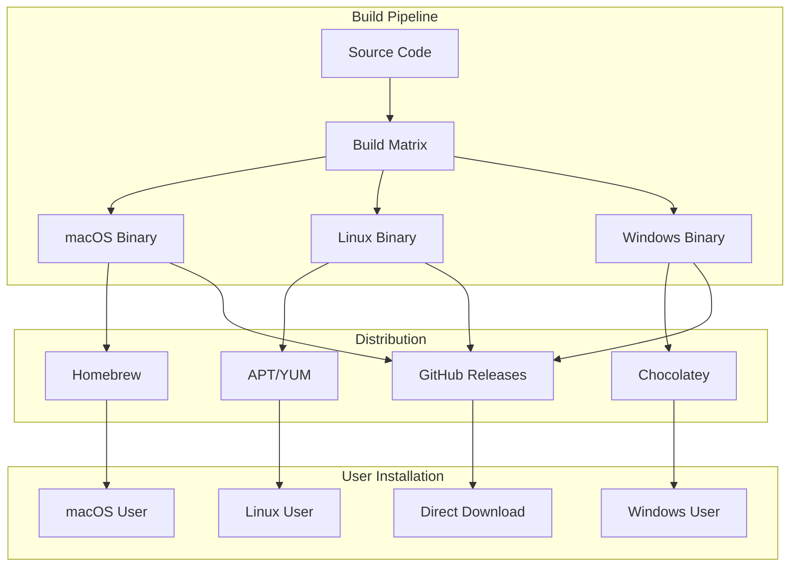

# DDx Deployment Strategy

> **Last Updated**: 2025-01-20
> **Status**: Active
> **Phase**: Design

## Overview

This document defines the deployment strategy for DDx, covering distribution methods, installation processes, update mechanisms, and platform-specific considerations. DDx is distributed as a standalone CLI binary with supporting library resources.

## Distribution Channels

### 1. Package Managers

#### Homebrew (macOS/Linux)
**Repository**: `homebrew-ddx` tap
**Installation**:
```bash
brew tap ddx-tools/ddx
brew install ddx
```
**Update**: `brew upgrade ddx`
**Benefits**:
- Automatic dependency management
- Simple updates
- Wide adoption on macOS

#### APT/YUM (Linux)
**Repository**: PPA/COPR repositories
**Installation**:
```bash
# Ubuntu/Debian
sudo add-apt-repository ppa:ddx-tools/ddx
sudo apt update && sudo apt install ddx

# RHEL/Fedora
sudo dnf copr enable ddx-tools/ddx
sudo dnf install ddx
```
**Benefits**:
- Native package management
- System-wide installation
- Automatic updates via system

#### Chocolatey (Windows)
**Repository**: Chocolatey Community Repository
**Installation**:
```powershell
choco install ddx
```
**Benefits**:
- Windows-native package manager
- PowerShell integration
- Corporate-friendly

### 2. Direct Download

#### GitHub Releases
**URL**: `https://github.com/ddx-tools/ddx/releases`
**Artifacts**:
- `ddx-darwin-amd64.tar.gz` (macOS Intel)
- `ddx-darwin-arm64.tar.gz` (macOS Apple Silicon)
- `ddx-linux-amd64.tar.gz` (Linux x64)
- `ddx-linux-arm64.tar.gz` (Linux ARM)
- `ddx-windows-amd64.zip` (Windows x64)

**Installation Script**:
```bash
#!/bin/bash
# One-line installer
curl -sSL https://get.ddx.tools | bash
```

### 3. Source Installation

#### Go Install
```bash
go install github.com/ddx-tools/ddx/cli@latest
```
**Requirements**: Go 1.21+
**Benefits**: Latest development version

#### Build from Source
```bash
git clone https://github.com/ddx-tools/ddx
cd ddx/cli
make install
```
**Benefits**: Customization, contributing

## Deployment Architecture

### Binary Distribution Model



### Component Deployment

```yaml
# Deployment structure
ddx/
├── bin/
│   └── ddx                    # Main binary (15-20MB)
├── lib/
│   └── ddx/
│       └── library/           # Resource library (via git)
└── config/
    └── ddx/
        ├── config.yml         # Global configuration
        └── cache/             # Local cache
```

## Installation Process

### First-Time Installation

1. **Binary Installation**
   - Download appropriate binary for platform
   - Place in PATH location
   - Set executable permissions (Unix)

2. **Environment Setup**
   - Create `~/.ddx/` directory
   - Initialize global configuration
   - Set up library path

3. **Library Bootstrap**
   - Clone DDx library repository
   - Or use embedded resources
   - Cache registry data

### Post-Installation

```bash
# Verify installation
ddx version

# Initialize shell completions
ddx completion bash >> ~/.bashrc
ddx completion zsh >> ~/.zshrc
ddx completion fish > ~/.config/fish/completions/ddx.fish

# Verify library access
ddx list templates
```

## Update Mechanisms

### Binary Updates

#### Self-Update Command
```bash
ddx self-update [--version=X.Y.Z] [--force]
```
- Checks for new versions
- Downloads appropriate binary
- Replaces current binary
- Preserves configuration

#### Package Manager Updates
```bash
# Homebrew
brew upgrade ddx

# APT
sudo apt update && sudo apt upgrade ddx

# Chocolatey
choco upgrade ddx
```

### Library Updates

#### Automatic Sync
```bash
ddx update
```
- Pulls latest library resources
- Updates git subtree in projects
- Preserves local modifications

#### Manual Sync
```bash
cd .ddx
git pull upstream main
```

## Platform-Specific Considerations

### macOS

#### Code Signing
- Binaries signed with Apple Developer ID
- Notarized for Gatekeeper approval
- Universal binary for Intel/ARM

#### Installation Locations
- Homebrew: `/usr/local/bin/ddx` (Intel)
- Homebrew: `/opt/homebrew/bin/ddx` (ARM)
- Manual: `/usr/local/bin/ddx`

### Linux

#### Distributions Supported
- Ubuntu 20.04+ (amd64, arm64)
- Debian 10+ (amd64, arm64)
- RHEL/CentOS 8+ (amd64, arm64)
- Fedora 34+ (amd64, arm64)
- Alpine 3.14+ (amd64, arm64)

#### Installation Locations
- System: `/usr/bin/ddx`
- User: `~/.local/bin/ddx`

### Windows

#### Requirements
- Windows 10 version 1809+
- Windows 11
- PowerShell 5.1+

#### Installation Locations
- Chocolatey: `C:\ProgramData\chocolatey\bin\ddx.exe`
- Manual: `C:\Program Files\ddx\ddx.exe`
- User: `%LOCALAPPDATA%\ddx\ddx.exe`

## CI/CD Pipeline

### Build Pipeline

```yaml
name: Release

on:
  push:
    tags: ['v*']

jobs:
  build:
    strategy:
      matrix:
        os: [ubuntu-latest, macos-latest, windows-latest]
        arch: [amd64, arm64]

    steps:
      - uses: actions/checkout@v3
      - uses: actions/setup-go@v4
        with:
          go-version: '1.21'

      - name: Build
        run: |
          GOOS=${{ matrix.os }} GOARCH=${{ matrix.arch }} \
          go build -ldflags "-X main.version=${{ github.ref_name }}" \
          -o ddx-${{ matrix.os }}-${{ matrix.arch }}

      - name: Upload artifact
        uses: actions/upload-artifact@v3
```

### Release Process

1. **Version Tagging**
   ```bash
   git tag -a v1.2.3 -m "Release v1.2.3"
   git push origin v1.2.3
   ```

2. **Automated Build**
   - CI builds for all platforms
   - Runs test suite
   - Generates checksums

3. **Package Creation**
   - Create platform packages
   - Sign binaries
   - Generate release notes

4. **Distribution**
   - Upload to GitHub Releases
   - Update package repositories
   - Update documentation

## Rollback Strategy

### Binary Rollback

```bash
# Via package manager
brew switch ddx 1.2.2
apt install ddx=1.2.2
choco install ddx --version 1.2.2

# Manual
ddx self-update --version=1.2.2
```

### Library Rollback

```bash
# In project
cd .ddx
git checkout <previous-commit>

# Global
ddx update --reset --version=1.2.2
```

## Monitoring & Telemetry

### Usage Metrics (Opt-in)
- Installation count via package managers
- GitHub release download statistics
- No runtime telemetry collected

### Error Reporting (Opt-in)
- Crash reports via GitHub Issues
- Anonymous error statistics
- Performance metrics

## Security Considerations

### Binary Security
- All binaries signed
- SHA256 checksums published
- Reproducible builds
- No auto-update without consent

### Update Security
- HTTPS only for downloads
- Signature verification
- Checksum validation
- Rollback capability

## Disaster Recovery

### Backup Strategy
- Configuration backed up before updates
- Previous binary kept as `.ddx.backup`
- Git history preserves library state

### Recovery Process
1. Restore previous binary from backup
2. Restore configuration from backup
3. Reset library to known good state
4. Re-apply local modifications

## Performance Targets

### Installation
- Download time: < 30 seconds (20MB binary)
- Installation time: < 10 seconds
- First run: < 1 second

### Updates
- Check time: < 2 seconds
- Download time: < 30 seconds
- Apply time: < 5 seconds

## Support Matrix

| Platform | Architecture | Min Version | Package Manager | Direct Download |
|----------|-------------|------------|-----------------|-----------------|
| macOS | Intel | 10.15+ | ✅ Homebrew | ✅ |
| macOS | Apple Silicon | 11.0+ | ✅ Homebrew | ✅ |
| Linux | amd64 | Kernel 3.10+ | ✅ APT/YUM | ✅ |
| Linux | arm64 | Kernel 3.10+ | ✅ APT/YUM | ✅ |
| Windows | amd64 | Win 10 1809+ | ✅ Chocolatey | ✅ |

## Related Documentation

- [[installation-guide]] - User installation guide
- [[development/release-process]] - Release procedures
- [[security-architecture]] - Security considerations
- [[architecture]] - System architecture