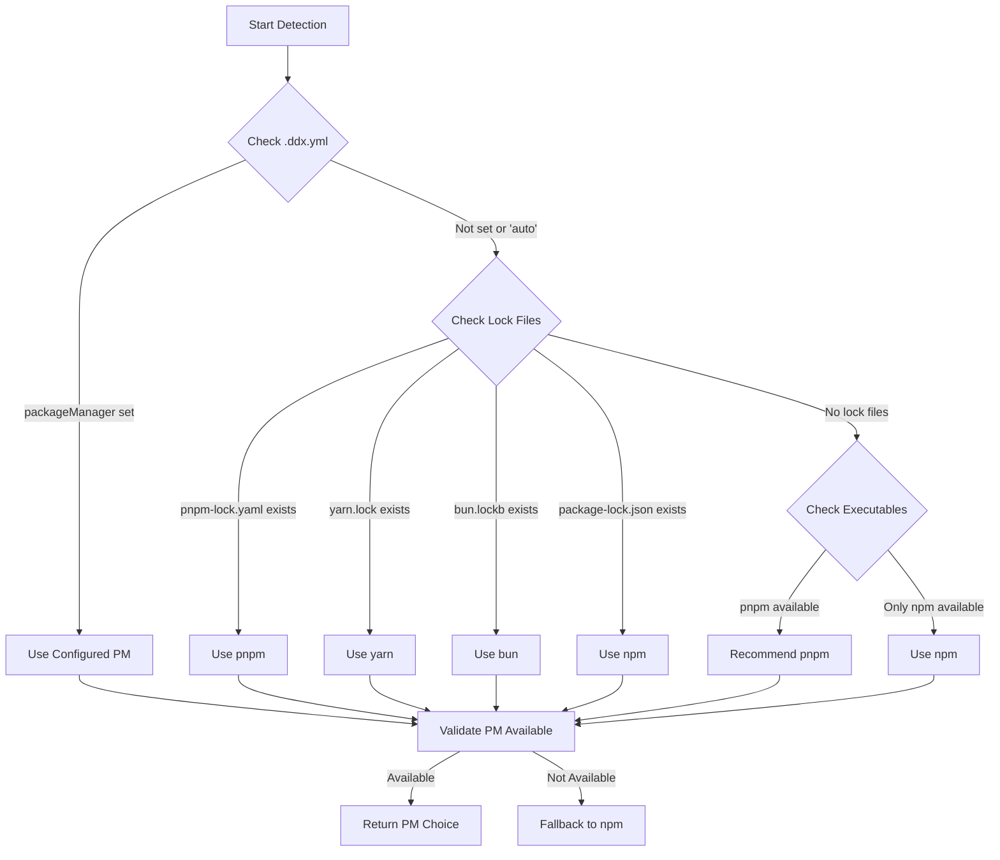

# Package Manager Detection and Selection Logic

> **Last Updated**: 2025-09-19
> **Status**: Design Phase
> **Owner**: DDx Team

## Overview

This document defines the logic for detecting and selecting the appropriate package manager for MCP server dependency management in DDx projects.

## Detection Priority Order

DDx follows a priority-based approach to determine which package manager to use:

1. **Explicit Configuration** (highest priority)
2. **Lock File Detection**
3. **Executable Availability**
4. **Default Fallback** (lowest priority)

## Detection Logic Flow



## Detection Implementation

### 1. Configuration Check

```yaml
# .ddx.yml
packageManager: auto    # Options: auto, npm, pnpm, yarn, bun
```

### 2. Lock File Detection

| Lock File | Package Manager | Priority |
|-----------|----------------|----------|
| `pnpm-lock.yaml` | pnpm | 1 (highest) |
| `yarn.lock` | yarn | 2 |
| `bun.lockb` | bun | 3 |
| `package-lock.json` | npm | 4 |
| `npm-shrinkwrap.json` | npm | 5 (lowest) |

### 3. Executable Detection

Check for package manager availability in this order:

```go
type ExecutableCheck struct {
    Command     string
    TestArgs    []string
    MinVersion  string
}

var ExecutableChecks = []ExecutableCheck{
    {Command: "pnpm", TestArgs: []string{"--version"}, MinVersion: "6.0.0"},
    {Command: "yarn", TestArgs: []string{"--version"}, MinVersion: "1.22.0"},
    {Command: "bun", TestArgs: []string{"--version"}, MinVersion: "1.0.0"},
    {Command: "npm", TestArgs: []string{"--version"}, MinVersion: "6.0.0"},
}
```

## Package Manager Profiles

### npm Profile
```go
NPMProfile = PackageManagerProfile{
    Type:           PackageManagerNPM,
    LockFile:       "package-lock.json",
    InstallCommand: "npm",
    InstallArgs:    []string{"install", "--save-dev"},
    RemoveCommand:  "npm",
    RemoveArgs:     []string{"uninstall"},
    ExecuteCommand: "npx",
    ExecuteArgs:    []string{},
    CIInstallArgs:  []string{"ci"},
}
```

### pnpm Profile
```go
PNPMProfile = PackageManagerProfile{
    Type:           PackageManagerPNPM,
    LockFile:       "pnpm-lock.yaml",
    InstallCommand: "pnpm",
    InstallArgs:    []string{"add", "--save-dev"},
    RemoveCommand:  "pnpm",
    RemoveArgs:     []string{"remove"},
    ExecuteCommand: "pnpm",
    ExecuteArgs:    []string{"exec"},
    CIInstallArgs:  []string{"install", "--frozen-lockfile"},
}
```

### yarn Profile
```go
YarnProfile = PackageManagerProfile{
    Type:           PackageManagerYarn,
    LockFile:       "yarn.lock",
    InstallCommand: "yarn",
    InstallArgs:    []string{"add", "--dev"},
    RemoveCommand:  "yarn",
    RemoveArgs:     []string{"remove"},
    ExecuteCommand: "yarn",
    ExecuteArgs:    []string{"dlx"},
    CIInstallArgs:  []string{"install", "--frozen-lockfile"},
}
```

### bun Profile
```go
BunProfile = PackageManagerProfile{
    Type:           PackageManagerBun,
    LockFile:       "bun.lockb",
    InstallCommand: "bun",
    InstallArgs:    []string{"add", "--dev"},
    RemoveCommand:  "bun",
    RemoveArgs:     []string{"remove"},
    ExecuteCommand: "bunx",
    ExecuteArgs:    []string{},
    CIInstallArgs:  []string{"install", "--frozen-lockfile"},
}
```

## Claude Configuration Adaptation

Based on the detected package manager, generate appropriate Claude configurations:

### npm Configuration
```json
{
  "command": "npx",
  "args": ["@modelcontextprotocol/server-filesystem", "$PWD"]
}
```

### pnpm Configuration
```json
{
  "command": "pnpm",
  "args": ["exec", "@modelcontextprotocol/server-filesystem", "$PWD"]
}
```

### yarn Configuration
```json
{
  "command": "yarn",
  "args": ["dlx", "@modelcontextprotocol/server-filesystem", "$PWD"]
}
```

### bun Configuration
```json
{
  "command": "bunx",
  "args": ["@modelcontextprotocol/server-filesystem", "$PWD"]
}
```

## Recommendation Logic

When no lock file exists and multiple package managers are available:

### Recommendation Priority

1. **pnpm** - Recommended for:
   - Disk space efficiency
   - Faster installations
   - Strict dependency resolution
   - Monorepo support

2. **yarn** - Recommended when:
   - Team prefers yarn
   - Existing yarn workspaces
   - Need Plug'n'Play support

3. **bun** - Recommended when:
   - Maximum speed required
   - Team uses bun runtime
   - Experimental features acceptable

4. **npm** - Default fallback:
   - Universal availability
   - Maximum compatibility
   - Simplest setup

## User Communication

### First-time Detection Message

```
🔍 Detecting package manager...
✨ No lock file found. Available options:
  - pnpm (recommended - efficient disk usage)
  - yarn (fast, good caching)
  - npm (default, universal)

💡 Using: pnpm
   To override: Set 'packageManager' in .ddx.yml
```

### Lock File Detected Message

```
🔍 Detected yarn from yarn.lock
✅ Using yarn for MCP server management
```

### Configuration Override Message

```
📋 Using npm (configured in .ddx.yml)
   Auto-detection overridden by configuration
```

## Migration Scenarios

### Switching Package Managers

When a project wants to switch package managers:

1. **Remove old lock file and node_modules**
2. **Update .ddx.yml configuration**
3. **Run `ddx mcp reinstall`**
4. **Commit new lock file**

### Example Migration Commands

```bash
# Migrate from npm to pnpm
rm -rf node_modules package-lock.json
echo "packageManager: pnpm" >> .ddx.yml
ddx mcp reinstall
git add pnpm-lock.yaml .ddx.yml
git commit -m "Migrate to pnpm for better efficiency"
```

## Error Handling

### Package Manager Not Found

```go
if !IsExecutableAvailable(selectedPM) {
    // Try fallback chain
    for _, fallback := range []PackageManagerType{NPM, PNPM, Yarn} {
        if IsExecutableAvailable(fallback) {
            log.Warn("Selected %s not available, falling back to %s", selectedPM, fallback)
            return fallback, nil
        }
    }
    return "", ErrNoPackageManagerFound
}
```

### Version Incompatibility

```go
if version < minVersion {
    return fmt.Errorf("%s version %s is below minimum required %s", pm, version, minVersion)
}
```

## Testing Strategy

### Test Cases

1. **No lock file, multiple PMs available** → Should recommend pnpm
2. **npm lock file exists** → Should use npm
3. **Configured as yarn, but pnpm lock exists** → Should use yarn (config wins)
4. **Bun configured but not installed** → Should fallback to npm with warning
5. **Clean project, only npm available** → Should use npm

### Mock Testing

```go
type MockFileSystem struct {
    Files map[string]bool
}

func (m *MockFileSystem) FileExists(path string) bool {
    return m.Files[path]
}

type MockExecutor struct {
    Available map[string]bool
}

func (m *MockExecutor) IsAvailable(cmd string) bool {
    return m.Available[cmd]
}
```

## Performance Considerations

### Detection Caching

Cache detection results for the session to avoid repeated filesystem checks:

```go
type DetectionCache struct {
    ProjectPath string
    PackageManager PackageManagerType
    Timestamp time.Time
    TTL time.Duration
}

func (d *DetectionCache) IsValid() bool {
    return time.Since(d.Timestamp) < d.TTL
}
```

### Parallel Checks

When checking multiple executables, use goroutines for parallel checking:

```go
func CheckExecutablesParallel(executables []string) map[string]bool {
    results := make(map[string]bool)
    var wg sync.WaitGroup
    var mu sync.Mutex

    for _, exe := range executables {
        wg.Add(1)
        go func(cmd string) {
            defer wg.Done()
            available := IsExecutableAvailable(cmd)
            mu.Lock()
            results[cmd] = available
            mu.Unlock()
        }(exe)
    }

    wg.Wait()
    return results
}
```

## Future Enhancements

1. **Workspace Detection**: Detect monorepo setups and workspace configurations
2. **Version Constraints**: Support minimum version requirements per project
3. **Custom Package Managers**: Allow plugins for proprietary package managers
4. **Performance Metrics**: Track installation times per package manager
5. **Smart Recommendations**: ML-based recommendations based on project characteristics

This detection logic ensures DDx adapts to each project's package management preferences while providing sensible defaults and clear migration paths.