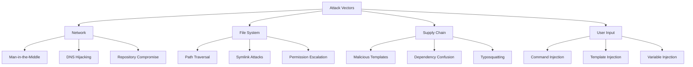

# Security Architecture

**Document Type**: Security Architecture
**Status**: Approved
**Created**: 2025-01-15
**Updated**: 2025-01-15

*Comprehensive security architecture and controls for DDx CLI toolkit*

## Security Principles

### Core Security Tenets

1. **Defense in Depth**: Multiple layers of security controls
2. **Least Privilege**: Minimal permissions required for operations
3. **Secure by Default**: Safe configurations out of the box
4. **Zero Trust**: Verify all inputs and operations
5. **Transparency**: Clear security boundaries and behaviors
6. **Privacy First**: No telemetry or data collection

## Threat Model

### Asset Inventory

| Asset | Value | Exposure |
|-------|-------|----------|
| Source code repositories | High | Network/Git |
| Configuration files | High | File system |
| Template/Pattern code | Medium | File system |
| User credentials | Critical | Memory/File system |
| Contribution content | Medium | Network |
| Local modifications | High | File system |

### Threat Actors

1. **External Attackers**: Attempting to inject malicious code
2. **Malicious Contributors**: Submitting harmful templates/patterns
3. **Compromised Dependencies**: Supply chain attacks
4. **Insider Threats**: Authorized users with malicious intent
5. **Accidental Exposure**: Unintentional secret commits

### Attack Vectors



## Security Architecture Layers

### 1. Input Validation Layer

```go
type InputValidator struct {
    rules map[string]ValidationRule
}

type ValidationRule interface {
    Validate(input string) error
}

// Path validation
type PathValidator struct {
    allowedPaths []string
    deniedPaths  []string
}

func (p *PathValidator) Validate(path string) error {
    // Normalize path
    cleaned := filepath.Clean(path)

    // Check for traversal
    if strings.Contains(cleaned, "..") {
        return ErrPathTraversal
    }

    // Check absolute paths
    if filepath.IsAbs(cleaned) && !p.isAllowedAbsolute(cleaned) {
        return ErrUnauthorizedPath
    }

    // Check against deny list
    for _, denied := range p.deniedPaths {
        if matched, _ := filepath.Match(denied, cleaned); matched {
            return ErrDeniedPath
        }
    }

    return nil
}

// Command validation
type CommandValidator struct {
    allowedCommands []string
    sanitizer       *Sanitizer
}

func (c *CommandValidator) Validate(cmd string) error {
    // Parse command
    parts := c.sanitizer.ParseCommand(cmd)

    // Check allowed list
    if !c.isAllowed(parts[0]) {
        return ErrUnauthorizedCommand
    }

    // Check for injection attempts
    if c.hasInjection(cmd) {
        return ErrCommandInjection
    }

    return nil
}
```

### 2. Authentication & Authorization

```go
type AuthManager struct {
    keyring  Keyring
    sessions SessionStore
}

// Git credential management
func (a *AuthManager) GetGitCredentials(repo string) (*Credentials, error) {
    // Try keyring first
    if creds, err := a.keyring.Get(repo); err == nil {
        return creds, nil
    }

    // Fall back to git credential helper
    return a.getFromGitHelper(repo)
}

// API authentication
func (a *AuthManager) AuthenticateAPI(token string) (*User, error) {
    // Validate token format
    if !a.isValidToken(token) {
        return nil, ErrInvalidToken
    }

    // Verify signature
    claims, err := a.verifyJWT(token)
    if err != nil {
        return nil, err
    }

    // Check expiration
    if claims.ExpiresAt.Before(time.Now()) {
        return nil, ErrTokenExpired
    }

    return &User{ID: claims.Subject}, nil
}

// Permission checking
type PermissionChecker struct {
    policies []Policy
}

func (p *PermissionChecker) CanAccess(user *User, resource string, action string) bool {
    for _, policy := range p.policies {
        if policy.Matches(user, resource, action) {
            return policy.Allow
        }
    }
    return false // Deny by default
}
```

### 3. Secure File Operations

```go
type SecureFileManager struct {
    validator PathValidator
    scanner   SecretScanner
}

func (s *SecureFileManager) WriteFile(path string, content []byte) error {
    // Validate path
    if err := s.validator.Validate(path); err != nil {
        return err
    }

    // Scan for secrets
    if secrets := s.scanner.Scan(content); len(secrets) > 0 {
        return fmt.Errorf("detected secrets: %v", secrets)
    }

    // Create with secure permissions
    return s.writeSecure(path, content, 0644)
}

func (s *SecureFileManager) writeSecure(path string, content []byte, perm os.FileMode) error {
    // Create temp file first
    tmp := path + ".tmp"

    // Write with restricted permissions
    if err := os.WriteFile(tmp, content, perm); err != nil {
        return err
    }

    // Atomic rename
    return os.Rename(tmp, path)
}
```

### 4. Template Sandboxing

```go
type TemplateSandbox struct {
    engine     TemplateEngine
    validator  TemplateValidator
    limiter    ResourceLimiter
}

func (t *TemplateSandbox) Execute(template string, vars map[string]interface{}) (string, error) {
    // Validate template syntax
    if err := t.validator.Validate(template); err != nil {
        return "", err
    }

    // Sanitize variables
    sanitized := t.sanitizeVariables(vars)

    // Execute with limits
    ctx := t.limiter.CreateContext()
    defer ctx.Release()

    return t.engine.Execute(template, sanitized)
}

// Prevent dangerous functions
type TemplateValidator struct {
    deniedFunctions []string
}

func (t *TemplateValidator) Validate(template string) error {
    ast, err := t.parse(template)
    if err != nil {
        return err
    }

    // Check for denied functions
    for _, fn := range t.deniedFunctions {
        if t.contains(ast, fn) {
            return fmt.Errorf("denied function: %s", fn)
        }
    }

    // Check for code execution attempts
    if t.hasCodeExecution(ast) {
        return ErrCodeExecution
    }

    return nil
}
```

### 5. Network Security

```go
type SecureHTTPClient struct {
    client      *http.Client
    validator   URLValidator
    rateLimiter RateLimiter
}

func NewSecureHTTPClient() *SecureHTTPClient {
    return &SecureHTTPClient{
        client: &http.Client{
            Timeout: 30 * time.Second,
            Transport: &http.Transport{
                TLSClientConfig: &tls.Config{
                    MinVersion: tls.VersionTLS12,
                    CipherSuites: []uint16{
                        tls.TLS_ECDHE_RSA_WITH_AES_256_GCM_SHA384,
                        tls.TLS_ECDHE_RSA_WITH_AES_128_GCM_SHA256,
                    },
                },
                DisableKeepAlives: true,
            },
        },
    }
}

func (s *SecureHTTPClient) Get(url string) (*http.Response, error) {
    // Validate URL
    if err := s.validator.Validate(url); err != nil {
        return nil, err
    }

    // Check rate limit
    if !s.rateLimiter.Allow() {
        return nil, ErrRateLimited
    }

    // Add security headers
    req, err := http.NewRequest("GET", url, nil)
    if err != nil {
        return nil, err
    }

    req.Header.Set("User-Agent", "DDx-CLI/1.0")
    req.Header.Set("X-Request-ID", generateRequestID())

    return s.client.Do(req)
}
```

## Security Controls Implementation

### Secret Detection and Prevention

```go
type SecretScanner struct {
    patterns []*regexp.Regexp
    entropy  EntropyCalculator
}

func (s *SecretScanner) Scan(content []byte) []Secret {
    var secrets []Secret

    // Pattern matching
    for _, pattern := range s.patterns {
        if matches := pattern.FindAll(content, -1); len(matches) > 0 {
            for _, match := range matches {
                secrets = append(secrets, Secret{
                    Type:  pattern.String(),
                    Value: string(match),
                })
            }
        }
    }

    // Entropy analysis
    tokens := s.tokenize(content)
    for _, token := range tokens {
        if s.entropy.Calculate(token) > 4.5 {
            secrets = append(secrets, Secret{
                Type:  "high_entropy",
                Value: token,
            })
        }
    }

    return secrets
}

// Common secret patterns
var secretPatterns = []*regexp.Regexp{
    regexp.MustCompile(`(?i)api[_-]?key[\s]*[:=][\s]*['"]?([a-zA-Z0-9_\-]{20,})['"]?`),
    regexp.MustCompile(`(?i)secret[\s]*[:=][\s]*['"]?([a-zA-Z0-9_\-]{20,})['"]?`),
    regexp.MustCompile(`(?i)token[\s]*[:=][\s]*['"]?([a-zA-Z0-9_\-]{20,})['"]?`),
    regexp.MustCompile(`(?i)password[\s]*[:=][\s]*['"]?([^'"\s]+)['"]?`),
    regexp.MustCompile(`-----BEGIN (RSA |EC |DSA |OPENSSH )?PRIVATE KEY-----`),
    regexp.MustCompile(`[a-zA-Z0-9_]{40}`), // GitHub token
    regexp.MustCompile(`sk_live_[a-zA-Z0-9]{24,}`), // Stripe
}
```

### Dependency Security

```go
type DependencyScanner struct {
    vulnerabilityDB VulnerabilityDatabase
    licenseChecker  LicenseChecker
}

func (d *DependencyScanner) Scan(dependencies []Dependency) (*SecurityReport, error) {
    report := &SecurityReport{
        Timestamp: time.Now(),
    }

    for _, dep := range dependencies {
        // Check for vulnerabilities
        vulns, err := d.vulnerabilityDB.Check(dep)
        if err != nil {
            return nil, err
        }

        if len(vulns) > 0 {
            report.Vulnerabilities = append(report.Vulnerabilities, vulns...)
        }

        // Check license compatibility
        if !d.licenseChecker.IsCompatible(dep.License) {
            report.LicenseIssues = append(report.LicenseIssues, LicenseIssue{
                Dependency: dep.Name,
                License:    dep.License,
            })
        }
    }

    return report, nil
}
```

### Secure Configuration

```yaml
# Default secure configuration
security:
  # Input validation
  validation:
    strict_mode: true
    max_path_depth: 10
    allowed_schemes:
      - https
      - ssh
    denied_paths:
      - /etc
      - /sys
      - /proc
      - ~/.ssh
      - ~/.aws

  # Secret scanning
  secret_scanning:
    enabled: true
    patterns:
      - api_key
      - secret
      - token
      - password
      - private_key
    entropy_threshold: 4.5

  # Network security
  network:
    tls_min_version: "1.2"
    verify_certificates: true
    timeout_seconds: 30
    max_redirects: 5
    allowed_domains:
      - github.com
      - gitlab.com
      - bitbucket.org

  # File operations
  file_operations:
    max_file_size: 10485760  # 10MB
    secure_permissions: true
    atomic_writes: true
    backup_before_modify: true

  # Template execution
  templates:
    sandbox_enabled: true
    max_execution_time: 5000  # ms
    max_memory: 104857600     # 100MB
    denied_functions:
      - exec
      - eval
      - system
      - shell
```

## Incident Response

### Security Event Logging

```go
type SecurityLogger struct {
    writer LogWriter
    level  LogLevel
}

func (s *SecurityLogger) LogSecurityEvent(event SecurityEvent) {
    entry := LogEntry{
        Timestamp: time.Now(),
        Level:     event.Severity,
        Type:      "SECURITY",
        Event:     event.Type,
        Details:   event.Details,
        User:      event.User,
        Source:    event.Source,
    }

    // Always log security events
    s.writer.Write(entry)

    // Alert on critical events
    if event.Severity == CRITICAL {
        s.sendAlert(event)
    }
}

// Security event types
const (
    EventAuthFailure      = "AUTH_FAILURE"
    EventUnauthorizedPath = "UNAUTHORIZED_PATH"
    EventSecretDetected   = "SECRET_DETECTED"
    EventInjectionAttempt = "INJECTION_ATTEMPT"
    EventVulnerability    = "VULNERABILITY_FOUND"
)
```

### Incident Response Procedures

1. **Detection**: Automated monitoring and alerting
2. **Containment**: Isolate affected components
3. **Investigation**: Analyze logs and artifacts
4. **Remediation**: Apply fixes and patches
5. **Recovery**: Restore normal operations
6. **Lessons Learned**: Update security controls

## Security Testing

### Security Test Suite

```go
func TestPathTraversalPrevention(t *testing.T) {
    validator := NewPathValidator()

    tests := []struct {
        path     string
        expected error
    }{
        {"../../../etc/passwd", ErrPathTraversal},
        {"/etc/shadow", ErrUnauthorizedPath},
        {"templates/../../../", ErrPathTraversal},
        {"templates/valid", nil},
    }

    for _, test := range tests {
        err := validator.Validate(test.path)
        assert.Equal(t, test.expected, err)
    }
}

func TestSecretDetection(t *testing.T) {
    scanner := NewSecretScanner()

    content := []byte(`
        api_key = "sk_live_abcd1234efgh5678"
        password: "super_secret_123"
        safe_var = "this_is_fine"
    `)

    secrets := scanner.Scan(content)
    assert.Len(t, secrets, 2)
    assert.Contains(t, secrets[0].Type, "api_key")
}
```

### Penetration Testing Checklist

- [ ] Input validation bypass attempts
- [ ] Path traversal exploitation
- [ ] Command injection tests
- [ ] Template injection attempts
- [ ] Secret exposure checks
- [ ] Network security validation
- [ ] Authentication bypass attempts
- [ ] Authorization escalation tests
- [ ] Dependency vulnerability scans
- [ ] Configuration security review

## Compliance and Standards

### Security Standards Compliance

| Standard | Requirement | Implementation |
|----------|------------|----------------|
| OWASP Top 10 | Injection prevention | Input validation, parameterization |
| CWE Top 25 | Memory safety | Go's memory management |
| NIST 800-53 | Access control | RBAC implementation |
| ISO 27001 | Risk management | Threat modeling, controls |
| PCI DSS | Data protection | Encryption, no card data |
| GDPR | Privacy | No PII collection |

### Security Metrics

```yaml
# Security metrics tracking
metrics:
  # Vulnerability metrics
  vulnerabilities:
    critical: 0
    high: 0
    medium: 2
    low: 5

  # Code quality metrics
  code_quality:
    security_coverage: 95%
    static_analysis_pass: true
    dependency_audit_pass: true

  # Incident metrics
  incidents:
    total_last_30_days: 0
    mean_time_to_resolve: 0
    false_positives: 3
```

## Security Roadmap

### Phase 1: Foundation (Current)
- ✅ Input validation
- ✅ Path traversal prevention
- ✅ Secret scanning
- ✅ Secure file operations

### Phase 2: Enhanced Controls (Q2 2025)
- [ ] Code signing for releases
- [ ] Advanced threat detection
- [ ] Runtime protection
- [ ] Security audit logging

### Phase 3: Advanced Security (Q3 2025)
- [ ] Zero-trust architecture
- [ ] Hardware security module support
- [ ] Advanced cryptography
- [ ] Formal verification

## Security Contact

For security issues, contact: security@ddx.dev
GPG Key: [Published on keyservers]
Bug Bounty: https://ddx.dev/security/bounty