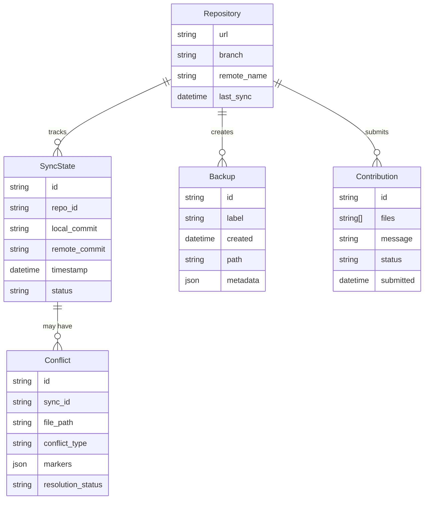
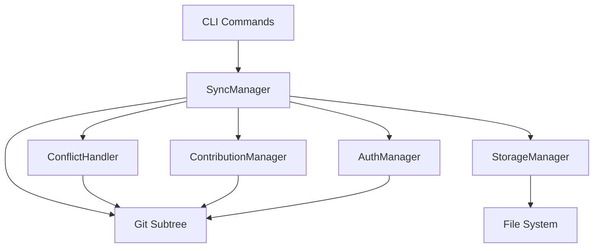

# Solution Design: Upstream Synchronization System

*Bridge between business requirements and technical implementation for FEAT-002*

## Requirements Analysis

### Functional Requirements Mapping
Map each functional requirement to technical capabilities:

| Requirement | Technical Capability | Component | Priority |
|------------|---------------------|-----------|----------|
| Pull updates from upstream | Git subtree pull operations | SyncManager | P0 |
| Handle update conflicts | Three-way merge with conflict markers | ConflictHandler | P0 |
| Contribute changes upstream | Git subtree push with validation | ContributionManager | P0 |
| Track asset versions | Git commit history and refs | VersionTracker | P0 |
| Rollback problematic updates | Git reset with backup restoration | RollbackManager | P0 |
| Initialize synchronization | Git subtree add with remote config | InitManager | P0 |
| View change history | Git log parsing and formatting | HistoryManager | P1 |
| Manage authentication | Git credential helper integration | AuthManager | P0 |
| Selective update application | Path-based subtree operations | SelectiveSync | P1 |
| Dry-run capability | Non-destructive preview operations | PreviewManager | P1 |
| Backup and restore | Filesystem snapshots with metadata | BackupManager | P0 |

### Non-Functional Requirements Impact
How NFRs shape the architecture:

| NFR Category | Requirement | Architectural Impact | Design Decision |
|--------------|------------|---------------------|-----------------|
| Performance | Fetch < 10s for typical repos | Incremental operations | Use git shallow clones and caching |
| Security | No plaintext credentials | Credential abstraction | Leverage git credential helpers |
| Scalability | Handle repos up to 1GB | Efficient operations | Selective subtree pulls, sparse checkout |
| Reliability | Atomic operations | Transaction boundaries | Backup before operations, rollback on failure |
| Usability | Clear conflict guidance | User-friendly interface | Structured conflict markers, interactive resolution |
| Compatibility | Git 2.0+, major platforms | Platform abstraction | Interface-based platform adapters |

## Solution Approaches

### Approach 1: Pure Git Subtree
**Description**: Use git subtree commands directly with minimal abstraction

**Pros**:
- Simple implementation with native git commands
- Full git history preservation
- No additional dependencies
- Works with standard git tools

**Cons**:
- Complex command syntax for users
- Limited control over merge strategies
- Difficult conflict resolution
- No built-in backup mechanism

**Evaluation**: Good foundation but needs abstraction for usability

### Approach 2: Custom Sync Protocol
**Description**: Build custom synchronization protocol on top of git

**Pros**:
- Full control over sync behavior
- Custom conflict resolution
- Optimized for DDX use cases
- Better error handling

**Cons**:
- High implementation complexity
- Maintenance burden
- Potential compatibility issues
- Reinventing existing solutions

**Evaluation**: Over-engineered for current requirements

### Approach 3: Git Subtree with Smart Wrapper
**Description**: Wrap git subtree with intelligent conflict resolution and state management

**Pros**:
- Leverages proven git subtree
- Adds user-friendly interface
- Custom conflict handling
- State tracking and rollback
- Incremental improvements possible

**Cons**:
- Some complexity in wrapper
- Need to handle git edge cases
- Learning curve for advanced features

**Evaluation**: Best balance of power and usability

### Selected Approach
**Decision**: Git Subtree with Smart Wrapper (Approach 3)
**Rationale**: Aligns with ADR-002 decision to use git subtree while addressing usability concerns through intelligent wrapping. Provides the reliability of git with enhanced user experience for DDX-specific workflows.

## Domain Model

### Core Entities
Identify the key business concepts:



### Business Rules
Critical domain logic to implement:
1. **Atomic Operations**: All sync operations must complete fully or rollback entirely
2. **Backup Before Destructive**: Any operation that modifies files must create a backup first
3. **Conflict Detection**: Local modifications must be detected before pulling updates
4. **Validation Before Contribution**: All contributions must pass validation before submission
5. **Authentication Required**: Remote operations require valid credentials
6. **History Preservation**: All operations must preserve git history

### Bounded Contexts
- **Synchronization Context**: Manages pull/push operations and state tracking
- **Conflict Resolution Context**: Handles detection, presentation, and resolution of conflicts
- **Contribution Context**: Manages validation, packaging, and submission of contributions
- **Storage Context**: Handles backups, rollbacks, and state persistence

## System Decomposition

### Component Identification
Breaking down the system into manageable parts:

#### Component 1: SyncManager
- **Purpose**: Orchestrates all synchronization operations
- **Responsibilities**:
  - Initialize git subtree configuration
  - Execute pull operations with proper flags
  - Coordinate with other components
  - Manage sync state and history
- **Requirements Addressed**: Pull updates, Initialize sync, Track versions
- **Interfaces**: CLI commands, internal Go APIs

#### Component 2: ConflictHandler
- **Purpose**: Detects and guides conflict resolution
- **Responsibilities**:
  - Detect merge conflicts during pulls
  - Parse git conflict markers
  - Provide resolution strategies
  - Guide users through resolution
- **Requirements Addressed**: Handle conflicts, Resolution guidance
- **Interfaces**: Conflict detection API, Resolution strategies

#### Component 3: ContributionManager
- **Purpose**: Manages upstream contributions
- **Responsibilities**:
  - Validate changes against standards
  - Package changes for submission
  - Execute git subtree push
  - Track submission status
- **Requirements Addressed**: Contribute changes, Validation
- **Interfaces**: Contribution API, Validation rules

#### Component 4: StorageManager
- **Purpose**: Handles backup and recovery operations
- **Responsibilities**:
  - Create filesystem snapshots
  - Manage backup metadata
  - Restore from backups
  - Cleanup old backups
- **Requirements Addressed**: Backup/restore, Rollback
- **Interfaces**: Backup API, Restore operations

#### Component 5: AuthManager
- **Purpose**: Manages authentication for remote operations
- **Responsibilities**:
  - Integrate with git credential helpers
  - Support multiple auth methods
  - Secure credential storage
  - Handle auth failures gracefully
- **Requirements Addressed**: Authentication management
- **Interfaces**: Credential API, Auth providers

### Component Interactions


## Technology Selection Rationale

### Programming Language: Go
**Why**: Already chosen per ADR-003, provides excellent git integration, cross-platform support
**Alternatives Considered**: N/A - predetermined by ADR-003

### Git Integration: Git Subtree
**Why**: Chosen per ADR-002, provides full history preservation with local independence
**Alternatives Considered**: Submodules, custom sync - rejected per ADR-002

### Storage: Local Filesystem
**Why**: Simple, reliable, no external dependencies, works offline
**Alternatives Considered**: Database (overhead), Cloud storage (requires network)

### Conflict Resolution: Three-way Merge
**Why**: Standard git approach, familiar to developers, preserves all information
**Alternatives Considered**: Auto-resolution (risky), Custom markers (non-standard)

### Authentication: Git Credential Helpers
**Why**: Secure, standard, integrates with existing developer workflows
**Alternatives Considered**: Custom auth (unnecessary complexity)

## Requirements Traceability

### Coverage Check
Ensure all requirements are addressed:

| Requirement ID | Requirement | Component | Design Element | Test Strategy |
|---------------|-------------|-----------|----------------|---------------|
| US-001 | Pull updates | SyncManager | Git subtree pull | Integration tests with test repo |
| US-002 | Handle conflicts | ConflictHandler | Conflict detection and guidance | Unit tests for conflict scenarios |
| US-003 | Contribute changes | ContributionManager | Git subtree push | Mock remote, validation tests |
| US-004 | Track versions | SyncManager | Git log integration | Unit tests for version parsing |
| US-005 | Rollback updates | StorageManager | Backup/restore mechanism | Integration tests with rollback |
| US-006 | Initialize sync | SyncManager | Git subtree add | Setup tests with various states |
| US-007 | View history | SyncManager | Git log formatting | Unit tests for log parsing |
| US-008 | Manage auth | AuthManager | Credential helper integration | Mock credential tests |

### Gap Analysis
Requirements not fully addressed:
- [ ] Large file optimization: May need Git LFS integration in future iterations
- [ ] Real-time sync: Explicitly out of scope but could be added with file watchers

## Constraints and Assumptions

### Technical Constraints
- Git 2.0+ required: Impacts minimum system requirements
- Git subtree limitations: Must work within subtree merge strategies
- Platform variations: Must handle Windows/Unix path differences

### Assumptions
- Users have git installed: Risk minimal, git is standard developer tool
- Network available for remote ops: Acceptable, local work continues offline
- .ddx directory structure: Assumes standard DDX project layout

### Dependencies
- Git executable: Version 2.0+
- Go standard library: For file operations and process execution
- Cobra framework: For CLI command structure

## Migration from Current State

### Current System Analysis
- **Existing functionality**: Manual file copying between projects
- **Data migration needs**: None - new feature
- **Integration points**: Must preserve existing .ddx structure

### Migration Strategy
1. **Phase 1**: Add sync capability to existing projects via `ddx update --init`
2. **Phase 2**: New projects get sync by default with `ddx init`
3. **Compatibility period**: Non-synced projects continue to work

## Risk Assessment

### Technical Risks
| Risk | Probability | Impact | Mitigation |
|------|------------|--------|------------|
| Git subtree merge conflicts | Medium | Medium | Clear conflict UI, documentation |
| Large repo performance | Low | Medium | Shallow clones, selective sync |
| Platform-specific git issues | Medium | Low | Platform testing, abstraction layer |
| Credential exposure | Low | High | Use git credential helpers exclusively |

### Design Risks
| Risk | Probability | Impact | Mitigation |
|------|------------|--------|------------|
| Complex wrapper increases maintenance | Medium | Medium | Keep wrapper thin, document well |
| Users bypass wrapper for direct git | Low | Low | Document risks, detect and warn |
| Backup storage growth | Medium | Low | Rotation policy, compression |

## Success Criteria

### Design Validation
- [x] All P0 requirements mapped to components
- [x] All NFRs addressed in architecture
- [x] Domain model captures all business rules
- [x] Technology choices justified against requirements
- [x] No single point of failure for critical paths
- [x] Clear upgrade/migration path

### Handoff to Implementation
This design is ready when:
- [ ] Development team understands the architecture
- [ ] All technical decisions are documented
- [ ] Test strategy aligns with design
- [ ] Stakeholders approve approach

## Implementation Notes

### Key Implementation Patterns

#### State Management
```go
type SyncState struct {
    LocalCommit  string
    RemoteCommit string
    LastSync     time.Time
    Status       SyncStatus
}
```

#### Conflict Detection
```go
// Check for local modifications before pull
func (s *SyncManager) HasLocalChanges() (bool, []string, error) {
    // Use git status to detect modifications
}
```

#### Backup Strategy
```go
// Create timestamped backup before operations
func (b *BackupManager) CreateBackup(label string) (*Backup, error) {
    // Copy .ddx to .ddx.backup.<timestamp>
}
```

### Command Interface
```bash
# Core sync commands following existing DDX patterns
ddx update            # Pull latest from upstream
ddx update --dry-run  # Preview changes
ddx contribute        # Push changes upstream
ddx status           # Show sync status
ddx rollback         # Restore previous state
```

---
*This solution design bridges the gap between what the business needs for upstream synchronization and how we'll build it technically using git subtree.*