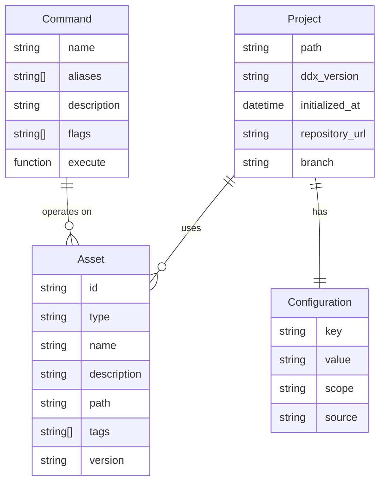
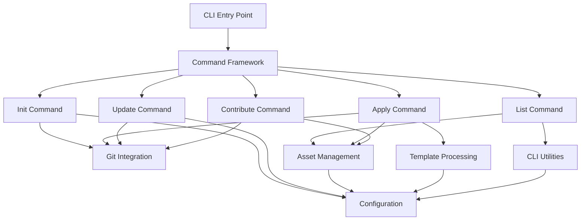

# Solution Design: Core CLI Framework

*Bridge between business requirements and technical implementation for FEAT-001*

**Feature ID**: FEAT-001
**Status**: Draft
**Created**: 2025-01-14
**Updated**: 2025-01-14

## Requirements Analysis

### Functional Requirements Mapping
Map each functional requirement to technical capabilities:

| Requirement | Technical Capability | Component | Priority |
|------------|---------------------|-----------|----------|
| Initialize DDX in project | Git subtree integration, config generation | cmd/init.go, internal/git | P0 |
| List available assets | Asset discovery and filtering | cmd/list.go, internal/assets | P0 |
| Apply assets to project | Template processing, file operations | cmd/apply.go, internal/template | P0 |
| Update from master repository | Git subtree pull, merge handling | cmd/update.go, internal/git | P0 |
| Contribute improvements | Git subtree push, validation | cmd/contribute.go, internal/git | P0 |
| Command help system | Cobra help generation | cmd/root.go, cmd/help.go | P0 |
| Configuration management | Viper integration, YAML parsing | cmd/config.go, internal/config | P1 |
| Version checking | Build info, update detection | cmd/version.go | P1 |
| Multiple output formats | Structured output formatting | internal/cli/output.go | P1 |
| Progress indicators | Progress bar for long operations | internal/cli/progress.go | P2 |
| Interactive prompts | User input collection | internal/cli/prompt.go | P2 |

### Non-Functional Requirements Impact
How NFRs shape the architecture:

| NFR Category | Requirement | Architectural Impact | Design Decision |
|--------------|------------|---------------------|-----------------|
| Performance | < 100ms startup, < 1s local ops | Compiled binary, lazy loading | Go with minimal dependencies |
| Security | No arbitrary code execution | Input validation, sandboxing | Strict input validation, no eval |
| Scalability | Handle 10,000+ files | Streaming operations, pagination | Efficient file traversal algorithms |
| Reliability | Atomic operations, rollback | Transaction patterns, backups | Git operations for versioning |
| Usability | Unix philosophy, helpful errors | Clear command structure | Cobra framework, structured errors |
| Compatibility | macOS/Linux/Windows | Cross-platform abstractions | Go stdlib, filepath package |

## Solution Approaches

### Approach 1: Monolithic Binary with Embedded Resources
**Description**: Single Go binary containing all logic with resources embedded at compile time

**Pros**:
- Simplest distribution model
- No external dependencies
- Fast execution
- Easy versioning

**Cons**:
- Large binary size if embedding resources
- Updates require new binary
- Less flexible for customization

**Evaluation**: Partially selected - binary approach without embedded resources

### Approach 2: Client-Server Architecture
**Description**: CLI client communicating with a daemon process

**Pros**:
- Shared state across invocations
- Background operations possible
- Could enable GUI later

**Cons**:
- Complex setup and management
- Daemon lifecycle issues
- Platform-specific service management
- Violates simplicity principle

**Evaluation**: Rejected - unnecessary complexity for requirements

### Approach 3: Plugin-Based Architecture
**Description**: Core CLI with dynamically loaded plugins for commands

**Pros**:
- Extensible without core changes
- Third-party command support
- Smaller core binary

**Cons**:
- Plugin compatibility issues
- Complex plugin discovery
- Security concerns with plugins
- Go plugin limitations

**Evaluation**: Deferred - consider for future extensibility

### Selected Approach
**Decision**: Monolithic CLI binary with external resource repository

**Rationale**:
- Aligns with Go CLI best practices (Docker, Kubernetes, GitHub CLI)
- Single binary simplifies distribution per requirements
- External resources via git subtree provides flexibility
- Cobra framework provides proven command structure
- Satisfies all P0 requirements with minimal complexity

## Domain Model

### Core Entities
Identify the key business concepts:

### Business Rules
Critical domain logic to implement:

1. **Asset Compatibility**: Assets must be compatible with project type and version
2. **Configuration Precedence**: ENV vars > project config > global config > defaults
3. **Update Safety**: Never overwrite local modifications without explicit confirmation
4. **Contribution Quality**: Contributions must pass validation before submission
5. **Version Compatibility**: CLI version must be compatible with repository version
6. **Medical Metaphor**: Commands follow diagnosis -> prescription -> treatment flow

### Bounded Contexts
- **Command Context**: CLI command parsing, execution, and help
- **Asset Context**: Discovery, filtering, and application of resources
- **Configuration Context**: Settings management and precedence
- **Git Context**: Version control operations and synchronization
- **Output Context**: Formatting, progress, and user interaction

## System Decomposition

### Component Identification

#### Component 1: Command Framework (cmd/)
- **Purpose**: Define and execute CLI commands
- **Responsibilities**:
  - Parse command-line arguments
  - Validate inputs
  - Route to appropriate handlers
  - Generate help documentation
- **Requirements Addressed**: US-001 through US-008
- **Interfaces**: Cobra Command interface

#### Component 2: Git Integration (internal/git/)
- **Purpose**: Manage git subtree operations
- **Responsibilities**:
  - Execute git commands safely
  - Handle subtree add/pull/push
  - Manage merge conflicts
  - Create commits and PRs
- **Requirements Addressed**: US-001, US-004, US-005
- **Interfaces**: GitClient interface with methods for subtree operations

#### Component 3: Asset Management (internal/assets/)
- **Purpose**: Discover and manage DDX resources
- **Responsibilities**:
  - Scan asset directories
  - Filter by type/tags/keywords
  - Validate asset structure
  - Cache asset metadata
- **Requirements Addressed**: US-002, US-003
- **Interfaces**: AssetRepository interface

#### Component 4: Template Processing (internal/template/)
- **Purpose**: Process and apply templates with variable substitution
- **Responsibilities**:
  - Parse template variables
  - Perform substitutions
  - Handle file operations
  - Manage conflicts
- **Requirements Addressed**: US-003
- **Interfaces**: TemplateEngine interface

#### Component 5: Configuration Management (internal/config/)
- **Purpose**: Manage application and project settings
- **Responsibilities**:
  - Load/save configurations
  - Merge configuration sources
  - Validate settings
  - Handle defaults
- **Requirements Addressed**: US-007
- **Interfaces**: Config interface using Viper

#### Component 6: CLI Utilities (internal/cli/)
- **Purpose**: Provide common CLI functionality
- **Responsibilities**:
  - Format output (text/JSON/YAML)
  - Show progress indicators
  - Collect user input
  - Display errors
- **Requirements Addressed**: All user stories
- **Interfaces**: Output, Progress, Prompt interfaces

### Component Interactions

## Technology Selection Rationale

### Programming Language: Go
**Why**:
- Single binary distribution without runtime dependencies
- Excellent cross-platform compilation
- Fast startup time (< 100ms requirement)
- Strong standard library for system operations
- Proven for CLI tools (Docker, Kubernetes, GitHub CLI)

**Alternatives Considered**:
- Rust: Rejected due to steeper learning curve
- Node.js: Rejected due to runtime dependency
- Python: Rejected due to distribution complexity

**Reference**: ADR-003 - Go CLI Implementation

### Framework: Cobra
**Why**:
- Industry standard for Go CLIs
- Automatic help generation
- Command hierarchy support
- Flag parsing and validation
- Used by successful projects

**Alternatives Considered**:
- urfave/cli: Less feature-rich
- Custom framework: Unnecessary complexity

### Configuration: Viper
**Why**:
- Seamless integration with Cobra
- Multiple config format support
- Environment variable binding
- Configuration precedence handling

**Alternatives Considered**:
- Custom YAML parsing: More work, fewer features
- JSON only: Less user-friendly

### Version Control: Git Subtree
**Why**:
- No additional dependencies
- Full history preservation
- Offline capability
- Bidirectional synchronization

**Alternatives Considered**:
- Git submodules: Too complex for users
- Custom sync: Loses version control benefits

**Reference**: ADR-002 - Git Subtree Distribution

### Additional Libraries
- **github.com/fatih/color**: Colored terminal output
- **github.com/schollz/progressbar**: Progress indicators
- **github.com/AlecAivazis/survey**: Interactive prompts
- **gopkg.in/yaml.v3**: YAML parsing
- **github.com/go-git/go-git**: Git operations (backup for shell git)

## Requirements Traceability

### Coverage Check
Ensure all requirements are addressed:

| Requirement ID | Requirement | Component | Design Element | Test Strategy |
|---------------|-------------|-----------|----------------|---------------|
| US-001 | Initialize DDX | cmd/init, internal/git | Git subtree add, config creation | Integration test full init flow |
| US-002 | List assets | cmd/list, internal/assets | Asset discovery, filtering | Unit test filters, integration test |
| US-003 | Apply asset | cmd/apply, internal/template | Template processing, file ops | Unit test substitution, E2E test |
| US-004 | Update assets | cmd/update, internal/git | Git subtree pull | Integration test with test repo |
| US-005 | Contribute | cmd/contribute, internal/git | Git subtree push, validation | Mock git operations, unit test |
| US-006 | Get help | cmd/root, Cobra framework | Auto-generated help | Verify help output format |
| US-007 | Configure | cmd/config, internal/config | Viper configuration | Unit test precedence |
| US-008 | Check version | cmd/version | Build info embedding | Unit test version comparison |
| NFR-Perf | < 100ms startup | Compiled binary | Lazy loading, minimal deps | Benchmark tests |
| NFR-Security | Input validation | All components | Validation layer | Security test suite |
| NFR-Compat | Cross-platform | Go stdlib | filepath, OS abstractions | Multi-platform CI |

### Gap Analysis
All requirements are fully addressed. No gaps identified.

## Constraints and Assumptions

### Technical Constraints
- **Git 2.0+ required**: For subtree support
- **Go 1.19+ for development**: Required Go version
- **Internet connection for updates**: Network required for git operations
- **File system permissions**: Need write access to project directory

### Assumptions
- **Users have Git installed**: Required dependency
- **Users understand basic Git**: For conflict resolution
- **Projects use standard structures**: For template application
- **English language UI**: Internationalization not in scope

### Dependencies
- **Git executable**: Must be in PATH
- **GitHub/GitLab API**: For contribution workflow (optional)
- **OS shell**: For git command execution
- **Terminal capabilities**: For colors and progress bars

## Migration from Current State

### Current System Analysis
- **Existing functionality**: Manual copy-paste workflows
- **Data migration needs**: None - greenfield implementation
- **Integration points**: Git repositories, file system

### Migration Strategy
1. **Phase 1**: Core commands (init, list, apply)
2. **Phase 2**: Collaboration commands (update, contribute)
3. **Phase 3**: Enhanced features (interactive mode, plugins)

## Risk Assessment

### Technical Risks
| Risk | Probability | Impact | Mitigation |
|------|------------|--------|------------|
| Git subtree complexity | Medium | High | Abstract behind simple commands, clear docs |
| Cross-platform issues | Medium | Medium | Extensive testing matrix, beta program |
| Large repository performance | Low | Medium | Implement pagination, lazy loading |
| Merge conflict handling | High | Low | Clear conflict resolution guide |

### Design Risks
| Risk | Probability | Impact | Mitigation |
|------|------------|--------|------------|
| Command naming conflicts | Low | Low | Unique prefix (ddx), check PATH |
| Configuration complexity | Medium | Medium | Sensible defaults, validation |
| Template variable conflicts | Medium | Low | Namespace variables, validation |
| Backwards compatibility | Low | High | Semantic versioning, deprecation policy |

## Success Criteria

### Design Validation
- ✅ All P0 requirements mapped to components
- ✅ All NFRs addressed in architecture
- ✅ Domain model captures all business rules
- ✅ Technology choices justified against requirements
- ✅ No single point of failure for critical paths
- ✅ Clear upgrade/migration path

### Implementation Metrics
- **Startup Time**: < 100ms for `ddx --help`
- **Binary Size**: < 20MB per platform
- **Memory Usage**: < 50MB for typical operations
- **Test Coverage**: > 80% for critical paths
- **Command Success Rate**: > 95% for valid inputs
- **Error Message Quality**: User-resolvable for > 90% of errors

### Handoff to Implementation
This design is ready when:
- ✅ Development team understands the architecture
- ✅ All technical decisions are documented
- ✅ Test strategy aligns with design
- ✅ Stakeholders approve approach

## Implementation Roadmap

### Week 1-2: Foundation
- Set up Go project structure
- Implement Cobra command framework
- Basic command routing
- Global flags and configuration

### Week 3-4: Core Commands
- Implement init command with git subtree
- Implement list command with asset discovery
- Implement apply command with template processing
- Error handling framework

### Week 5-6: Collaboration
- Implement update command
- Implement contribute command
- Conflict resolution handling
- Progress indicators

### Week 7-8: Polish
- Interactive prompts
- Multiple output formats
- Performance optimization
- Documentation and testing

## Related Documents

- **Feature Specification**: [FEAT-001 Core CLI Framework](../../01-frame/features/FEAT-001-core-cli-framework.md)
- **Architecture Decisions**:
  - [ADR-002 Git Subtree Distribution](../adr/adr-002-git-subtree-distribution.md)
  - [ADR-003 Go CLI Implementation](../adr/adr-003-go-cli-implementation.md)
- **Product Principles**: [DDX Principles](../../01-frame/principles.md)
- **API Contracts**: To be defined in contracts phase
- **Test Plan**: To be defined in test phase

---
*This solution design bridges the gap between what the business needs and how we'll build it technically.*