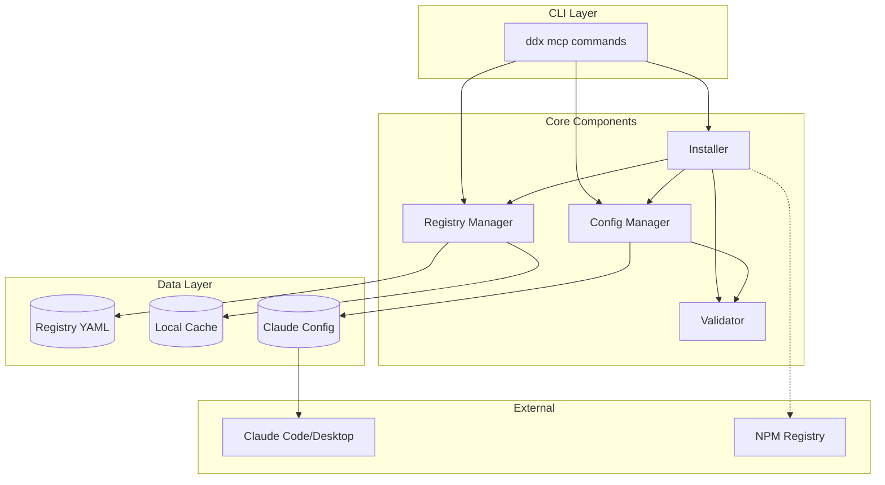
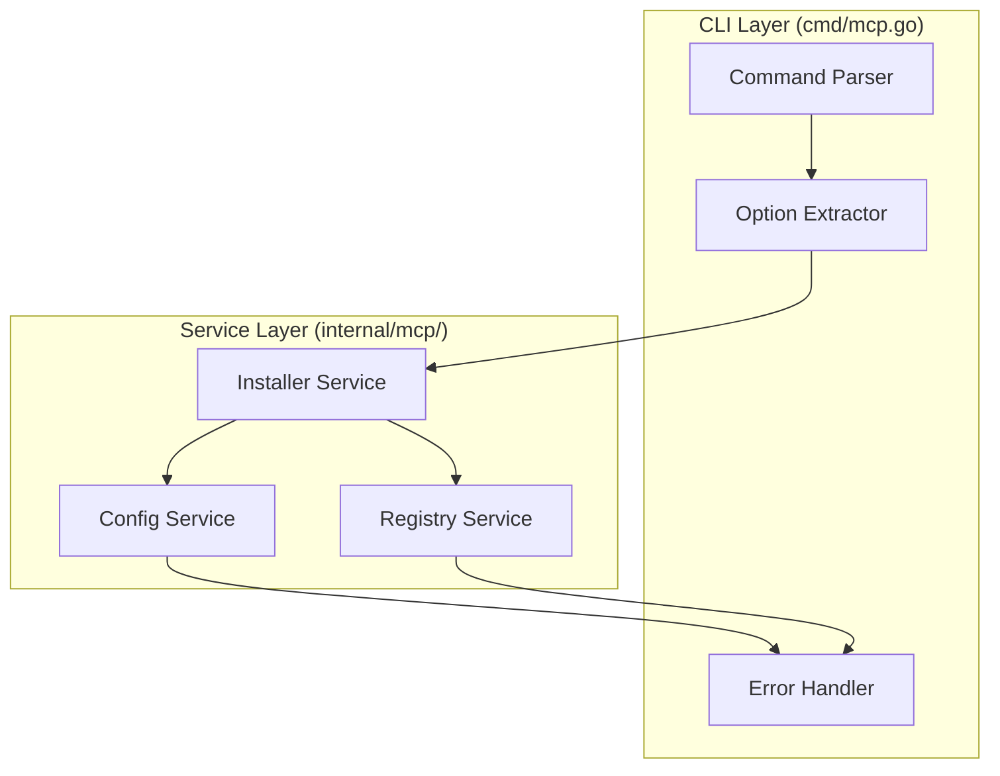
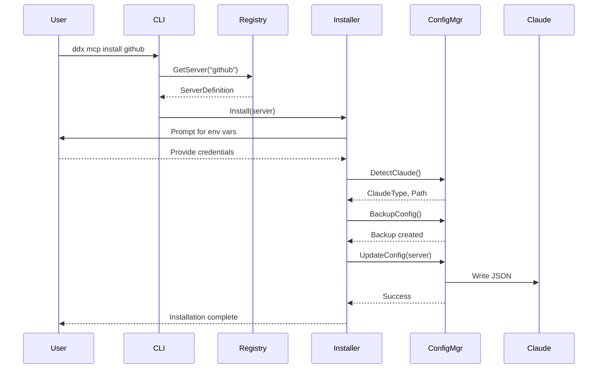
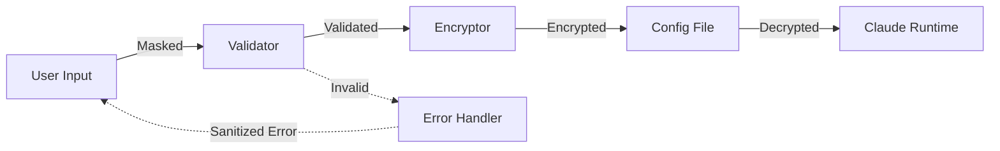

# SD-001: MCP Server Management Solution Design

## Overview

**Design ID**: SD-001  
**Feature**: FEAT-001 (MCP Server Management)  
**Status**: In Design  
**Author**: DDx Architecture Team  
**Created**: 2025-01-15  
**Updated**: 2025-01-15  

## Executive Summary

This solution design describes the technical architecture for MCP (Model Context Protocol) server management within the DDx toolkit. The solution provides a registry-based approach for discovering, installing, configuring, and managing MCP servers for Claude Code and Claude Desktop.

## Requirements Mapping

### Functional Requirements → Technical Capabilities

| Requirement | Technical Capability | Implementation |
|------------|---------------------|----------------|
| FR-001: List servers | Registry management system | YAML-based registry with caching |
| FR-002: Install server | Configuration generator | JSON builder with schema validation |
| FR-003: Manage config | Config file manipulation | Atomic file operations with backup |
| FR-004: Security | Credential management | Masking, validation, secure storage |

### Non-Functional Requirements → Design Decisions

| NFR | Design Decision | Rationale |
|-----|----------------|------------|
| Performance <100ms | Local registry caching | Avoid network calls for listing |
| Security | Credential masking layer | Prevent accidental exposure |
| Cross-platform | Platform abstraction layer | Handle OS-specific paths |
| Reliability | Atomic operations with rollback | Prevent partial updates |

## Solution Architecture

### Component Overview



### Component Responsibilities

#### 1. Registry Manager (`internal/mcp/registry.go`)
- Load and parse MCP server definitions
- Search and filter capabilities
- Cache management with TTL
- Version checking and updates

#### 2. Installer (`internal/mcp/installer.go`)
- Orchestrate installation process
- Environment variable collection
- Dependency resolution
- Progress tracking and reporting

#### 3. Configuration Manager (`internal/mcp/config.go`)
- Claude configuration detection
- JSON file manipulation
- Backup and restore operations
- Configuration merging logic

#### 4. Validator (`internal/mcp/validator.go`)
- Input sanitization
- Security validation
- Schema validation
- Credential format checking

## Domain Model

### Core Entities

```go
// MCPServer represents a server definition
type MCPServer struct {
    Name        string            `yaml:"name"`
    Description string            `yaml:"description"`
    Category    string            `yaml:"category"`
    Author      string            `yaml:"author"`
    Version     string            `yaml:"version"`
    Command     CommandSpec       `yaml:"command"`
    Environment []EnvironmentVar  `yaml:"environment"`
    Docs        Documentation     `yaml:"documentation"`
    Security    SecurityConfig    `yaml:"security"`
}

// CommandSpec defines how to run the server
type CommandSpec struct {
    Executable string   `yaml:"executable"`
    Args       []string `yaml:"args"`
}

// EnvironmentVar defines required environment variables
type EnvironmentVar struct {
    Name        string `yaml:"name"`
    Description string `yaml:"description"`
    Required    bool   `yaml:"required"`
    Sensitive   bool   `yaml:"sensitive"`
    Validation  string `yaml:"validation"` // Regex pattern
    Default     string `yaml:"default"`
}

// ClaudeConfig represents the Claude configuration
type ClaudeConfig struct {
    MCPServers map[string]ServerConfig `json:"mcpServers"`
    // Other Claude settings preserved
}

// ServerConfig is the installed server configuration
type ServerConfig struct {
    Command string            `json:"command"`
    Args    []string         `json:"args"`
    Env     map[string]string `json:"env"`
}
```

### Business Rules

1. **Server Naming**: Lowercase, alphanumeric with hyphens
2. **Version Compatibility**: Semantic versioning with compatibility checks
3. **Category Taxonomy**: Predefined categories (development, database, filesystem, productivity)
4. **Credential Handling**: Sensitive vars never logged or displayed
5. **Installation Prerequisites**: Check for npm/npx before server install

## Technical Architecture

### CLI Integration Architecture

The CLI commands must be connected to their internal implementations through a clear architectural pattern that eliminates stub implementations.

#### Command Handler Pattern
```go
// cmd/mcp.go - Command Definition Layer
func newMCPInstallCommand() *cobra.Command {
    cmd := &cobra.Command{
        Use:   "install <server-name>",
        RunE: func(cmd *cobra.Command, args []string) error {
            // Extract CLI options
            opts := extractInstallOptions(cmd, args)

            // Create and invoke service
            installer := mcp.NewInstaller()
            return installer.Install(args[0], opts)
        },
    }
    return cmd
}
```

#### Service Layer Integration
```go
// internal/mcp/installer.go - Implementation Layer
type Installer struct {
    registry  *Registry
    config    *ConfigManager
    validator *Validator
}

func (i *Installer) Install(serverName string, opts InstallOptions) error {
    // Actual implementation logic
    // This eliminates the "TODO: Implement" placeholder
}
```

#### Integration Flow


#### Stub Implementation Elimination Strategy

1. **Command Factory Pattern**
   - Each command creates its service instance
   - Services contain actual business logic
   - No TODO comments in command handlers

2. **Dependency Injection**
   - Services injected at command creation
   - Enables testing with mock services
   - Clear separation of concerns

3. **Error Boundary Pattern**
   - CLI layer handles user-facing errors
   - Service layer handles business logic errors
   - Consistent error handling across commands

#### Command-to-Service Mapping

| CLI Command | Service Method | Implementation |
|-------------|----------------|----------------|
| `ddx mcp list` | `Registry.List(filters)` | Load registry, apply filters, format output |
| `ddx mcp install` | `Installer.Install(name, opts)` | Complete installation flow |
| `ddx mcp configure` | `ConfigManager.UpdateServer(name, config)` | Update existing configuration |
| `ddx mcp remove` | `ConfigManager.RemoveServer(name, opts)` | Remove with backup |
| `ddx mcp status` | `StatusChecker.Check(name)` | Verify installation status |
| `ddx mcp update` | `Registry.Update(opts)` | Refresh registry data |

Each command handler MUST call its corresponding service method - no placeholder implementations allowed.

### Data Flow

#### Installation Flow


### Security Architecture

#### Credential Flow


#### Security Layers
1. **Input Layer**: Masking, validation, sanitization
2. **Storage Layer**: Encryption, secure permissions
3. **Runtime Layer**: Memory protection, secure deletion
4. **Audit Layer**: Logging without sensitive data

## Implementation Strategy

### Phase 1: Core Infrastructure
1. Registry data model and parser
2. Basic CRUD operations
3. File system operations
4. Security validation framework

### Phase 2: CLI Integration
1. Command structure with Cobra
2. Interactive prompts with masking
3. Progress indicators
4. Error handling and recovery
5. **CLI-to-Implementation Binding**: Connect command handlers to internal services

### Phase 3: Configuration Management
1. Claude detection logic
2. JSON manipulation
3. Backup/restore mechanism
4. Configuration merging

### Phase 4: Advanced Features
1. Registry caching
2. Batch operations
3. Template integration
4. Update notifications

## Technology Stack

### Core Technologies
- **Language**: Go 1.21+
- **CLI Framework**: Cobra/Viper
- **YAML Parsing**: gopkg.in/yaml.v3
- **JSON Handling**: encoding/json
- **Terminal UI**: github.com/charmbracelet/bubbletea

### Dependencies
```go
module github.com/yourusername/ddx

require (
    github.com/spf13/cobra v1.8.0
    github.com/spf13/viper v1.18.0
    gopkg.in/yaml.v3 v3.0.1
    github.com/charmbracelet/bubbletea v0.25.0
    github.com/stretchr/testify v1.8.4
)
```

## Error Handling Strategy

### Error Categories

1. **User Errors**: Clear messages with resolution steps
2. **System Errors**: Detailed logs with context
3. **Security Errors**: Sanitized messages, detailed audit logs
4. **Network Errors**: Retry logic with exponential backoff

### Error Recovery

```go
type MCPError struct {
    Code       string
    Message    string
    Details    map[string]interface{}
    Resolution string
    Wrapped    error
}

// Example usage
if err := validateToken(token); err != nil {
    return &MCPError{
        Code:       "INVALID_TOKEN",
        Message:    "GitHub token validation failed",
        Resolution: "Generate a new token at https://github.com/settings/tokens",
        Wrapped:    err,
    }
}
```

## Performance Considerations

### Optimization Strategies

1. **Registry Caching**: 15-minute TTL with background refresh
2. **Lazy Loading**: Load server details only when needed
3. **Parallel Operations**: Concurrent server status checks
4. **Incremental Updates**: Patch config instead of full rewrite

### Performance Targets

| Operation | Target | Maximum |
|-----------|--------|----------|
| List servers | <50ms | 100ms |
| Search servers | <100ms | 200ms |
| Install server | <5s | 30s |
| Config update | <500ms | 1s |

## Testing Strategy

### Test Coverage Requirements

- Unit tests: 80% coverage minimum
- Integration tests: All user paths
- Security tests: All input points
- Performance tests: Load and stress testing

### Test Scenarios

1. **Happy Path**: Standard installation flow
2. **Error Paths**: Invalid inputs, missing dependencies
3. **Edge Cases**: Large configs, concurrent access
4. **Security**: Injection attempts, malformed inputs

## Migration and Compatibility

### Backwards Compatibility

- Preserve existing Claude configurations
- Support manual MCP configurations
- Gradual migration path for users

### Version Migration

```go
type ConfigMigrator interface {
    CanMigrate(version string) bool
    Migrate(config []byte) ([]byte, error)
    ValidateResult(config []byte) error
}
```

## Deployment Considerations

### Distribution

- Single binary with embedded resources
- No runtime dependencies except npm/npx
- Cross-platform builds (darwin/linux/windows)

### Configuration

- Default registry embedded in binary
- Optional custom registry URLs
- Environment variable overrides

## Monitoring and Observability

### Metrics

- Installation success/failure rates
- Most popular servers
- Error frequency by type
- Performance metrics

### Logging

- Structured logging with levels
- Audit trail for security events
- Debug mode for troubleshooting
- Log rotation and cleanup

## Future Enhancements

1. **Server Marketplace**: Community-contributed servers
2. **Auto-Updates**: Automatic server version updates
3. **Server Development Kit**: Tools for creating MCP servers
4. **Cloud Sync**: Share configurations across devices
5. **Enterprise Features**: Centralized management, policies

## Risks and Mitigations

| Risk | Impact | Mitigation |
|------|--------|------------|
| Malicious servers | High | Registry validation, sandboxing |
| API changes | Medium | Version detection, compatibility layer |
| Credential leaks | High | Encryption, secure deletion |
| Performance degradation | Low | Caching, optimization |

## Success Criteria

1. **Functional**: All user stories implemented and tested
2. **Performance**: Meet all performance targets
3. **Security**: Pass security audit, no vulnerabilities
4. **Usability**: <5 minute setup time for new users
5. **Reliability**: 99.9% success rate for operations

## Appendix

### A. Registry Schema

```yaml
servers:
  - name: github
    description: GitHub integration for repository access
    category: development
    author: modelcontextprotocol
    version: 1.0.0
    command:
      executable: npx
      args: ["-y", "@modelcontextprotocol/server-github"]
    environment:
      - name: GITHUB_PERSONAL_ACCESS_TOKEN
        description: Personal access token with repo permissions
        required: true
        sensitive: true
        validation: "^ghp_[a-zA-Z0-9]{36}$"
```

### B. Claude Configuration Format

```json
{
  "mcpServers": {
    "github": {
      "command": "npx",
      "args": ["-y", "@modelcontextprotocol/server-github"],
      "env": {
        "GITHUB_PERSONAL_ACCESS_TOKEN": "<encrypted>"
      }
    }
  }
}
```

---

*This solution design is a living document and will be updated as implementation progresses.*