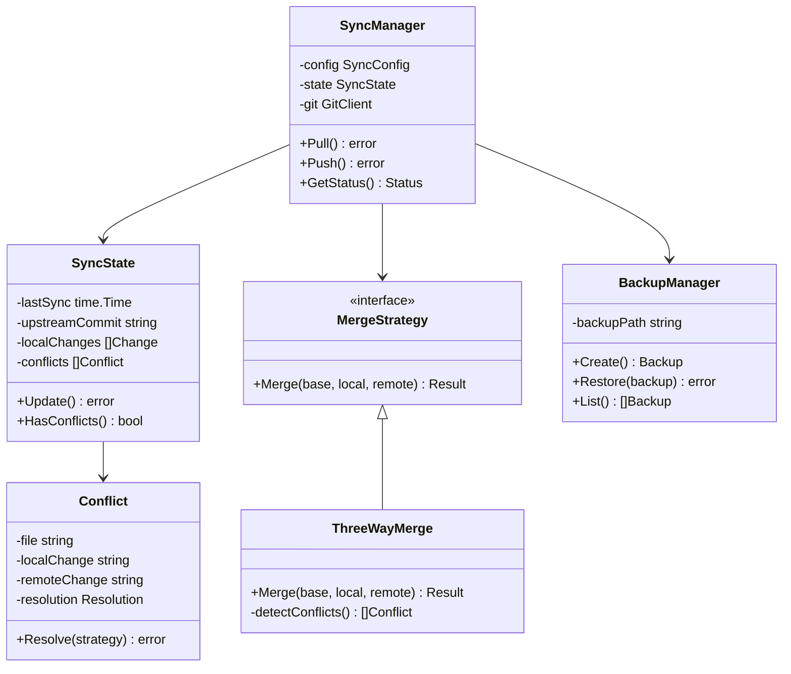
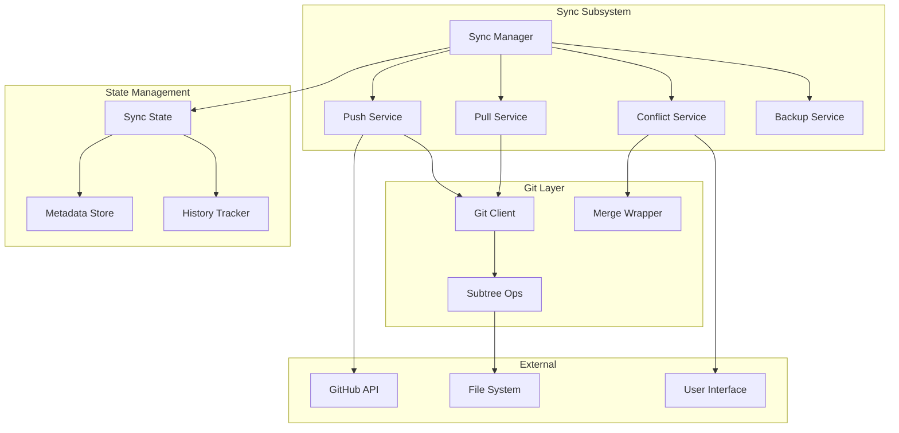
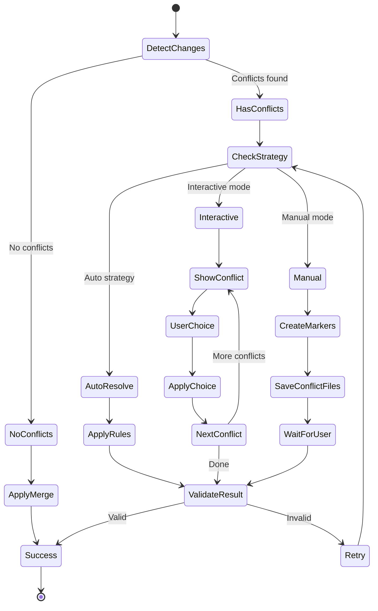

# Solution Design: Upstream Synchronization System

*Bridge between business requirements and technical implementation for FEAT-002*

**Feature ID**: FEAT-002
**Status**: Approved
**Created**: 2025-01-15
**Updated**: 2025-01-15

## Requirements Analysis

### Functional Requirements Mapping

| Requirement | Technical Capability | Component | Priority |
|------------|---------------------|-----------|----------|
| Pull upstream updates | Git subtree pull, merge strategies | internal/sync/pull.go | P0 |
| Preserve local changes | Three-way merge, conflict detection | internal/sync/merge.go | P0 |
| Conflict resolution | Interactive and automatic strategies | internal/sync/conflict.go | P0 |
| Contribute improvements | Git subtree push, validation | internal/sync/push.go | P0 |
| Track sync state | Metadata management, history | internal/sync/state.go | P0 |
| Backup before update | Snapshot creation, rollback | internal/sync/backup.go | P1 |
| Selective updates | Component filtering, partial sync | internal/sync/filter.go | P1 |
| PR creation | GitHub API integration | internal/sync/github.go | P1 |
| Diff preview | Change detection, visualization | internal/sync/diff.go | P2 |
| Offline mode | Cache management, deferred sync | internal/sync/cache.go | P2 |

### Non-Functional Requirements Impact

| NFR Category | Requirement | Architectural Impact | Design Decision |
|--------------|------------|---------------------|-----------------|
| Performance | < 30s for typical sync | Incremental updates, parallel fetch | Git packfile optimization, concurrent ops |
| Reliability | Atomic operations, rollback | Transaction pattern, backup strategy | Git reflog, explicit backups |
| Data Integrity | No data loss during sync | Merge strategies, conflict preservation | Three-way merge, backup files |
| Scalability | Handle large repos (1GB+) | Streaming operations, shallow clones | Partial fetch, sparse checkout |
| Usability | Clear conflict resolution | Interactive UI, helpful messages | Guided resolution, examples |
| Network | Resilient to failures | Retry logic, resume capability | Exponential backoff, checkpoint saves |

## Solution Approaches

### Approach 1: Git Subtree Native (Selected)
**Description**: Leverage git subtree commands directly with custom merge strategies

**Pros**:
- Native git integration
- Preserves full history
- Standard git workflow
- Reliable and tested

**Cons**:
- Requires git installation
- Complex conflict resolution
- Subtree squash complications

**Evaluation**: Selected - Most reliable and maintainable

### Approach 2: Custom Sync Engine
**Description**: Build proprietary sync mechanism with custom protocols

**Pros**:
- Full control over sync logic
- Optimized for DDx use case
- Custom conflict resolution

**Cons**:
- Complex implementation
- Maintain sync protocol
- Limited git integration

**Evaluation**: Rejected - Unnecessary complexity

### Approach 3: Git Submodule
**Description**: Use git submodules for resource management

**Pros**:
- Built-in git feature
- Separate repository tracking
- Clear boundaries

**Cons**:
- Poor user experience
- Complex for contributors
- Detached HEAD issues

**Evaluation**: Rejected - Poor UX for target users

## Domain Model



## Component Architecture



## Technical Design

### Sync State Management

The sync system maintains state in `.ddx.yml`:

```yaml
sync:
  last_update: 2025-01-15T10:00:00Z
  upstream:
    url: https://github.com/ddx-tools/ddx
    branch: main
    commit: abc123def
  local:
    modifications:
      - path: templates/custom/package.json
        type: modified
        hash: sha256:123abc
      - path: patterns/auth/new-auth.js
        type: added
    ignored:
      - "*.tmp"
      - ".cache/*"
  history:
    - timestamp: 2025-01-10T09:00:00Z
      action: pull
      commit: xyz789
      conflicts: 0
    - timestamp: 2025-01-08T14:00:00Z
      action: push
      pr: 234
      status: merged
```

### Merge Strategy Implementation

```go
type MergeStrategy interface {
    Merge(ctx context.Context, base, local, remote File) (*MergeResult, error)
    Name() string
}

type ThreeWayMerge struct {
    conflictMarkers bool
    autoResolve     bool
}

func (m *ThreeWayMerge) Merge(ctx context.Context, base, local, remote File) (*MergeResult, error) {
    // 1. Compute diffs
    localDiff := diff.Compute(base, local)
    remoteDiff := diff.Compute(base, remote)

    // 2. Detect conflicts
    conflicts := m.detectConflicts(localDiff, remoteDiff)

    // 3. Apply non-conflicting changes
    result := m.applyChanges(base, localDiff, remoteDiff, conflicts)

    // 4. Handle conflicts
    if len(conflicts) > 0 {
        if m.autoResolve {
            result = m.autoResolveConflicts(result, conflicts)
        } else {
            result = m.markConflicts(result, conflicts)
        }
    }

    return result, nil
}
```

### Conflict Resolution Flow



### Contribution Workflow

```go
type ContributionManager struct {
    validator Validator
    packager  Packager
    github    GitHubClient
}

func (c *ContributionManager) Contribute(resources []Resource) (*PullRequest, error) {
    // 1. Validate contributions
    if err := c.validator.ValidateAll(resources); err != nil {
        return nil, fmt.Errorf("validation failed: %w", err)
    }

    // 2. Package changes
    pkg, err := c.packager.Package(resources)
    if err != nil {
        return nil, fmt.Errorf("packaging failed: %w", err)
    }

    // 3. Create branch
    branch := fmt.Sprintf("contrib-%s-%d", pkg.Type, time.Now().Unix())
    if err := c.createBranch(branch); err != nil {
        return nil, err
    }

    // 4. Commit changes
    commit := c.createCommit(pkg)
    if err := c.git.Commit(commit); err != nil {
        return nil, err
    }

    // 5. Push to fork
    if err := c.git.Push(branch); err != nil {
        return nil, err
    }

    // 6. Create PR
    pr, err := c.github.CreatePR(branch, pkg.Description)
    if err != nil {
        return nil, err
    }

    return pr, nil
}
```

### Backup Strategy

```go
type BackupManager struct {
    path string
    retention int // days
}

func (b *BackupManager) CreateBackup() (*Backup, error) {
    backup := &Backup{
        ID:        uuid.New().String(),
        Timestamp: time.Now(),
        Path:      filepath.Join(b.path, fmt.Sprintf("backup-%d", time.Now().Unix())),
    }

    // 1. Create backup directory
    if err := os.MkdirAll(backup.Path, 0755); err != nil {
        return nil, err
    }

    // 2. Copy current state
    if err := b.copyTree(".ddx", backup.Path); err != nil {
        return nil, err
    }

    // 3. Save metadata
    if err := b.saveMetadata(backup); err != nil {
        return nil, err
    }

    // 4. Clean old backups
    if err := b.cleanOldBackups(); err != nil {
        // Log but don't fail
        log.Printf("cleanup failed: %v", err)
    }

    return backup, nil
}
```

## Error Handling

### Error Categories

1. **Network Errors**: Retry with exponential backoff
2. **Merge Conflicts**: Preserve state, guide resolution
3. **Permission Errors**: Clear messages, suggest fixes
4. **Corruption**: Detect and recover from backups
5. **Version Mismatch**: Handle gracefully, suggest update

### Recovery Procedures

```go
type RecoveryManager struct {
    backup BackupManager
    state  StateManager
}

func (r *RecoveryManager) Recover(err error) error {
    switch e := err.(type) {
    case *MergeError:
        return r.recoverFromMerge(e)
    case *CorruptionError:
        return r.recoverFromCorruption(e)
    case *NetworkError:
        return r.resumeOperation(e)
    default:
        return fmt.Errorf("unrecoverable error: %w", err)
    }
}
```

## Performance Optimization

### Incremental Updates

Only fetch and merge changed files:

```go
func (s *SyncManager) IncrementalPull() error {
    // 1. Get change list from upstream
    changes, err := s.git.GetChangesSince(s.state.LastCommit)
    if err != nil {
        return err
    }

    // 2. Filter by included components
    filtered := s.filterChanges(changes)

    // 3. Fetch only required objects
    if err := s.git.FetchObjects(filtered); err != nil {
        return err
    }

    // 4. Apply changes
    return s.applyChanges(filtered)
}
```

### Parallel Operations

```go
func (s *SyncManager) ParallelSync(components []string) error {
    var wg sync.WaitGroup
    errors := make(chan error, len(components))

    for _, comp := range components {
        wg.Add(1)
        go func(c string) {
            defer wg.Done()
            if err := s.syncComponent(c); err != nil {
                errors <- fmt.Errorf("%s: %w", c, err)
            }
        }(comp)
    }

    wg.Wait()
    close(errors)

    // Collect errors
    var errs []error
    for err := range errors {
        errs = append(errs, err)
    }

    if len(errs) > 0 {
        return fmt.Errorf("sync failed: %v", errs)
    }

    return nil
}
```

## Security Considerations

### Input Validation

- Validate repository URLs
- Sanitize branch names
- Check file paths for traversal
- Verify commit signatures

### Secret Protection

- Never sync files matching secret patterns
- Scan for accidental secret commits
- Sanitize logs and error messages
- Use secure credential storage

### Network Security

- Use HTTPS/SSH for git operations
- Verify SSL certificates
- Support proxy configurations
- Implement request signing for API calls

## Testing Strategy

### Unit Tests

```go
func TestThreeWayMerge(t *testing.T) {
    merger := NewThreeWayMerge()

    base := File{Content: "original"}
    local := File{Content: "original+local"}
    remote := File{Content: "original+remote"}

    result, err := merger.Merge(context.TODO(), base, local, remote)
    assert.NoError(t, err)
    assert.Contains(t, result.Content, "local")
    assert.Contains(t, result.Content, "remote")
}
```

### Integration Tests

```go
func TestFullSyncWorkflow(t *testing.T) {
    // Setup test repository
    repo := setupTestRepo(t)
    defer repo.Cleanup()

    // Initialize sync
    sync := NewSyncManager(repo)

    // Perform sync
    err := sync.Pull()
    assert.NoError(t, err)

    // Verify state
    state := sync.GetState()
    assert.NotEmpty(t, state.LastCommit)
    assert.True(t, state.IsSynced())
}
```

## Implementation Plan

### Phase 1: Core Sync (Week 1)
- Git subtree integration
- Basic pull/push operations
- State management

### Phase 2: Conflict Resolution (Week 2)
- Three-way merge implementation
- Conflict detection
- Manual resolution flow

### Phase 3: Advanced Features (Week 3)
- Backup system
- Selective sync
- PR creation

### Phase 4: Optimization (Week 4)
- Incremental updates
- Parallel operations
- Performance tuning

## Success Metrics

- **Sync Performance**: < 30 seconds for typical update
- **Conflict Resolution**: 90% auto-resolved
- **Data Integrity**: Zero data loss incidents
- **User Satisfaction**: < 2% sync-related issues
- **Contribution Success**: 80% PRs accepted