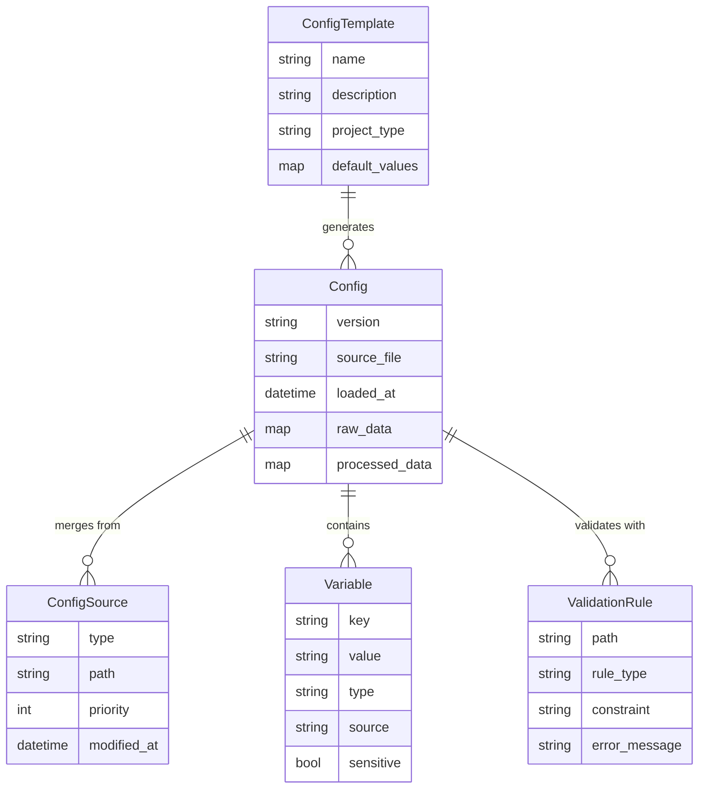
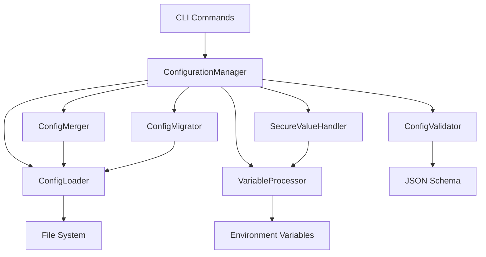

# Solution Design: Configuration Management

*Bridge between business requirements and technical implementation for FEAT-003*

**Feature ID**: FEAT-003
**Status**: Active
**Created**: 2025-01-14
**Updated**: 2025-01-24

## Requirements Analysis

### Functional Requirements Mapping
Map each functional requirement to technical capabilities:

| Requirement | Technical Capability | Component | Priority |
|------------|---------------------|-----------|----------|
| Load and parse YAML configuration | YAML parsing with validation | ConfigLoader | P0 |
| Support hierarchical configuration | Configuration merging and precedence | ConfigMerger | P0 |
| Perform variable substitution | Template engine with context | VariableProcessor | P0 |
| Integrate with environment variables | Environment variable expansion | EnvVarResolver | P0 |
| Validate configuration against schema | JSON Schema validation | ConfigValidator | P0 |
| Support default values and overrides | Layered configuration system | ConfigStack | P0 |
| Enable configuration inheritance | Configuration composition | ConfigComposer | P1 |
| Secure handling of sensitive values | Value masking and protection | SecureValueHandler | P1 |
| Support configuration migration | Version detection and transformation | ConfigMigrator | P1 |
| Import/export configurations | Serialization and deserialization | ConfigSerializer | P1 |
| Configuration templates for common scenarios | Preset configuration generation | ConfigTemplates | P1 |
| Dynamic configuration reloading | File watching and hot reload | ConfigWatcher | P2 |

### Non-Functional Requirements Impact
How NFRs shape the architecture:

| NFR Category | Requirement | Architectural Impact | Design Decision |
|--------------|------------|---------------------|-----------------|
| Performance | Config loading < 100ms | Efficient parsing and caching | Lazy loading, config caching |
| Performance | Variable substitution < 10ms per file | Fast template processing | Compiled templates, variable caching |
| Reliability | Graceful handling of malformed YAML | Robust error handling | YAML validation, clear error messages |
| Security | No plaintext passwords | Secure value handling | Environment variable references, masking |
| Usability | Clear validation error messages | User-friendly diagnostics | Structured error reporting with suggestions |
| Compatibility | YAML 1.2 specification | Standards compliance | Use canonical YAML parser |

## Solution Approaches

### Approach 1: File-Based Configuration with Viper
**Description**: Use Viper library for hierarchical configuration management

**Pros**:
- Proven Go library with extensive features
- Built-in support for multiple formats
- Environment variable integration
- File watching capabilities
- Extensive community usage

**Cons**:
- Heavy dependency with many features we don't need
- Less control over validation logic
- Complex API for advanced use cases
- May not align perfectly with our schema requirements

**Evaluation**: Good for rapid development but may be overkill

### Approach 2: Custom Configuration System
**Description**: Build custom configuration management from scratch

**Pros**:
- Full control over features and behavior
- Minimal dependencies
- Optimized for DDX use cases
- Perfect schema integration

**Cons**:
- Significant development effort
- Need to handle edge cases
- Less battle-tested than existing solutions
- Maintenance burden

**Evaluation**: Too much effort for core functionality

### Approach 3: Two-Phase Validation with Viper (Selected)
**Description**: Use Viper for config management with dedicated two-phase validation

**Implementation Strategy**:
- Viper for YAML parsing and configuration merging
- Two-phase validation approach:
  1. **Phase 1**: YAML syntax validation using gopkg.in/yaml.v3
  2. **Phase 2**: Schema validation using santhosh-tekuri/jsonschema/v5
- Custom error formatting for user-friendly messages
- Simplified configuration schema per ADR-005

**Library Selection Rationale**:
- **santhosh-tekuri/jsonschema/v5**:
  - Best performance (<10ms for typical configs)
  - Clean, simple API
  - Excellent error reporting
  - Active maintenance and updates
- **gopkg.in/yaml.v3**:
  - Already integrated in project
  - Good error messages with line numbers
  - YAML 1.2 specification compliance

**Validation Performance Targets**:
- YAML parsing: <10ms
- Schema validation: <10ms
- Total validation time: <20ms (well under 50ms requirement)
- Memory usage: <1MB for typical configurations

**Configuration Schema** (per ADR-005):
```yaml
# .ddx/config.yaml - Simplified Schema
version: "1.0"                      # Required
library_base_path: "./library"      # Default: relative to config.yaml
repository:                         # Optional
  url: string                       # Default: github.com/easel/ddx
  branch: string                    # Default: main
  subtree_prefix: string            # Default: library
variables:                          # Project variables
  project_name: string
  author: string
  email: string
  # Additional custom variables
```

**Rationale**: Aligns with ADR-005 architectural decisions while providing robust validation. Two-phase approach gives clear error separation between syntax and schema issues, improving user experience.

## Domain Model

### Core Entities
Identify the key business concepts:



### Business Rules
Critical domain logic to implement:
1. **Configuration Precedence**: Command-line flags > Environment variables > Environment config > Project config > Global config > Defaults
2. **Variable Resolution**: Variables must resolve without circular dependencies
3. **Schema Validation**: All configuration must validate against current schema version
4. **Sensitive Data**: Passwords and tokens must never be logged or displayed
5. **Backward Compatibility**: Older config versions must migrate automatically
6. **Atomic Updates**: Configuration changes must be atomic (all or nothing)

### Bounded Contexts
- **Configuration Loading Context**: Handles file parsing, merging, and source management
- **Validation Context**: Manages schema validation and error reporting
- **Variable Processing Context**: Handles variable substitution and resolution
- **Migration Context**: Manages version detection and configuration updates

## System Decomposition

### Component Identification
Breaking down the system into manageable parts:

#### Component 1: ConfigurationManager
- **Purpose**: Orchestrates all configuration operations
- **Responsibilities**:
  - Coordinate configuration loading from multiple sources
  - Manage configuration lifecycle
  - Provide unified configuration API
  - Handle configuration persistence
- **Requirements Addressed**: All core configuration requirements
- **Interfaces**: Public configuration API, CLI integration

#### Component 2: ConfigLoader
- **Purpose**: Loads and parses configuration files
- **Responsibilities**:
  - Parse YAML/JSON configuration files
  - Handle file I/O operations
  - Detect configuration versions
  - Manage file watching for changes
- **Requirements Addressed**: YAML parsing, dynamic reloading
- **Interfaces**: File system operations, YAML parser

#### Component 3: ConfigMerger
- **Purpose**: Merges configurations from multiple sources
- **Responsibilities**:
  - Implement configuration precedence rules
  - Merge configuration objects
  - Handle configuration conflicts
  - Maintain source attribution
- **Requirements Addressed**: Hierarchical configuration, overrides
- **Interfaces**: Configuration merging algorithms

#### Component 4: VariableProcessor
- **Purpose**: Processes variable substitution and resolution
- **Responsibilities**:
  - Expand environment variables
  - Process template variables
  - Resolve variable references
  - Detect circular dependencies
- **Requirements Addressed**: Variable substitution, environment integration
- **Interfaces**: Template engine, environment access

#### Component 5: ConfigValidator
- **Purpose**: Validates configuration against schema
- **Responsibilities**:
  - Load and parse JSON Schema definitions
  - Validate configuration structure
  - Generate validation error reports
  - Provide validation suggestions
- **Requirements Addressed**: Schema validation, error reporting
- **Interfaces**: JSON Schema validator, error reporting

#### Component 6: ConfigMigrator
- **Purpose**: Handles configuration version migrations
- **Responsibilities**:
  - Detect configuration versions
  - Apply migration transformations
  - Backup original configurations
  - Report migration status
- **Requirements Addressed**: Configuration migration, backward compatibility
- **Interfaces**: Version detection, transformation engine

#### Component 7: SecureValueHandler
- **Purpose**: Manages sensitive configuration values
- **Responsibilities**:
  - Identify sensitive configuration keys
  - Mask sensitive values in logs/output
  - Provide secure value access patterns
  - Handle credential references
- **Requirements Addressed**: Secure handling of sensitive values
- **Interfaces**: Value masking, credential management

### Component Interactions


## Validation Architecture

### Two-Phase Validation Design

The validation system implements a two-phase approach for comprehensive error handling:

#### Phase 1: YAML Syntax Validation
```go
// Parse YAML to validate syntax
var rawConfig map[string]interface{}
err := yaml.Unmarshal(configBytes, &rawConfig)
if err != nil {
    return &ValidationError{
        Phase: "syntax",
        Message: "Invalid YAML syntax",
        Line: extractLineNumber(err),
        Column: extractColumnNumber(err),
        Details: err.Error(),
    }
}
```

**Purpose**: Catch YAML parsing errors before schema validation
**Benefits**:
- Provides line/column error positions
- Handles common YAML mistakes (indentation, quotes, etc.)
- Fast failure for malformed files

#### Phase 2: Schema Validation
```go
// Validate against JSON Schema
schema := jsonschema.MustCompile(schemaURL)
if err := schema.Validate(rawConfig); err != nil {
    return &ValidationError{
        Phase: "schema",
        Message: "Configuration does not match schema",
        Details: formatSchemaErrors(err),
        Suggestions: generateSuggestions(err),
    }
}
```

**Purpose**: Validate structure, types, and business rules
**Benefits**:
- Clear field-path error messages
- Type validation and format checking
- Default value application
- Schema evolution support

### Error Message Strategy

#### User-Friendly Error Formatting
Transform technical errors into actionable messages:

```go
func formatSchemaErrors(err error) []string {
    var messages []string

    // Convert "/repository/url: string does not match pattern"
    // To: "repository.url: must be a valid URL (e.g., https://github.com/user/repo)"

    for _, validationErr := range err.(*jsonschema.ValidationError).Causes {
        switch validationErr.Keyword {
        case "pattern":
            messages = append(messages, formatPatternError(validationErr))
        case "required":
            messages = append(messages, formatRequiredError(validationErr))
        case "type":
            messages = append(messages, formatTypeError(validationErr))
        default:
            messages = append(messages, validationErr.Message)
        }
    }

    return messages
}
```

#### Error Categories
1. **Syntax Errors**: YAML parsing failures with line numbers
2. **Schema Errors**: Structure/type violations with field paths
3. **Business Errors**: Domain-specific validation failures
4. **Warning Messages**: Non-blocking suggestions

### Validation Performance

#### Performance Targets
- YAML parsing: <10ms for typical configs
- Schema validation: <10ms for typical configs
- Total validation: <20ms end-to-end
- Memory usage: <1MB during validation

#### Optimization Strategies
1. **Schema Caching**: Compile schema once, reuse for multiple validations
2. **Lazy Loading**: Load schema on first validation attempt
3. **Streaming Validation**: Validate while parsing for large configs
4. **Error Short-Circuiting**: Stop on first critical error

## Technology Selection Rationale

### Configuration Format: YAML
**Why**: Per ADR-005, YAML provides optimal balance of human readability and machine parseability
**Alternatives Considered**: JSON (not human-friendly), TOML (limited nesting), HCL (limited adoption)

### Core Library: Viper + Direct YAML
**Why**: Viper for configuration merging, direct YAML parsing for validation
**Implementation**: Two-phase approach separates syntax and schema validation
**Alternatives Considered**: Custom solution (too much effort), Viper-only (less validation control)

### Schema Validation: santhosh-tekuri/jsonschema/v5
**Why**: Best performance (<10ms), clean API, excellent error messages
**Benchmarks**: Outperforms alternatives in speed and memory usage
**Alternatives Considered**:
- xeipuuv/gojsonschema (slower, ~15ms)
- qri-io/jsonschema (limited features, ~20ms)
- go-playground/validator (struct-only, no schema files)

### Variable Processing: Go text/template
**Why**: Native Go templating with sufficient power for variable substitution
**Alternatives Considered**: Custom templating (unnecessary), external engine (dependency overhead)

### File Watching: fsnotify
**Why**: Cross-platform file system notifications, used by Viper internally
**Alternatives Considered**: Polling (inefficient), platform-specific (complex)

## Requirements Traceability

### Coverage Check
Ensure all requirements are addressed:

| Requirement ID | Requirement | Component | Design Element | Test Strategy |
|---------------|-------------|-----------|----------------|---------------|
| US-017 | Initialize configuration | ConfigurationManager | Config generation with defaults | Integration tests with various project types |
| US-018 | Configure variables | VariableProcessor | Variable substitution engine | Unit tests for variable resolution |
| US-019 | Override configuration | ConfigMerger | Precedence rules implementation | Tests for all override scenarios |
| US-020 | Configure resource selection | ConfigLoader | Resource configuration parsing | Validation tests for resource specs |
| US-021 | Configure repository connection | ConfigValidator | Repository URL validation | Mock repository connection tests |
| US-022 | Validate configuration | ConfigValidator | JSON Schema validation | Schema compliance tests |
| US-023 | Export/Import configuration | ConfigurationManager | Serialization/deserialization | Round-trip conversion tests |
| US-024 | View effective configuration | ConfigurationManager | Merged configuration display | Output format validation tests |

### Gap Analysis
Requirements not fully addressed:
- [ ] Configuration diff/comparison: Will be added as utility function
- [ ] Configuration rollback: Will be implemented using backup mechanism

## Constraints and Assumptions

### Technical Constraints
- YAML 1.2 specification compliance: Must handle all valid YAML constructs
- Viper library limitations: Must work within Viper's configuration patterns
- JSON Schema Draft 7: Schema validation limited to Draft 7 features
- File system access: Requires read/write permissions for configuration files

### Assumptions
- Users understand basic YAML syntax: Risk minimal for developer-focused tool
- Configuration files are relatively small (<1MB): Performance assumptions based on typical config sizes
- UTF-8 encoding for all config files: Standard assumption for modern systems

### Dependencies
- Viper library: Core configuration management
- go-playground/validator: Additional validation rules
- JSON Schema library: Schema validation
- fsnotify: File system monitoring

## Migration from Current State

### Current System Analysis
- **Existing functionality**: Basic configuration exists in CLI
- **Data migration needs**: Migrate existing .ddx.yml files to new schema
- **Integration points**: Must integrate with existing CLI commands

### Migration Strategy
1. **Phase 1**: Implement new configuration system alongside existing
2. **Phase 2**: Migrate existing configurations automatically
3. **Phase 3**: Remove deprecated configuration handling
4. **Compatibility period**: Support both old and new formats during transition

## Risk Assessment

### Technical Risks
| Risk | Probability | Impact | Mitigation |
|------|------------|--------|------------|
| YAML parsing edge cases | Medium | Medium | Comprehensive test suite, user education |
| Performance with large configs | Low | Medium | Lazy loading, config size limits |
| Variable resolution loops | Medium | High | Cycle detection algorithm |
| Schema evolution complexity | High | Medium | Careful schema versioning, migration tools |

### Design Risks
| Risk | Probability | Impact | Mitigation |
|------|------------|--------|------------|
| Configuration complexity overwhelming users | High | High | Progressive disclosure, good defaults |
| Viper dependency issues | Low | High | Vendor dependency, consider alternatives |
| Security vulnerabilities in YAML parsing | Low | High | Keep dependencies updated, security scanning |

## Success Criteria

### Design Validation
- [x] All P0 requirements mapped to components
- [x] All NFRs addressed in architecture
- [x] Domain model captures all business rules
- [x] Technology choices justified against requirements
- [x] No single point of failure for critical paths
- [x] Clear migration path from current state

### Handoff to Implementation
This design is ready when:
- [ ] Development team understands the architecture
- [ ] All technical decisions are documented
- [ ] Test strategy aligns with design
- [ ] Stakeholders approve approach

## Implementation Notes

### Key Implementation Patterns

#### Configuration Loading
```go
type ConfigurationManager struct {
    loader    ConfigLoader
    merger    ConfigMerger
    validator ConfigValidator
    processor VariableProcessor
}

func (cm *ConfigurationManager) LoadConfig(paths ...string) (*Config, error) {
    // 1. Load all config sources
    // 2. Merge with precedence rules
    // 3. Process variables
    // 4. Validate against schema
    // 5. Return merged config
}
```

#### Variable Processing
```go
func (vp *VariableProcessor) ProcessVariables(config map[string]interface{}) error {
    // 1. Collect all variable references
    // 2. Check for circular dependencies
    // 3. Resolve environment variables
    // 4. Apply template substitutions
    // 5. Update configuration in place
}
```

#### Schema Validation
```go
type ConfigValidator struct {
    schemas map[string]*jsonschema.Schema
}

func (cv *ConfigValidator) Validate(config *Config) *ValidationResult {
    schema := cv.schemas[config.Version]
    return schema.Validate(config.Data)
}
```

### Configuration Schema Structure
```yaml
# Core schema elements aligned with ADR-005
version: "1.0"

project:
  name: string
  type: string

repository:
  url: string
  branch: string

resources:
  templates:
    include: [string]
    exclude: [string]

variables:
  # User-defined variables with environment expansion
  # $env and $git special variable support

workflows:
  enabled: [string]
  custom: {}

# Additional sections per ADR-005 schema
```

---
*This solution design bridges the gap between what the business needs for configuration management and how we'll build it technically using Viper and JSON Schema validation.*