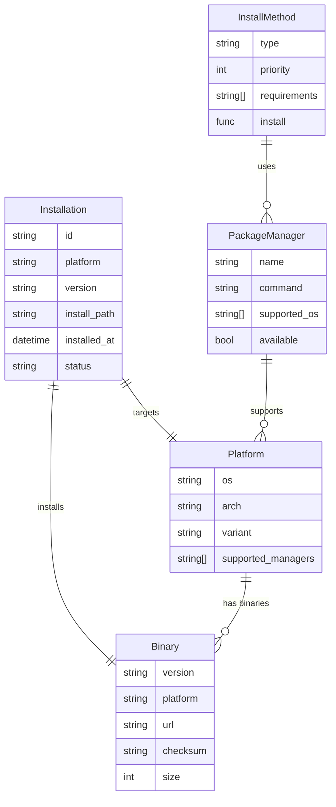
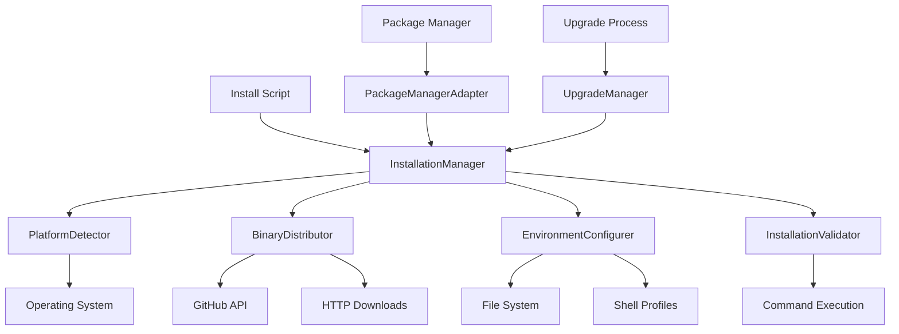

# Solution Design: Cross-Platform Installation

*Bridge between business requirements and technical implementation for FEAT-004*

**Feature ID**: FEAT-004
**Status**: Draft
**Created**: 2025-01-14
**Updated**: 2025-01-14

## Requirements Analysis

### Functional Requirements Mapping
Map each functional requirement to technical capabilities:

| Requirement | Technical Capability | Component | Priority |
|------------|---------------------|-----------|----------|
| Platform detection | OS and architecture detection | PlatformDetector | P0 |
| Binary distribution | Multi-platform binary hosting and retrieval | BinaryDistributor | P0 |
| Installation location | User-space installation with PATH management | InstallationManager | P0 |
| Environment configuration | Shell profile modification and PATH setup | EnvironmentConfigurer | P0 |
| Package manager support | Integration with platform package managers | PackageManagerAdapter | P1 |
| Installation verification | Post-install testing and validation | InstallationValidator | P0 |
| Upgrade capability | Version comparison and binary replacement | UpgradeManager | P1 |
| Uninstallation | Complete removal with configuration cleanup | UninstallationManager | P1 |
| Offline installation | Standalone installer packages | OfflinePackageBuilder | P1 |
| Error handling | Installation failure diagnosis and recovery | InstallationErrorHandler | P0 |

### Non-Functional Requirements Impact
How NFRs shape the architecture:

| NFR Category | Requirement | Architectural Impact | Design Decision |
|--------------|------------|---------------------|-----------------|
| Performance | Installation < 60s on 10Mbps | Efficient downloads, parallel operations | Streaming downloads, concurrent setup |
| Reliability | 99% installation success rate | Robust error handling, rollback capability | Transaction-based installation |
| Security | No admin privileges required | User-space installation only | Home directory installation |
| Security | Encrypted downloads, integrity verification | HTTPS, checksums, signatures | TLS + SHA256 verification |
| Usability | Single command installation | Minimal user interaction | Automated detection and setup |
| Compatibility | macOS 10.15+, Ubuntu 18.04+, Windows 10+ | Platform-specific installers | OS-specific installation paths |

## Solution Approaches

### Approach 1: Shell Script Installation (curl/wget)
**Description**: Single shell script that detects platform and downloads appropriate binary

**Pros**:
- Simple, widely-used pattern (used by Rust, Node.js, etc.)
- Single command installation experience
- No dependencies beyond curl/wget
- Easy to maintain and understand

**Cons**:
- Platform detection complexity in shell script
- Limited error handling capabilities
- Security concerns with pipe-to-shell
- Windows PowerShell version needed separately

**Evaluation**: Good for Unix-like systems but needs Windows solution

### Approach 2: Native Installers Per Platform
**Description**: Platform-specific installers (.pkg, .msi, .deb, .rpm)

**Pros**:
- Native user experience per platform
- Integrated with OS package management
- Professional appearance and trust
- Automatic uninstall support

**Cons**:
- Complex build and signing process
- Different installer for each platform/distro
- Requires code signing certificates
- Slow release cycle due to complexity

**Evaluation**: Professional but too complex for v1

### Approach 3: Hybrid Approach with GitHub Releases (Selected)
**Description**: GitHub Releases for binary hosting with smart install script

**Pros**:
- Leverages GitHub's CDN and reliability
- Automatic checksums and release management
- Single install script with platform detection
- Easy to add package managers later
- Community-familiar pattern

**Cons**:
- Dependency on GitHub availability
- Limited to GitHub's artifact limits
- Need fallback for corporate networks

**Evaluation**: Optimal balance of simplicity and functionality

**Rationale**: Aligns with open-source distribution patterns while providing reliable, fast installation. GitHub Releases provide built-in CDN, checksums, and release management. Can evolve to native installers in future versions.

## Domain Model

### Core Entities
Identify the key business concepts:



### Business Rules
Critical domain logic to implement:
1. **Platform Compatibility**: Only install binaries compatible with detected platform
2. **Version Consistency**: All installed components must be same DDX version
3. **Atomic Installation**: Installation succeeds completely or fails completely
4. **No Admin Privileges**: Must install to user-accessible directories only
5. **PATH Safety**: Never corrupt existing PATH, always provide rollback
6. **Checksum Verification**: All downloads must pass integrity checks
7. **Single Instance**: Only one version of DDX per installation location

### Bounded Contexts
- **Platform Detection Context**: OS, architecture, and capability detection
- **Binary Distribution Context**: Download, verification, and storage
- **Installation Context**: File placement, PATH configuration, verification
- **Package Management Context**: Integration with OS package managers

## System Decomposition

### Component Identification
Breaking down the system into manageable parts:

#### Component 1: PlatformDetector
- **Purpose**: Detects target platform and capabilities
- **Responsibilities**:
  - Identify operating system and version
  - Detect architecture (x86_64, arm64, etc.)
  - Check available package managers
  - Validate minimum requirements
- **Requirements Addressed**: Platform detection, compatibility checking
- **Interfaces**: OS APIs, command execution

#### Component 2: BinaryDistributor
- **Purpose**: Manages binary downloads and verification
- **Responsibilities**:
  - Fetch available versions from GitHub API
  - Download appropriate binary for platform
  - Verify checksums and signatures
  - Handle download failures and retries
- **Requirements Addressed**: Binary distribution, offline packages
- **Interfaces**: GitHub API, HTTP client, crypto verification

#### Component 3: InstallationManager
- **Purpose**: Orchestrates the installation process
- **Responsibilities**:
  - Coordinate all installation steps
  - Manage installation state and rollback
  - Handle user interaction and prompts
  - Provide installation progress feedback
- **Requirements Addressed**: Installation coordination, user experience
- **Interfaces**: All other components, user interaction

#### Component 4: EnvironmentConfigurer
- **Purpose**: Manages environment and PATH configuration
- **Responsibilities**:
  - Detect current shell and profile files
  - Modify shell profiles to add DDX to PATH
  - Create backup of original configurations
  - Provide rollback capability
- **Requirements Addressed**: PATH configuration, environment setup
- **Interfaces**: File system, shell detection

#### Component 5: PackageManagerAdapter
- **Purpose**: Integrates with platform package managers
- **Responsibilities**:
  - Detect available package managers
  - Generate packages for different formats
  - Handle package manager installation
  - Manage package metadata
- **Requirements Addressed**: Package manager installation
- **Interfaces**: Package manager commands, package formats

#### Component 6: InstallationValidator
- **Purpose**: Validates successful installation
- **Responsibilities**:
  - Test DDX binary execution
  - Verify PATH configuration works
  - Check file permissions and ownership
  - Generate installation report
- **Requirements Addressed**: Installation verification
- **Interfaces**: Command execution, file system checks

#### Component 7: UpgradeManager
- **Purpose**: Handles version upgrades
- **Responsibilities**:
  - Detect current DDX version
  - Compare with available versions
  - Backup current installation
  - Replace binary with new version
- **Requirements Addressed**: Upgrade capability
- **Interfaces**: Version comparison, binary replacement

### Component Interactions


## Technology Selection Rationale

### Installation Script: Shell Script + PowerShell
**Why**: Ubiquitous availability, no dependencies, familiar to users
**Alternatives Considered**: Native binaries (chicken-and-egg problem), Python (not always available)

### Binary Distribution: GitHub Releases
**Why**: Free hosting, built-in CDN, checksums, familiar to developers
**Alternatives Considered**: Custom CDN (expensive), package registries (platform-specific)

### Platform Detection: Runtime Detection
**Why**: Most accurate, adapts to actual environment
**Alternatives Considered**: User specification (error-prone), build matrix (incomplete coverage)

### Checksum Verification: SHA256
**Why**: Industry standard, good security/performance balance
**Alternatives Considered**: MD5 (insecure), SHA512 (overkill for this use case)

### Installation Directory: User Home
**Why**: No admin privileges required, user owns the installation
**Alternatives Considered**: System directories (need admin), /usr/local (not Windows compatible)

## Requirements Traceability

### Coverage Check
Ensure all requirements are addressed:

| Requirement ID | Requirement | Component | Design Element | Test Strategy |
|---------------|-------------|-----------|----------------|---------------|
| US-028 | One-command installation | InstallationManager | Shell script wrapper | Integration test full install flow |
| US-029 | Automatic PATH configuration | EnvironmentConfigurer | Shell profile modification | Test PATH changes in clean environments |
| US-030 | Installation verification | InstallationValidator | Post-install testing | Verify ddx command works |
| US-031 | Package manager installation | PackageManagerAdapter | Package format generation | Test with Homebrew, apt, winget |
| US-032 | Upgrade existing installation | UpgradeManager | Version replacement | Test upgrade scenarios |
| US-033 | Uninstall DDX | InstallationManager | Complete removal | Verify clean uninstall |
| US-034 | Offline installation | BinaryDistributor | Downloadable packages | Test without network |
| US-035 | Installation diagnostics | InstallationManager | Error analysis | Test failure scenarios |

### Gap Analysis
Requirements not fully addressed:
- [ ] Corporate proxy support: Will be added through environment variable detection
- [ ] Air-gapped installation: Will provide downloadable installer bundles

## Constraints and Assumptions

### Technical Constraints
- GitHub rate limits: 5000 requests/hour for unauthenticated users
- Binary size limits: GitHub releases limited to 2GB per file
- Platform variations: Each OS/arch needs separate binary
- Shell compatibility: Must work with bash, zsh, fish, PowerShell

### Assumptions
- Users have curl/wget or PowerShell: Standard on target platforms
- Internet access for initial install: Offline mode available as alternative
- Write permissions to home directory: Standard user capability
- PATH modification acceptable: Users expect this for CLI tools

### Dependencies
- GitHub API availability: Primary distribution method
- HTTP client (curl/wget): For downloads
- Shell environment: For PATH modification
- File system permissions: For installation

## Migration from Current State

### Current System Analysis
- **Existing functionality**: Manual installation instructions
- **Data migration needs**: None - new installation system
- **Integration points**: Must work with existing DDX binary

### Migration Strategy
1. **Phase 1**: Create automated installation script
2. **Phase 2**: Add package manager support
3. **Phase 3**: Create offline installation packages
4. **Compatibility period**: Maintain manual instructions as fallback

## Risk Assessment

### Technical Risks
| Risk | Probability | Impact | Mitigation |
|------|------------|--------|------------|
| GitHub API rate limiting | Medium | Medium | Authentication tokens, fallback CDN |
| Platform detection failures | Medium | High | Comprehensive platform testing, manual override |
| Network connectivity issues | High | Medium | Offline packages, retry logic, clear error messages |
| PATH corruption | Low | High | Backup original PATH, validation before modification |
| Binary corruption during download | Low | High | Checksum verification, retry downloads |

### Design Risks
| Risk | Probability | Impact | Mitigation |
|------|------------|--------|------------|
| Installation script complexity | Medium | Medium | Modular design, extensive testing |
| Cross-platform compatibility | High | High | Platform-specific testing, beta program |
| Package manager integration failures | Medium | Medium | Gradual rollout, fallback to manual install |
| User permission issues | Medium | High | Clear error messages, troubleshooting guide |

## Success Criteria

### Design Validation
- [x] All P0 requirements mapped to components
- [x] All NFRs addressed in architecture
- [x] Domain model captures all business rules
- [x] Technology choices justified against requirements
- [x] No single point of failure for critical paths
- [x] Clear rollback and error recovery

### Handoff to Implementation
This design is ready when:
- [ ] Development team understands the architecture
- [ ] All technical decisions are documented
- [ ] Test strategy aligns with design
- [ ] Stakeholders approve approach

## Implementation Notes

### Key Implementation Patterns

#### Platform Detection
```bash
# Shell script platform detection
detect_platform() {
    local os arch
    case "$(uname -s)" in
        Darwin) os="darwin" ;;
        Linux) os="linux" ;;
        MINGW*) os="windows" ;;
        *) echo "Unsupported OS: $(uname -s)" && exit 1 ;;
    esac

    case "$(uname -m)" in
        x86_64|amd64) arch="amd64" ;;
        aarch64|arm64) arch="arm64" ;;
        *) echo "Unsupported architecture: $(uname -m)" && exit 1 ;;
    esac

    echo "${os}_${arch}"
}
```

#### Installation Process
```bash
# Main installation flow
install_ddx() {
    local platform version install_dir

    platform=$(detect_platform)
    version=$(get_latest_version)
    install_dir=$(get_install_directory)

    echo "Installing DDX ${version} for ${platform}..."

    # Download and verify
    download_binary "${platform}" "${version}" "${install_dir}"
    verify_checksum "${install_dir}/ddx" "${version}" "${platform}"

    # Configure environment
    setup_path "${install_dir}"

    # Verify installation
    verify_installation "${install_dir}/ddx"

    echo "DDX installed successfully!"
    echo "Run 'ddx --help' to get started."
}
```

#### PATH Configuration
```bash
# Configure shell PATH
setup_path() {
    local install_dir="$1"
    local shell_rc profile_updated

    # Detect current shell
    shell_rc=$(detect_shell_rc)

    # Check if already in PATH
    if echo "$PATH" | grep -q "${install_dir}"; then
        echo "DDX already in PATH"
        return
    fi

    # Add to PATH
    echo "export PATH=\"${install_dir}:\$PATH\"" >> "${shell_rc}"
    export PATH="${install_dir}:$PATH"

    profile_updated=true
}
```

### Installation Commands
```bash
# Primary installation methods
curl -sSL https://ddx.dev/install | sh                    # Unix/Linux/macOS
iwr -useb https://ddx.dev/install.ps1 | iex              # Windows PowerShell

# Package manager installations (future)
brew install ddx                                          # macOS Homebrew
sudo apt install ddx                                      # Ubuntu/Debian
winget install ddx                                        # Windows Package Manager

# Verification command
ddx --version                                             # Verify installation
```

---
*This solution design bridges the gap between what the business needs for cross-platform installation and how we'll build it technically using GitHub Releases and platform-specific installation scripts.*