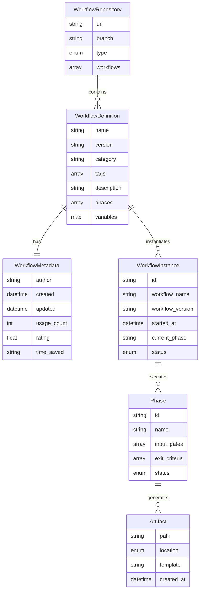
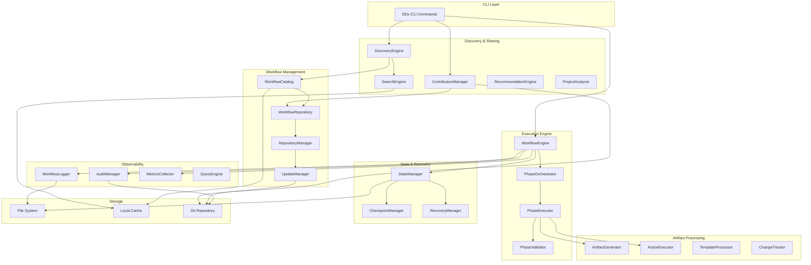

# Solution Design: Workflow Execution Engine with Observability

*Bridge between business requirements and technical implementation for FEAT-005*

**Feature ID**: FEAT-005
**Status**: Draft
**Created**: 2025-01-14
**Updated**: 2025-01-14

## Requirements Analysis

### Functional Requirements Mapping

Based on FEAT-005 (Workflow Execution Engine with Observability and Sharing):

| Requirement | Technical Capability | Component | Priority |
|------------|---------------------|-----------|----------|
| **Workflow CLI Commands** | | | |
| `ddx workflow init <type>` - Initialize workflow | Workflow instantiation from templates | WorkflowInitializer | P0 |
| `ddx workflow list` - Browse available | Catalog search and filtering | WorkflowCatalog | P0 |
| `ddx workflow apply <name>` - Apply workflow | Fast workflow application (<10s) | WorkflowApplicator | P0 |
| `ddx workflow status` - Check progress | Real-time status monitoring | StatusMonitor | P0 |
| `ddx analyze` - Find opportunities | Project pattern analysis | ProjectAnalyzer | P0 |
| `ddx recommend <issue>` - Get recommendations | ML-based recommendation engine | RecommendationEngine | P0 |
| **Workflow Sharing & Discovery** | | | |
| Share via `ddx contribute` | Git-based contribution workflow | ContributionManager | P0 |
| Discover by category/tags (<30s) | Indexed search with caching | DiscoveryEngine | P0 |
| Pull updates via `ddx update` | Bidirectional git sync | UpdateManager | P0 |
| Private team repositories | Multi-repo management | RepositoryManager | P1 |
| Usage statistics and ratings | Analytics collection | MetricsCollector | P1 |
| **Workflow Definition & Execution** | | | |
| Define complete methodologies | YAML-based workflow definitions | WorkflowRegistry | P0 |
| Sequential/parallel/conditional phases | State machine execution | WorkflowEngine | P0 |
| Phase dependencies and ordering | Dependency graph resolution | PhaseOrchestrator | P0 |
| Input gates and exit criteria | Validation engine | PhaseValidator | P0 |
| **Artifact & Action Management** | | | |
| Generate from templates + prompts | Template engine with AI | ArtifactGenerator | P0 |
| Execute arbitrary operations | Prompt-driven actions | ActionExecutor | P0 |
| Track affected resources | Change tracking system | ChangeTracker | P0 |
| Dry-run mode preview | Safe preview execution | DryRunEngine | P1 |
| **State Management & Tracking** | | | |
| Persist execution state | YAML state files | StateManager | P0 |
| Session recovery | Checkpoint/restore mechanism | RecoveryManager | P0 |
| Track all transitions | Event-driven state machine | StateTracker | P0 |
| Query current state | State inspection API | StateQuery | P0 |
| **Logging & Audit** | | | |
| Structured logging (5 levels) | Append-only log system | WorkflowLogger | P0 |
| Immutable audit trail | Git commit integration | AuditManager | P0 |
| Compliance reporting | Report generation engine | ComplianceReporter | P0 |
| Query and export | Multi-format export | ExportManager | P0 |

### Non-Functional Requirements Impact

| NFR Category | Requirement | Architectural Impact | Design Decision |
|--------------|------------|---------------------|-----------------|
| Performance | Discovery <30 seconds | Local caching required | Indexed catalog with async refresh |
| Performance | Application <10 seconds | Optimized I/O | Parallel operations, minimal file access |
| Performance | Phase transition <1 second | Efficient state updates | In-memory state with periodic persistence |
| Reliability | 100% audit durability | Immutable storage | Git commits for audit events |
| Scalability | Support 1000+ workflows | Efficient indexing | Category-based partitioning |
| Security | Tamper-proof audit logs | Cryptographic integrity | Git SHA-based verification |
| Usability | Clear progress visualization | Real-time updates | Interactive CLI with progress bars |
| Extensibility | Plugin architecture | Interface-based design | Go interfaces for all components |

## Solution Approaches

### Approach 1: Cloud-based Workflow Registry
**Description**: Central cloud service for workflow storage and discovery

**Pros**:
- Fast global search
- Real-time collaboration
- Centralized metrics

**Cons**:
- Requires internet connectivity
- Additional infrastructure
- Privacy concerns
- Against DDx philosophy of local-first

**Evaluation**: Rejected - violates core principles of git-based, local-first operation

### Approach 2: Pure Git-based Distribution
**Description**: Workflows stored and shared entirely through git repositories

**Pros**:
- Leverages existing git infrastructure
- Complete version history
- Decentralized
- Works offline with local cache
- Natural contribution workflow

**Cons**:
- Search requires local indexing
- Discovery needs optimization

**Evaluation**: Selected - aligns perfectly with DDx philosophy and PRD requirements

### Selected Approach
**Decision**: Git-based distribution with local caching and indexing
**Rationale**: Maintains DDx principles while achieving performance targets through smart caching

## Domain Model

### Core Entities



### Business Rules
1. **Discovery Performance**: Workflow discovery must complete in <30 seconds
2. **Application Performance**: Workflow application must complete in <10 seconds
3. **Sharing Integrity**: Contributed workflows preserve complete git history
4. **Version Compatibility**: Workflows maintain backward compatibility within major versions
5. **Audit Completeness**: All workflow operations create immutable audit records

## System Decomposition

### Component Architecture



### Component Specifications

#### DiscoveryEngine
- **Purpose**: Enable fast workflow discovery (<30s)
- **Responsibilities**:
  - Search by category, tags, keywords
  - Filter by compatibility
  - Sort by relevance, popularity
  - Cache management
- **Requirements Addressed**: Discovery time <30 seconds
- **Interfaces**: CLI, SearchEngine, WorkflowCatalog

#### ContributionManager
- **Purpose**: Share workflow improvements
- **Responsibilities**:
  - Package local changes
  - Generate changelog
  - Create pull requests
  - Track contribution status
- **Requirements Addressed**: Community contribution >50/month
- **Interfaces**: Git, WorkflowRepository

#### WorkflowEngine
- **Purpose**: Execute workflow phases
- **Responsibilities**:
  - Load workflow definitions
  - Orchestrate phase execution
  - Manage state transitions
  - Handle errors and recovery
- **Requirements Addressed**: Workflow execution, state management
- **Interfaces**: PhaseOrchestrator, StateManager

#### StateManager
- **Purpose**: Persist and recover workflow state
- **Responsibilities**:
  - Save state atomically
  - Create checkpoints
  - Support recovery
  - Track transitions
- **Requirements Addressed**: Session recovery, state tracking
- **Interfaces**: File System, CheckpointManager

## Technology Selection Rationale

### Programming Language: Go
**Why**: Already used in DDx, excellent for CLI tools, good concurrency
**Alternatives Considered**: None - maintaining consistency

### Workflow Format: YAML
**Why**: Human-readable, git-friendly, supports complex structures
**Alternatives Considered**: JSON (less readable), TOML (less expressive)

### Distribution: Git
**Why**: Core to DDx, provides versioning, enables contribution workflow
**Alternatives Considered**: Package managers (not git-native)

### Storage: File System
**Why**: Simple, portable, no dependencies
**Alternatives Considered**: Database (unnecessary complexity)

## Directory Structure

```
project/
├── docs/                           # Generated documentation (in project)
│   ├── 01-frame/
│   │   └── *.md                   # Workflow-generated artifacts
│   └── 02-design/
├── src/                           # Modified source (in project)
├── .ddx/
│   ├── library/                   # Git subtree (shared content)
│   │   └── workflows/             # Community workflows
│   │       ├── catalog.yml        # Workflow index
│   │       ├── helix/
│   │       │   ├── workflow.yml   # Definition
│   │       │   ├── metadata.yml   # Discovery metadata
│   │       │   └── phases/        # Phase definitions
│   │       ├── agile/
│   │       └── tdd/
│   ├── local/                     # Local state (not shared)
│   │   ├── workflows/
│   │   │   ├── active/           # Currently running
│   │   │   │   └── helix/
│   │   │   │       ├── state.yml
│   │   │   │       ├── workflow.log
│   │   │   │       ├── audit.log
│   │   │   │       └── checkpoints/
│   │   │   ├── custom/           # Local custom workflows
│   │   │   └── archive/          # Completed workflows
│   │   └── cache/
│   │       ├── search-index.db   # Fast search index
│   │       └── metrics.yml       # Usage analytics
│   └── config/
│       └── repositories.yml       # Repo configuration
```

## Workflow Metadata Structure

```yaml
# .ddx/library/workflows/helix/metadata.yml
name: helix
version: 1.0.0
description: AI-assisted iterative development workflow
category: methodology
tags:
  - ai-assisted
  - iterative
  - test-driven
  - helix
author: DDx Team
license: MIT
created: 2025-01-13
updated: 2025-01-14

# Discovery optimization
keywords:
  - development methodology
  - AI workflow
  - test-first
  - iterative design

# Usage metrics
statistics:
  usage_count: 1247
  success_rate: 0.95
  avg_completion_time: 4.5h
  time_saved: "15-20 hours/month"

# User feedback
rating: 4.8
reviews: 67

# Compatibility
compatible_with:
  languages: [nodejs, python, go, java]
  tools: [git, docker, kubernetes]
  platforms: [linux, macos, windows]

prerequisites:
  - git >= 2.0
  - ai-cli-tool

# Phase summary
phases:
  - id: frame
    duration: "1-2 days"
  - id: design
    duration: "1-2 days"
  - id: test
    duration: "2-3 days"
  - id: build
    duration: "variable"
  - id: deploy
    duration: "1 day"
  - id: iterate
    duration: "ongoing"
```

## Workflow State Structure

```yaml
# .ddx/local/workflows/active/helix/state.yml
workflow:
  name: helix
  version: 1.0.0
  source: community  # or "local", "team"
  repository: https://github.com/ddx/workflows
  instance_id: helix-20250114-123456
  started_at: 2025-01-14T12:34:56Z

status:
  current_phase: design
  workflow_status: running
  last_checkpoint: 2025-01-14T14:00:00Z

phases:
  - id: frame
    status: completed
    started_at: 2025-01-14T12:34:56Z
    completed_at: 2025-01-14T14:00:00Z
    gates_passed: true
    exit_criteria_met: true
    artifacts:
      - path: docs/helix/01-frame/prd.md
        location: project  # vs .ddx/local
        template: prd
        created_at: 2025-01-14T13:00:00Z

variables:
  project_name: ddx
  workflow_type: helix

context:
  user: developer@example.com
  environment: development
  git_branch: main
  git_commit: abc123def

sharing:
  contributed_improvements:
    - timestamp: 2025-01-14T16:00:00Z
      description: "Improved frame phase prompts"
      pr_url: "https://github.com/ddx/workflows/pull/123"
      status: pending
  last_sync: 2025-01-14T12:00:00Z
  local_modifications: true

metrics:
  time_saved: 4.5  # hours this instance
  phases_completed: 3
  artifacts_generated: 12
  actions_executed: 8

transitions:
  - timestamp: 2025-01-14T12:34:56Z
    from: null
    to: pending
  - timestamp: 2025-01-14T12:34:57Z
    from: pending
    to: running
    phase: frame
```

## Performance Optimization Strategies

### Discovery Optimization (<30s target)

```go
type DiscoveryCache struct {
    SearchIndex   *SearchIndex     // Pre-built search index
    Catalog       *WorkflowCatalog // Cached catalog
    LastRefresh   time.Time        // Cache timestamp
    RefreshPeriod time.Duration    // Refresh interval
}

// Optimization techniques:
// 1. Local search index updated async
// 2. Lazy loading of full definitions
// 3. Progressive search refinement
// 4. Category-based partitioning
// 5. Popular workflows cached in memory
```

### Application Optimization (<10s target)

```go
type ApplicationOptimizer struct {
    PreValidated   bool  // Skip validation for known-good workflows
    ParallelPhases bool  // Execute independent phases in parallel
    BatchedIO      bool  // Batch file operations
    LazyArtifacts  bool  // Generate artifacts on-demand
}

// Optimization techniques:
// 1. Pre-validated workflow definitions
// 2. Parallel artifact generation
// 3. Incremental state updates
// 4. Memory-mapped file operations
// 5. Async logging
```

## Requirements Traceability

### Coverage Check

| Requirement ID | Requirement | Component | Design Element | Test Strategy |
|---------------|-------------|-----------|----------------|---------------|
| FEAT-005-CLI-01 | `ddx workflow init` | WorkflowInitializer | CLI command | Integration test |
| FEAT-005-CLI-02 | `ddx workflow list` | DiscoveryEngine | Search/filter | Performance test |
| FEAT-005-CLI-03 | Discovery <30s | SearchEngine | Cached index | Benchmark test |
| FEAT-005-CLI-04 | Application <10s | WorkflowApplicator | Optimized I/O | Performance test |
| FEAT-005-SHARE-01 | `ddx contribute` | ContributionManager | Git integration | E2E test |
| FEAT-005-SHARE-02 | Bidirectional sync | UpdateManager | Git subtree | Integration test |
| FEAT-005-EXEC-01 | Phase execution | WorkflowEngine | State machine | Unit test |
| FEAT-005-STATE-01 | State persistence | StateManager | YAML files | Recovery test |
| FEAT-005-LOG-01 | Structured logging | WorkflowLogger | Log format | Log parsing test |
| FEAT-005-AUDIT-01 | Immutable audit | AuditManager | Git commits | Audit test |

### Gap Analysis
All requirements from FEAT-005 are addressed. No gaps identified.

## Constraints and Assumptions

### Constraints
- **Technical**:
  - Must work with existing DDx CLI framework
  - File system-based storage for portability
  - Git required for sharing features
  - Go 1.19+ for development

- **Business**:
  - Open source distribution model
  - Community-driven contributions
  - No cloud dependencies

- **Operational**:
  - Local execution by default
  - Offline operation capability
  - Cross-platform compatibility

### Assumptions
- Users have git installed and configured
- Projects use standard directory structures
- Network available for discovery/contribution
- AI models available for prompt execution
- Workflows are text-based and versionable

### Dependencies
- Git 2.0+ for version control
- GitHub for repository hosting
- Cobra framework for CLI
- YAML parser for configurations
- Template engine for artifacts

## Migration from Current State

### Current System Analysis
- **Existing functionality**: Basic DDx CLI with init, apply, update commands
- **Data migration needs**: None - new feature
- **Integration points**: Existing configuration system

### Migration Strategy
1. **Phase 1**: Add workflow commands without breaking existing CLI
2. **Phase 2**: Integrate with existing apply command
3. **Phase 3**: Enable contribution workflow
4. **Compatibility period**: Maintain backward compatibility

## Risk Assessment

### Technical Risks
| Risk | Probability | Impact | Mitigation |
|------|------------|--------|------------|
| Slow discovery performance | Medium | High | Local caching, async updates |
| Workflow version conflicts | Medium | Medium | Semantic versioning, compatibility checks |
| Large repository size | Low | Medium | Shallow clones, pruning |
| Network dependency | Medium | Low | Offline mode with cache |

### Design Risks
| Risk | Probability | Impact | Mitigation |
|------|------------|--------|------------|
| Complex workflow definitions | Medium | Medium | Template library, examples |
| Low contribution quality | Medium | Low | Review process, validation |
| Adoption barriers | Low | High | Clear documentation, quick start |

## Success Criteria

### Design Validation
- [x] All FEAT-005 requirements mapped to components
- [x] Performance targets achievable (<30s discovery, <10s application)
- [x] Sharing mechanism via git defined
- [x] State management strategy clear
- [x] Observability comprehensive
- [x] No single point of failure

### Handoff to Implementation
This design is ready when:
- [x] Development team understands architecture
- [x] All technical decisions documented
- [x] Test strategy aligns with design
- [x] Performance optimization strategies defined
- [x] Implementation phases prioritized

## Implementation Plan

### Phase 1: Core Engine (Weeks 1-2)
- WorkflowEngine with basic execution
- StateManager with persistence
- Simple CLI commands (init, status)
- Basic phase orchestration

### Phase 2: Discovery & Catalog (Weeks 3-4)
- WorkflowCatalog implementation
- DiscoveryEngine with search
- Local caching system
- Performance optimization for <30s

### Phase 3: Application & Execution (Weeks 5-6)
- WorkflowApplicator optimization
- Parallel phase execution
- Artifact generation
- Performance optimization for <10s

### Phase 4: Sharing & Contribution (Weeks 7-8)
- ContributionManager implementation
- Git integration for sharing
- UpdateManager for syncing
- PR workflow automation

### Phase 5: Analysis & Recommendations (Weeks 9-10)
- ProjectAnalyzer implementation
- RecommendationEngine with scoring
- Time-saving calculations
- Workflow suggestions

### Phase 6: Observability & Polish (Weeks 11-12)
- Complete logging system
- Audit trail via git
- Metrics collection
- Documentation and examples

---
*This solution design bridges the gap between FEAT-005 requirements and technical implementation, focusing on DDx's core value proposition of eliminating workflow recreation and enabling frictionless sharing.*