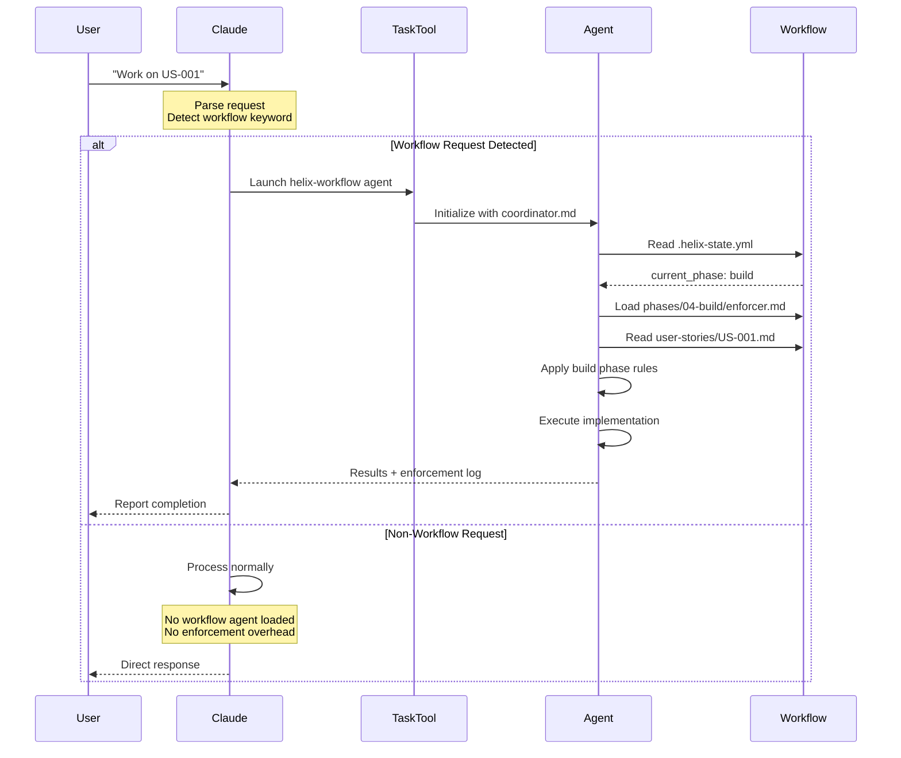

# SD-014: Agent-Based Workflow Enforcement

**Solution Design ID**: SD-014
**Feature**: FEAT-014 - Agent-Based Workflow Enforcement
**Status**: Draft
**Created**: 2025-01-20
**Updated**: 2025-01-20
**Author**: Core Team

## Overview

This solution design details the technical approach for refactoring HELIX workflow enforcement from passive CLAUDE.md instructions into an active agent-based system, achieving a 45% reduction in base token usage while maintaining full functionality.

## Design Goals

1. **Token Efficiency**: Reduce CLAUDE.md from ~400 to ~220 lines
2. **Reactive Activation**: Agent activates only when workflow tasks occur
3. **Path Consistency**: Standardize all library references to `.ddx/library/*`
4. **Zero Regression**: All workflow commands work identically
5. **Clean Architecture**: Clear separation of concerns

## Current State Analysis

### CLAUDE.md Structure (Before)
```markdown
# CLAUDE.md (~400 lines, ~20,000 tokens)

## Project Overview (50 lines)
- Architecture
- Key components
- Development commands

## Workflow Enforcement (150 lines) ← REMOVE
### Activation Instructions
### Workflow Structure
### Phase Detection
### Enforcement Principles
### Example Enforcement
### Workflow Execution Tools
### Workflow Actions
### Approved Workflow Actions

## Auto-Prompts (30 lines) ← REMOVE
### Workflow Auto-Continuation
### Auto-Loop Instructions
### Phase Completion Auto-Advance

## Additional Content (170 lines) ← KEEP
- Architectural principles
- Testing requirements
- Persona system
- CLI commands
```

### Problems
1. **Always Parsed**: 150 lines of workflow instructions parsed even during non-workflow tasks
2. **Mixed Concerns**: Project info mixed with workflow enforcement
3. **Path Inconsistency**: References to `library/` should be `.ddx/library/`
4. **Hard to Maintain**: Logic scattered across multiple sections

## Proposed Solution

### Architecture Overview

```
┌─────────────────────────────────────────────────────────┐
│ CLAUDE.md (Minimal - 220 lines)                         │
├─────────────────────────────────────────────────────────┤
│ • Project overview & architecture (50 lines)            │
│ • Development commands (50 lines)                       │
│ • Workflow reference (20 lines) ← NEW MINIMAL SECTION   │
│ • Architectural principles (50 lines)                   │
│ • Testing requirements (50 lines)                       │
└─────────────────────────────────────────────────────────┘
                          │
                          │ References (when needed)
                          ▼
┌─────────────────────────────────────────────────────────┐
│ Workflow Agent System (.ddx/library/workflows/helix/)  │
├─────────────────────────────────────────────────────────┤
│ ┌───────────────────────────────────────────────────┐   │
│ │ coordinator.md (Agent System Prompt)              │   │
│ │ • Phase detection logic                          │   │
│ │ • Enforcer delegation                            │   │
│ │ • Transition management                          │   │
│ └───────────────────────────────────────────────────┘   │
│                                                         │
│ ┌───────────────────────────────────────────────────┐   │
│ │ phases/*/enforcer.md (Phase-Specific Rules)      │   │
│ │ • 01-frame/enforcer.md                           │   │
│ │ • 02-design/enforcer.md                          │   │
│ │ • 03-test/enforcer.md                            │   │
│ │ • 04-build/enforcer.md                           │   │
│ │ • 05-deploy/enforcer.md                          │   │
│ │ • 06-iterate/enforcer.md                         │   │
│ └───────────────────────────────────────────────────┘   │
│                                                         │
│ ┌───────────────────────────────────────────────────┐   │
│ │ actions/*.md (Action Prompts)                    │   │
│ │ • build-story.md                                 │   │
│ │ • continue.md                                    │   │
│ │ • status.md                                      │   │
│ │ • refine-story.md                                │   │
│ └───────────────────────────────────────────────────┘   │
└─────────────────────────────────────────────────────────┘
```

### Agent Activation Flow



### Component Details

#### 1. Minimal CLAUDE.md

**Size**: ~220 lines (~11,000 tokens)
**Reduction**: 180 lines (~9,000 tokens saved)

**Sections**:

```markdown
# CLAUDE.md

## Project Overview (50 lines)
- Architecture
- Key components
- Technology stack

## Development Commands (50 lines)
- CLI commands
- Build/test/lint
- Git workflow

## Workflow System (20 lines) ← NEW MINIMAL SECTION
### Quick Reference
Use these commands for HELIX workflow tasks:
- `ddx workflow helix execute build-story US-XXX` - Work on story
- `ddx workflow helix execute continue` - Continue work
- `ddx workflow helix execute status` - Check status
- `ddx workflow helix execute next` - Next priority story

These commands automatically load the workflow agent which handles
phase detection and enforcement from `.ddx/library/workflows/helix/`.

See workflow documentation: `.ddx/library/workflows/helix/README.md`

## Architectural Principles (50 lines)
- CLI minimalism
- Extensibility through composition
- Test-first development

## Testing Requirements (50 lines)
- Testing strategy
- Pre-commit checks
- Release tests
```

#### 2. Workflow Agent (coordinator.md)

**Location**: `.ddx/library/workflows/helix/coordinator.md`
**Purpose**: Agent system prompt for workflow enforcement
**Status**: Already exists, no changes needed

**Capabilities**:
- Detects current phase from `.helix-state.yml`
- Loads appropriate phase enforcer
- Manages phase transitions
- Delegates to phase-specific rules

#### 3. Phase Enforcers

**Location**: `.ddx/library/workflows/helix/phases/*/enforcer.md`
**Purpose**: Phase-specific rules and guidance
**Status**: Already exist, no changes needed

**Examples**:
- `01-frame/enforcer.md` - Prevents premature solutioning
- `04-build/enforcer.md` - Enforces test-driven development
- etc.

#### 4. Action Prompts

**Location**: `.ddx/library/workflows/helix/actions/*.md`
**Purpose**: Task-specific prompts for workflow execution
**Status**: Already exist, may need path updates

**Files**:
- `build-story.md` - Execute work on a user story
- `continue.md` - Continue current work
- `consolidate-docs.md` - Consolidate documentation
- `refine-story.md` - Refine user story details

**Required Changes**:
- Update any `library/` references to `.ddx/library/`
- Ensure agent activation patterns are clear

### Agent Activation Triggers

Claude Code should automatically activate the workflow agent when it detects:

1. **Explicit Workflow Commands**:
   ```bash
   ddx workflow helix execute <action>
   ```

2. **Workflow Keywords**:
   - "work on US-XXX"
   - "continue the workflow"
   - "check workflow status"
   - "work on next story"
   - "HELIX phase"

3. **Phase Violations** (detected in CLAUDE.md, delegated to agent):
   - Attempting to write code during Frame phase
   - Attempting to design during Build phase
   - etc.

### Path Standardization Strategy

**Problem**: References to `library/` are ambiguous after library split

**Solution**: All references use `.ddx/library/*` format

**Rationale**:
- Library content is in separate `ddx-library` repository
- Projects sync library via git subtree to `.ddx/library/`
- Master ddx repo has `./library/` temporarily (legacy, to be removed later)
- Using `.ddx/library/*` in all docs ensures consistency

**Files to Update**:
1. `CLAUDE.md` - All library references
2. `.ddx/library/workflows/helix/actions/*.md` - Action prompts
3. `.ddx/library/workflows/helix/README.md` - Documentation
4. Any other docs referencing library paths

**Migration Pattern**:
```bash
# Before
library/workflows/helix/coordinator.md
library/prompts/claude/system-prompts/focused.md
library/templates/nextjs-app/

# After
.ddx/library/workflows/helix/coordinator.md
.ddx/library/prompts/claude/system-prompts/focused.md
.ddx/library/templates/nextjs-app/
```

## Implementation Approach

### Phase 1: Preparation
1. Validate existing coordinator.md works as agent prompt
2. Audit all library path references
3. Create path migration checklist
4. Write test cases

### Phase 2: Path Updates
1. Update CLAUDE.md path references
2. Update workflow action prompts
3. Update workflow README
4. Update any other documentation

### Phase 3: CLAUDE.md Refactoring
1. Create new minimal CLAUDE.md structure
2. Extract workflow sections to preserve
3. Remove enforcement sections
4. Add minimal workflow reference section
5. Validate structure

### Phase 4: Testing
1. Test all workflow commands
2. Verify agent activation
3. Test phase violation detection
4. Measure token usage
5. Regression testing

### Phase 5: Documentation
1. Update workflow README
2. Document agent activation patterns
3. Update contributing guide
4. Create ADR

## Data Model Changes

**None**. This is a pure refactoring that moves existing logic without changing any data structures or files. The agent reads existing workflow state files but doesn't modify them differently than before.

## API/Interface Changes

### Claude Code Behavior

**Before**:
```
User: "Work on US-001"
Claude: [Reads 400 lines of CLAUDE.md including enforcement]
        [Detects workflow request]
        [Manually applies enforcement rules]
        [Executes work]
```

**After**:
```
User: "Work on US-001"
Claude: [Reads 220 lines of CLAUDE.md without enforcement]
        [Detects workflow request]
        [Launches workflow agent via Task tool]
        Agent: [Reads coordinator.md]
               [Detects phase, loads enforcer]
               [Executes work with enforcement]
```

### Workflow Commands
No changes. All existing commands work identically:
- `ddx workflow helix execute build-story US-XXX`
- `ddx workflow helix execute continue`
- `ddx workflow helix execute status`
- `ddx workflow helix execute next`

## Performance Considerations

### Token Usage Analysis

**Current CLAUDE.md**:
- ~400 lines
- ~50 tokens per line average
- ~20,000 tokens per message
- Parsed on EVERY message

**Refactored CLAUDE.md**:
- ~220 lines
- ~50 tokens per line average
- ~11,000 tokens per message
- Parsed on EVERY message

**Savings**: ~9,000 tokens per message (45% reduction)

**Agent Overhead**:
- coordinator.md: ~250 lines (~12,500 tokens)
- Phase enforcer: ~150 lines (~7,500 tokens)
- Only loaded when workflow tasks occur
- Net positive: saves tokens on non-workflow messages

### Activation Performance
- Agent activation via Task tool: negligible overhead
- Phase detection: file read + YAML parse (<10ms)
- Enforcer loading: file read (<5ms)
- Total overhead: <20ms (acceptable)

## Security Considerations

No security implications. This is an internal refactoring that doesn't change:
- Access controls
- Data handling
- External interfaces
- User permissions

## Error Handling

### Agent Activation Failures

**Scenario**: Task tool fails to launch agent
**Handling**:
1. Fall back to minimal enforcement from CLAUDE.md
2. Log error for investigation
3. User sees degraded but functional behavior

### Phase Detection Failures

**Scenario**: `.helix-state.yml` missing or corrupted
**Handling**:
1. Agent defaults to Frame phase
2. Prompts user to initialize workflow
3. Provides recovery instructions

### Path Resolution Failures

**Scenario**: `.ddx/library/` not found
**Handling**:
1. Agent checks alternative paths (./library/ fallback)
2. Suggests running `ddx update` to sync library
3. Provides manual instructions

## Testing Strategy

### Unit Tests
1. **CLAUDE.md Structure**:
   - Validate line count (~220 lines)
   - Check required sections present
   - Verify no enforcement sections remain
   - Confirm path references use `.ddx/library/*`

2. **Agent Activation**:
   - Test keyword detection
   - Verify Task tool invocation
   - Validate agent initialization

### Integration Tests
1. **Workflow Commands**:
   - Test `execute build-story`
   - Test `execute continue`
   - Test `execute status`
   - Test `execute next`

2. **Phase Enforcement**:
   - Test phase violation detection
   - Test phase transition validation
   - Test enforcer loading

3. **Path Resolution**:
   - Test library path resolution
   - Test fallback behavior
   - Test error messages

### Performance Tests
1. **Token Usage**:
   - Measure CLAUDE.md tokens before/after
   - Verify 45% reduction achieved
   - Monitor agent overhead

2. **Activation Speed**:
   - Measure agent activation time
   - Verify <20ms overhead
   - Monitor phase detection speed

### Regression Tests
- All existing workflow tests must pass
- No functionality changes
- No user-visible behavior changes

## Migration Plan

### Rollout Strategy
1. **Development**: Test in development environment
2. **Documentation**: Update all docs before release
3. **Release**: Single atomic change
4. **Monitor**: Watch for issues post-release

### Rollback Plan
If issues occur:
1. Revert CLAUDE.md to previous version
2. Restore workflow enforcement sections
3. Revert path changes
4. Git commit revert

Time to rollback: <5 minutes

## Monitoring & Observability

### Success Metrics
- Token usage reduction: Measure via API
- Agent activation rate: Log all activations
- Error rate: Monitor agent failures
- User feedback: GitHub issues

### Logging
- Agent activations
- Phase detections
- Enforcer loads
- Path resolutions
- Errors

## Open Questions

1. **Q**: Should we add an opt-out for agent activation?
   **A**: No, agent is transparent to users

2. **Q**: What if coordinator.md needs updates?
   **A**: Updates go to ddx-library repo, sync via `ddx update`

3. **Q**: How to handle legacy `library/` references?
   **A**: Find-and-replace during implementation

## Dependencies

### Internal
- Existing coordinator.md (validated)
- Existing phase enforcers (validated)
- Task tool for agent activation (available)
- `.helix-state.yml` for phase detection (exists)

### External
- None

## Related Documents

- **Feature Spec**: `docs/helix/01-frame/features/FEAT-014-agent-workflow-enforcement.md`
- **User Story**: `docs/helix/01-frame/user-stories/US-044-workflow-enforcer-agent.md`
- **Coordinator**: `.ddx/library/workflows/helix/coordinator.md`
- **Current CLAUDE.md**: `CLAUDE.md`

## Decision Log

### Decision 1: Agent vs Inline
**Options**:
1. Keep enforcement in CLAUDE.md
2. Move to agent system
3. Hybrid approach

**Choice**: Agent system
**Rationale**: Maximum token savings, better separation of concerns

### Decision 2: Path Format
**Options**:
1. Use `library/*`
2. Use `.ddx/library/*`
3. Use relative paths

**Choice**: `.ddx/library/*`
**Rationale**: Consistent with library split, clear origin

### Decision 3: Activation Triggers
**Options**:
1. Only explicit commands
2. Keyword detection
3. Automatic on all requests

**Choice**: Explicit commands + keyword detection
**Rationale**: Balance between convenience and overhead

## Next Steps

1. **Test Phase**: Create comprehensive test suite
2. **Build Phase**: Implement refactoring
3. **Validation**: Measure token savings
4. **Documentation**: Update all references
5. **Release**: Deploy with monitoring

---
*Status: Ready for test phase*