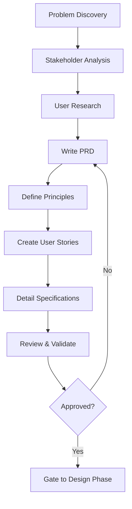

# Phase 01: Frame

The foundation phase where we define WHAT to build and WHY before considering HOW.

## Purpose

The Frame phase establishes the project's foundation by focusing on understanding the problem, defining business value, and aligning stakeholders on objectives. This phase deliberately avoids technical solutions to ensure we're solving the right problem for the right users.

## Key Principle

**Problem First, Solution Later**: Frame is about deeply understanding the problem space and user needs. Technical architecture and implementation details are intentionally deferred to the Design phase.

## Input Gates

Prerequisites to enter this phase (defined in `input-gates.yml`):
- **Problem or opportunity identified**: A clear business need or challenge requiring solution
- **Time allocated for analysis**: Dedicated time for thorough problem exploration

These gates ensure the team is ready to invest in proper framing before jumping to solutions.

## Work Items

### Artifacts (Template-Based Outputs)

All artifacts for this phase are located in the `artifacts/` directory. Each artifact includes:
- **Templates**: Define the structure and sections required
- **Prompts**: Guide the creation and completion of templates
- **Examples**: Reference implementations (when available)

#### 1. Product Requirements Document (PRD)
**Artifact Location**: `artifacts/prd/`
**Output Location**: `docs/01-frame/prd.md`

The business vision document that:
- Defines the problem and opportunity
- Establishes success metrics and goals
- Identifies users and personas
- Prioritizes requirements (P0/P1/P2)
- Sets scope and timeline

**Key Sections**:
- Executive Summary (write last)
- Problem Statement with quantifiable impact
- Success Metrics with specific targets
- User Personas based on research
- Prioritized Requirements
- Risks and Mitigation strategies

#### 2. Principles Document
**Artifact Location**: `artifacts/principles/`
**Output Location**: `docs/01-frame/principles.md`

Technical and project constraints that will guide all development:
- Core development principles (e.g., library-first, test-first)
- Technology constraints and decisions
- Quality standards and practices
- Exception tracking for justified violations

#### 3. User Stories
**Artifact Location**: `artifacts/user-stories/`
**Output Location**: `docs/01-frame/user-stories/US-XXX-[name].md`

Concrete user needs with clear acceptance criteria:
- Story format: As a [user], I want [goal], so that [value]
- Acceptance criteria using Given/When/Then format
- Definition of Done for each story
- Story prioritization and dependencies
- Validation scenarios

#### 4. Feature Specification
**Artifact Location**: `artifacts/feature-specification/`
**Output Location**: `docs/01-frame/features/FEAT-XXX-[name].md`

Detailed requirements and constraints:
- Functional requirements (what the system must do)
- Non-functional requirements (performance, security, scalability)
- Edge cases and error handling
- Dependencies and assumptions
- Explicit out-of-scope items

#### 5. Feature Registry
**Artifact Location**: `artifacts/feature-registry/`
**Output Location**: `docs/01-frame/feature-registry.md`

Centralized registry of all features:
- Feature identification with FEAT-XXX IDs
- Status tracking across all phases
- Dependency management and relationships
- Team ownership and responsibility
- Cross-phase traceability
- Priority categorization (P0/P1/P2)

### Actions (Prompt-Only Operations)

The Frame phase focuses entirely on structured documentation (artifacts) and does not include arbitrary actions. All work items follow templates to ensure consistency, completeness, and alignment across stakeholders.

## Artifact Metadata

Each artifact directory can optionally include a `meta.yml` file that formally defines:
- Dependencies on other artifacts
- Validation rules and requirements
- Output file locations
- Required variables and conditionals

This metadata enables automated validation and dependency tracking across the workflow.

## Workflow Principles

This phase operates under the HELIX workflow principles, emphasizing:
- **Human-AI Collaboration**: Humans provide vision and priorities; AI assists with documentation
- **Phase Separation**: Clear boundaries between Frame (what/why) and Design (how)
- **Validation Gates**: Input gates ensure readiness; exit criteria ensure completeness
- **Iterative Refinement**: Continuous improvement through feedback loops

The workflow's overarching principles guide all decisions and ensure consistency across phases.

## File Organization

### Structure Overview
- **Artifact Definitions**: `workflows/helix/phases/01-frame/artifacts/`
  - Contains templates, prompts, and examples for each artifact
  - Defines the structure and guidance for artifact creation

- **Generated Outputs**: `docs/frame/`
  - Where completed artifacts are stored in the project
  - Makes documentation easily accessible to all stakeholders
  - Features organized by FEAT-XXX identifier
  - User stories organized by US-XXX identifier

This separation keeps workflow templates reusable while placing outputs where they're most useful in the project structure.

## Process Flow



## Human vs AI Responsibilities

### Human Responsibilities
- **Vision Setting**: Define business goals and strategy
- **Stakeholder Alignment**: Gather input and build consensus
- **Priority Decisions**: Determine P0/P1/P2 requirements
- **Success Metrics**: Define measurable business outcomes
- **Final Approval**: Review and sign off on artifacts

### AI Assistant Responsibilities
- **Documentation Support**: Help structure and write artifacts
- **Consistency Checking**: Ensure alignment across documents
- **Gap Analysis**: Identify missing requirements or considerations
- **Template Application**: Apply best practices and formats
- **Question Generation**: Surface clarification needs

## Quality Gates

Before proceeding to Design phase, ensure:

### Completeness Checklist
- [ ] PRD approved by stakeholders
- [ ] Success metrics are specific and measurable
- [ ] All P0 requirements have clear acceptance criteria
- [ ] User personas validated with actual user data
- [ ] Principles document reflects technical constraints
- [ ] No [NEEDS CLARIFICATION] markers remain

### Validation Questions
1. **Problem Clarity**: Can a new team member understand what problem we're solving?
2. **User Focus**: Are we designing for specific, validated personas?
3. **Success Definition**: Do we know exactly how to measure success?
4. **Scope Boundaries**: Is it clear what we're NOT building?
5. **Risk Awareness**: Have we identified and planned for major risks?

## Common Pitfalls

### ❌ Avoid These Mistakes

1. **Solution Bias**
   - Bad: "Users need a dashboard with real-time updates"
   - Good: "Users can't track project progress effectively"

2. **Vague Metrics**
   - Bad: "Improve user experience"
   - Good: "Reduce task completion time from 5 minutes to 2 minutes"

3. **Everyone User**
   - Bad: "This is for all developers"
   - Good: "Primary: Senior backend engineers at startups (50-200 employees)"

4. **Feature Creep**
   - Bad: Adding "nice to have" features to P0
   - Good: Ruthless prioritization with clear P0/P1/P2 boundaries

5. **Missing NFRs**
   - Bad: Only listing functional features
   - Good: Defining performance, security, and scalability requirements

## Success Criteria

The Frame phase is complete when:

1. **Alignment Achieved**: All stakeholders agree on problem and approach
2. **Metrics Defined**: Success is measurable with specific targets
3. **Users Identified**: Personas are based on real user research
4. **Scope Clear**: P0 requirements fit within timeline and resources
5. **Risks Acknowledged**: Major risks have mitigation strategies
6. **Documentation Complete**: All artifacts reviewed and approved

## Next Phase: Design

Once Frame is validated, proceed to Design phase where you'll:
- Create technical architecture based on requirements
- Design API contracts and interfaces
- Develop implementation plan
- Specify test strategies

Remember: Frame defines the "what" and "why" - Design will define the "how".

## Tips for Success

1. **Resist Solutioning**: When technical solutions arise, note them for Design phase
2. **Talk to Users**: Base personas on actual user interviews, not assumptions
3. **Quantify Everything**: Use numbers for metrics, timelines, and impact
4. **Document Decisions**: Capture why certain choices were made
5. **Iterate Quickly**: Use feedback loops to refine artifacts

## Using AI Assistance

When working with AI assistants during Frame:

```bash
# Generate initial PRD from project idea
ddx apply prompts/helix/frame/prd

# Validate user stories for completeness
ddx apply prompts/helix/frame/user-stories

# Check specification for gaps
ddx apply prompts/helix/frame/specification
```

The AI can help ensure completeness but human judgment is essential for business decisions and priority setting.

---

*The Frame phase sets the foundation for everything that follows. Time invested here prevents costly mistakes later.*