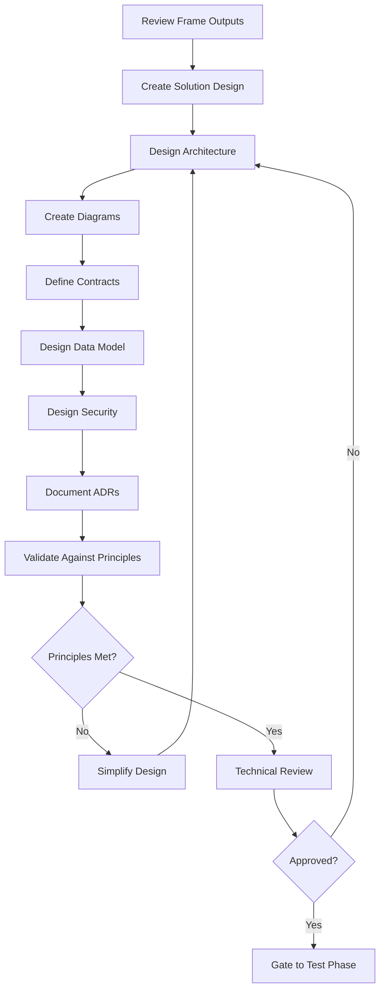

# Phase 02: Design

The architecture phase where we transform requirements into a concrete technical plan with contracts, tests, and implementation strategy.

## Purpose

The Design phase transforms validated business requirements from Frame into a comprehensive technical architecture. This phase focuses on making and documenting architectural decisions, defining system structure, and establishing contracts that will guide implementation.

## Key Principle

**Architecture Before Implementation**: Design establishes the system's structure, makes key technical decisions, and defines all interfaces before any code is written. This ensures a solid foundation and prevents architectural drift.

## Input Gate

Before starting Design, verify Frame outputs:
- [ ] PRD reviewed and approved
- [ ] Success metrics clearly defined
- [ ] User stories with acceptance criteria
- [ ] Principles document established
- [ ] All stakeholders aligned on scope

## Artifacts

### 1. Solution Design
**Location**: `docs/design/solution-designs/SD-XXX-[name].md`

Bridges business requirements to technical implementation:
- **Requirements Mapping**: Transform functional/non-functional requirements to technical capabilities
- **Solution Approaches**: Multiple alternatives with trade-offs
- **Domain Model**: Core entities and business rules
- **Component Decomposition**: Breaking down the system
- **Technology Rationale**: Why specific technologies were chosen

### 2. Architecture Diagrams
**Location**: `docs/design/architecture.md`

Visual system documentation using C4 model:
- **System Context**: How the system fits in the larger ecosystem
- **Container Diagram**: Major architectural components
- **Component Diagrams**: Internal structure of containers
- **Deployment Diagram**: Infrastructure and deployment
- **Data Flow**: How information moves through the system

### 3. API/Interface Contracts
**Location**: `docs/design/contracts/API-XXX-[name].md`

Defines all external interfaces:
- **CLI Contracts**: Command structure, options, input/output formats
- **REST API Contracts**: Endpoints, request/response schemas, error codes
- **Library APIs**: Public functions, parameters, return types
- **Data Contracts**: JSON schemas, validation rules
- **Error Contracts**: Error codes, messages, recovery actions

### 4. Architecture Decision Records (ADRs)
**Location**: `docs/design/adr/ADR-XXX-[title].md`

Documents significant architectural decisions:
- **Decision Context**: Problem and constraints
- **Alternatives Considered**: Options with pros/cons
- **Decision Rationale**: Why this approach was chosen
- **Consequences**: Trade-offs and impacts
- **Success Criteria**: How to validate the decision

### 5. Data Design
**Location**: `docs/design/data-design.md`

Comprehensive data architecture:
- **Conceptual Model**: Business entities and relationships
- **Logical Model**: Database schema design
- **Data Patterns**: Soft deletes, audit trails, versioning
- **Access Patterns**: Common queries and optimization
- **Migration Strategy**: Moving from current to target state

### 6. Security Design
**Location**: `docs/design/security.md`

Security architecture and threat modeling:
- **Threat Model**: STRIDE analysis of system
- **Authentication**: How users prove identity
- **Authorization**: Access control model
- **Data Protection**: Encryption and privacy
- **Security Controls**: Input validation, headers, monitoring

## Process Flow



## Human vs AI Responsibilities

### Human Responsibilities
- **Architecture Decisions**: Choose technologies and patterns
- **Trade-off Analysis**: Balance competing constraints
- **Risk Assessment**: Identify technical challenges
- **Contract Definition**: Define external interfaces
- **Review and Approval**: Validate design decisions

### AI Assistant Responsibilities
- **Contract Generation**: Create detailed interface specifications
- **Test Case Design**: Generate comprehensive test scenarios
- **Consistency Validation**: Check alignment with requirements
- **Documentation**: Structure technical specifications
- **Pattern Suggestions**: Recommend proven solutions

## Design Principles Enforcement

### Core Principles Checklist
- [ ] **Library-First**: Each feature is a standalone library
- [ ] **CLI Interface**: All functionality exposed via text interface
- [ ] **Test-First**: Tests specified before implementation
- [ ] **Simplicity**: Maximum 3 major components
- [ ] **Anti-Abstraction**: Direct framework usage, no wrappers
- [ ] **Integration Testing**: Real environments over mocks

### Complexity Budget
Track design complexity to prevent over-engineering:

| Component | Complexity Points | Justification |
|-----------|------------------|---------------|
| Component 1 | 1 | Core requirement |
| Component 2 | 1 | Essential integration |
| Component 3 | 1 | (Only if justified) |
| **Total** | **≤ 3** | Must stay within budget |

## Quality Gates

Before proceeding to Test phase:

### Completeness Checklist
- [ ] All contracts fully specified with examples
- [ ] Solution design bridges requirements to technical approach
- [ ] Architecture diagram shows data flow
- [ ] Technology choices justified
- [ ] ADRs document key decisions
- [ ] No [TO BE DEFINED] markers remain

### Validation Questions
1. **Contract Clarity**: Could another team implement from these contracts alone?
2. **Decision Rationale**: Are all architectural decisions justified with ADRs?
3. **Simplicity**: Have we used the minimum viable architecture?
4. **Principles**: Does the design comply with all project principles?
5. **Feasibility**: Can this be built within time and resource constraints?

## Common Pitfalls

### ❌ Avoid These Mistakes

1. **Over-Engineering**
   - Bad: Complex microservices for simple CRUD
   - Good: Monolithic library with CLI interface

2. **Implementation Details in Contracts**
   - Bad: "Calls internal processData() function"
   - Good: "Accepts JSON, returns transformed JSON"

3. **Mock-Heavy Testing**
   - Bad: Mocking all external dependencies
   - Good: Testing with real databases and services

4. **Abstraction Layers**
   - Bad: Custom wrapper around framework
   - Good: Direct framework usage

5. **Missing Error Cases**
   - Bad: Only happy path in contracts
   - Good: Comprehensive error scenarios

## Success Criteria

The Design phase is complete when:

1. **Solution Defined**: Requirements mapped to technical approach
2. **Architecture Documented**: Visual diagrams and component structure clear
3. **Contracts Specified**: All external interfaces defined
4. **Decisions Recorded**: ADRs document key choices with rationale
5. **Data Model Complete**: Schema and patterns designed
6. **Security Addressed**: Threats identified and mitigated

## Next Phase: Test

Once Design is validated, proceed to Test phase where you'll:
- Write comprehensive test specifications
- Implement failing tests (Red phase)
- Define test data and scenarios
- Establish test infrastructure

Remember: Design defines the architecture - Test validates it through executable specifications.

## Tips for Success

1. **Start with Contracts**: Define what before how
2. **Think in Tests**: Every contract needs test cases
3. **Embrace Constraints**: Principles prevent complexity
4. **Iterate on Simplicity**: First design is rarely simple enough
5. **Document Decisions**: Capture why, not just what

## Anti-Patterns to Avoid

### 🚫 Speculative Generality
Don't design for hypothetical future needs. Design for current requirements only.

### 🚫 Framework Religions
Choose tools pragmatically based on requirements, not preferences.

### 🚫 Test Theater
Don't write tests that always pass. Tests must fail first, then pass.

### 🚫 Contract Drift
Implementation must match contracts exactly. No undocumented behavior.

## Using AI Assistance

When working with AI assistants during Design:

```bash
# Generate contracts from requirements
ddx apply prompts/helix/design/contracts

# Create test specifications
ddx apply prompts/helix/design/test-specs

# Validate architecture simplicity
ddx apply prompts/helix/design/complexity-check
```

The AI excels at generating comprehensive contracts and test cases but human judgment is essential for architectural decisions.

## Design Review Checklist

Before approval, ensure:
- [ ] Contracts are complete and unambiguous
- [ ] Every contract has test cases
- [ ] Architecture is as simple as possible
- [ ] All principles are followed (or violations documented)
- [ ] Implementation plan is realistic
- [ ] Team understands and agrees with design

---

*Good design is not when there is nothing left to add, but when there is nothing left to remove.*