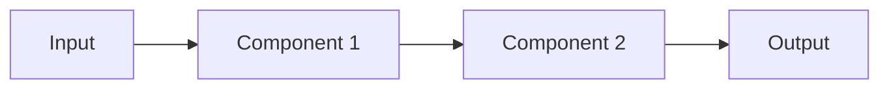

# Implementation Plan

## Pre-Implementation Gates

### Principles Compliance Check
Review against project principles before proceeding:

- [ ] **Article I: Library-First** - Is each feature designed as a standalone library?
- [ ] **Article II: CLI Interface** - Does each component expose a text-based interface?
- [ ] **Article III: Test-First** - Are test specifications complete before implementation?
- [ ] **Article VII: Simplicity** - Are we using ≤3 major components initially?
- [ ] **Article VIII: Anti-Abstraction** - Are we using frameworks directly without wrappers?
- [ ] **Article IX: Integration-First** - Are we testing with real environments?

### Complexity Tracking
*Document any necessary violations of principles*

| Principle | Violation | Justification | Resolution Plan |
|-----------|-----------|---------------|-----------------|
| | | | |

## Architecture Overview

### System Components
1. **[Component 1 Name]**
   - Purpose: 
   - Responsibilities:
   - Interfaces:

2. **[Component 2 Name]**
   - Purpose:
   - Responsibilities:
   - Interfaces:

3. **[Component 3 Name]** *(if needed)*
   - Purpose:
   - Responsibilities:
   - Interfaces:

### Data Flow


## Implementation Phases

### Phase 1: Foundation
**Duration**: [Timeframe]
**Deliverables**:
- [ ] Core library structure
- [ ] CLI interface skeleton
- [ ] Contract tests (failing)

### Phase 2: Core Features
**Duration**: [Timeframe]
**Deliverables**:
- [ ] Primary functionality
- [ ] Integration tests (failing)
- [ ] Basic error handling

### Phase 3: Complete Implementation
**Duration**: [Timeframe]
**Deliverables**:
- [ ] All features implemented
- [ ] All tests passing
- [ ] Documentation complete

## Technology Decisions

### Language and Framework
- **Primary Language**: [Language]
- **Framework**: [Framework]
- **Rationale**: [Why these choices align with requirements]

### Data Storage
- **Database**: [Type/Product]
- **Rationale**: [Why this choice]

### External Dependencies
| Dependency | Purpose | Version | Rationale |
|------------|---------|---------|-----------|
| | | | |

## API Design

### Public Interfaces
*Define the contract before implementation*

```
[Interface definition in appropriate format]
```

### CLI Commands
```bash
# Primary command structure
$ [command] [subcommand] [options]

# Examples
$ [specific example]
$ [specific example]
```

## Test Strategy

### Test Pyramid
1. **Contract Tests** (Most important)
   - Verify external interfaces
   - Test API contracts
   
2. **Integration Tests**
   - Test component interactions
   - Use real dependencies
   
3. **Unit Tests** (Least important)
   - Test internal logic
   - Fast feedback

### Test Coverage Goals
- Contract Tests: 100% of public interfaces
- Integration Tests: All critical paths
- Unit Tests: Complex logic only

## Risk Mitigation

### Technical Risks
| Risk | Impact | Probability | Mitigation |
|------|--------|-------------|------------|
| | | | |

### Assumptions
- [ ] [Assumption 1]
- [ ] [Assumption 2]

## Success Criteria
- [ ] All contract tests passing
- [ ] Performance requirements met
- [ ] Security requirements satisfied
- [ ] Documentation complete

## File Creation Order
Following Test-First Development:
1. Create contract test files
2. Create integration test files  
3. Create unit test files
4. Verify all tests fail
5. Create implementation files
6. Make tests pass incrementally