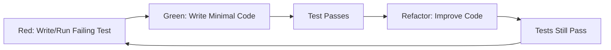

# Phase 03: Build

The implementation phase where we write code to make failing tests pass using test-driven development.

## Purpose

The Build phase is where code comes to life. Following the contracts from Design and the failing tests from Test phase, this phase focuses on implementing the minimum code necessary to make tests pass, then refactoring for quality.

## Key Principle

**Make Tests Pass, Then Improve**: Write the simplest code that makes tests pass (Green phase), then refactor for quality while keeping tests green. No production code exists without a failing test demanding it.

## Input Gate

Before starting Build phase, verify Test phase outputs:
- [ ] All contract tests written and failing
- [ ] Integration tests defined and failing
- [ ] Unit tests (if needed) created and failing
- [ ] Test infrastructure operational
- [ ] Coverage targets defined
- [ ] Test plan reviewed and approved

## Artifacts

### 1. Implementation Plan
**Location**: `docs/build/implementation-plan.md`

Technical execution strategy:
- **Build Phases**: Incremental delivery approach
- **Component Order**: What to build first
- **Technology Setup**: Development environment
- **Coding Standards**: Conventions and patterns
- **Integration Points**: How components connect

### 2. Build Log
**Location**: `docs/build/build-log.md`

Progress tracking document:
- **Daily Progress**: Tests passing, coverage metrics
- **Decisions Made**: Implementation choices
- **Problems Solved**: Challenges and solutions
- **Refactoring Notes**: Improvements made
- **Lessons Learned**: What worked, what didn't

## TDD Workflow

### The Red-Green-Refactor Cycle



### Step-by-Step Process

#### 1. Red Phase (from Test phase)
```javascript
// Test is already written and failing
describe('User Service', () => {
  it('should create a new user', async () => {
    const user = await createUser({email: 'test@example.com'});
    expect(user.id).toBeDefined();
    expect(user.email).toBe('test@example.com');
  });
});
// ❌ FAIL: createUser is not defined
```

#### 2. Green Phase (Build phase)
```javascript
// Write minimal code to pass
async function createUser(data) {
  return {
    id: '123',
    email: data.email
  };
}
// ✅ PASS: Test now passes
```

#### 3. Refactor Phase (Build phase)
```javascript
// Improve code quality while keeping test green
class UserService {
  constructor(database) {
    this.db = database;
  }

  async createUser(data) {
    const user = await this.db.users.create({
      email: data.email,
      createdAt: new Date()
    });
    return user;
  }
}
// ✅ PASS: Test still passes with better code
```

## Build Phases

### Phase 1: Core Infrastructure
**Goal**: Set up foundational components

Priorities:
1. Database connections and models
2. Basic API framework
3. Configuration management
4. Logging infrastructure
5. Error handling framework

**Success**: Basic contract tests passing

### Phase 2: Business Logic
**Goal**: Implement core functionality

Priorities:
1. Domain models and entities
2. Business rule implementation
3. Service layer logic
4. Data validation
5. Transaction management

**Success**: Integration tests passing

### Phase 3: User Interface
**Goal**: Complete user-facing components

Priorities:
1. API endpoints
2. CLI commands
3. Response formatting
4. Input processing
5. User feedback

**Success**: End-to-end tests passing

### Phase 4: Quality Enhancement
**Goal**: Optimize and harden

Priorities:
1. Performance optimization
2. Security hardening
3. Error recovery
4. Monitoring hooks
5. Documentation

**Success**: All quality metrics met

## Implementation Guidelines

### Code Quality Standards

#### Clean Code Principles
- **Single Responsibility**: Each function/class has one job
- **DRY**: Don't Repeat Yourself
- **KISS**: Keep It Simple, Stupid
- **YAGNI**: You Aren't Gonna Need It
- **Boy Scout Rule**: Leave code better than you found it

#### Refactoring Triggers
Refactor when you see:
- Duplicated code (extract to function)
- Long functions (break into smaller ones)
- Large classes (split responsibilities)
- Long parameter lists (use objects)
- Comments explaining what (code should be self-documenting)

### Incremental Development

#### Daily Workflow
```bash
# Morning: Review failing tests
npm test -- --only-failures

# Pick next test to make pass
npm test -- --watch specific-test

# Write minimal code
# See test pass
# Commit immediately
git commit -m "✅ Make [test name] pass"

# Refactor if needed
# Verify tests still pass
# Commit refactoring
git commit -m "♻️ Refactor [what was improved]"

# Move to next test
```

#### Progress Tracking
| Day | Tests Written | Tests Passing | Coverage | Notes |
|-----|--------------|---------------|----------|-------|
| 1 | 50 | 5 | 10% | Core infrastructure |
| 2 | 50 | 15 | 25% | Basic API working |
| 3 | 50 | 30 | 50% | Business logic complete |
| 4 | 50 | 45 | 75% | Most features working |
| 5 | 50 | 50 | 85% | All tests passing! |

## Common Implementation Patterns

### Pattern: Repository Pattern
```javascript
// Separate data access from business logic
class UserRepository {
  async findById(id) {
    return this.db.query('SELECT * FROM users WHERE id = ?', [id]);
  }

  async create(data) {
    return this.db.query('INSERT INTO users SET ?', data);
  }
}

class UserService {
  constructor(userRepository) {
    this.users = userRepository;
  }

  async getUser(id) {
    const user = await this.users.findById(id);
    if (!user) throw new NotFoundError('User not found');
    return user;
  }
}
```

### Pattern: Dependency Injection
```javascript
// Make components testable and loosely coupled
class Application {
  constructor({ database, emailService, logger }) {
    this.db = database;
    this.email = emailService;
    this.logger = logger;
  }
}

// Easy to test with mocks
const app = new Application({
  database: mockDatabase,
  emailService: mockEmailService,
  logger: mockLogger
});
```

## Success Criteria

The Build phase is complete when:

1. **All Tests Pass**: 100% of tests are green
2. **Coverage Met**: Line and branch coverage targets achieved
3. **Code Quality**: Passes linting and code review
4. **Performance**: Meets response time requirements
5. **Documentation**: Code is documented and clear
6. **Refactored**: Code is clean and maintainable

## Common Pitfalls

### ❌ Avoid These Mistakes

1. **Writing Code Without Tests**
   - Bad: "I'll add tests later"
   - Good: Test fails → Code written → Test passes

2. **Over-Engineering**
   - Bad: Building for hypothetical future needs
   - Good: Minimal code to pass current tests

3. **Skipping Refactor**
   - Bad: Moving to next feature immediately
   - Good: Refactor while tests are green

4. **Big Bang Integration**
   - Bad: Write all code, then test
   - Good: Incremental test-driven development

5. **Ignoring Test Failures**
   - Bad: Commenting out failing tests
   - Good: Fix the code or fix the test

## Next Phase: Deploy

Once Build is complete with all tests passing:
- Package application for deployment
- Configure production environment
- Set up monitoring and alerts
- Deploy with confidence (tests prove it works!)

## Tools and Commands

### Development Commands
```bash
# Run tests in watch mode
npm test -- --watch

# Check coverage
npm run coverage

# Lint code
npm run lint

# Format code
npm run format

# Build for production
npm run build
```

### Git Workflow
```bash
# After making test pass
git add .
git commit -m "✅ Implement [feature]: [test name] passes"

# After refactoring
git add .
git commit -m "♻️ Refactor: [what was improved]"

# After fixing bug
git add .
git commit -m "🐛 Fix: [what was broken]"
```

## Build Artifacts

By the end of Build phase, you have:

1. **Source Code**: All production code
2. **Passing Tests**: Complete test suite, all green
3. **Documentation**: API docs, code comments
4. **Build Output**: Compiled/bundled application
5. **Coverage Report**: Proof of test coverage
6. **Deployment Package**: Ready for production

---

*The Build phase transforms failing tests into working software through disciplined TDD practices.*