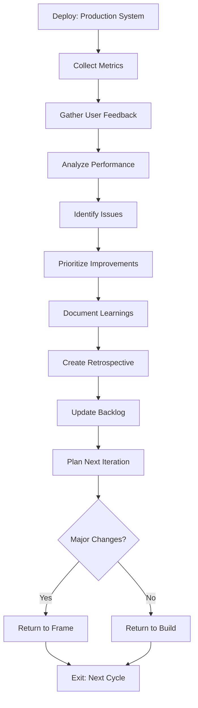

# Phase 06: Iterate

The continuous improvement phase where production feedback drives the next development cycle, completing the HELIX loop.

## Purpose

The Iterate phase analyzes production data, user feedback, and system metrics to identify improvements, fix issues, and plan the next iteration. This phase transforms real-world usage into actionable insights, ensuring the product evolves based on actual user needs rather than assumptions.

## Key Principle

**Learning Never Stops**: Every deployment is an opportunity to learn. The Iterate phase captures these learnings systematically, feeding them back into the next Frame phase to create a true continuous improvement cycle.

## Workflow Principles

This phase operates under the HELIX workflow principles, emphasizing:

- **Data-Driven Decisions**: Base improvements on metrics, not opinions
- **User-Centric Evolution**: Prioritize based on actual user behavior
- **Continuous Learning**: Every incident is a learning opportunity
- **Rapid Feedback Loops**: Shorten time from insight to action
- **Human-AI Collaboration**: Humans interpret meaning; AI analyzes patterns

Iteration is not just about fixing bugs—it's about systematic improvement based on production reality.

## Input Gates

Prerequisites to enter this phase (defined in `input-gates.yml`):

1. **System in production**
   - Requirement: Application deployed and serving users
   - Validation: Production health checks passing
   - Source: 05-deploy phase

2. **Monitoring active**
   - Requirement: Metrics, logs, and traces being collected
   - Validation: Dashboards showing current data
   - Source: 05-deploy phase

3. **Feedback channels open**
   - Requirement: User feedback mechanisms in place
   - Validation: Support tickets, surveys, analytics active
   - Source: 05-deploy phase

These gates ensure we have data to analyze and improve upon.

## Process Flow



## Work Items

### Artifacts (Template-Based Outputs)

#### 1. Retrospective Report
**Artifact Location**: `artifacts/retrospective/`
**Output Location**: `docs/06-iterate/retrospectives/RETRO-[date].md`

Structured reflection on the iteration:
- What went well
- What could improve
- Action items
- Metrics review
- Incident analysis
- Team feedback

#### 2. Performance Analysis
**Artifact Location**: `artifacts/performance-analysis/`
**Output Location**: `docs/06-iterate/performance-analysis.md`

Production performance review:
- Latency analysis
- Throughput metrics
- Error rate trends
- Resource utilization
- Cost analysis
- Optimization opportunities

#### 3. User Feedback Summary
**Artifact Location**: `artifacts/user-feedback/`
**Output Location**: `docs/06-iterate/user-feedback.md`

Consolidated user insights:
- Feature requests
- Bug reports
- Usability issues
- Satisfaction scores
- Usage patterns
- Churn analysis

#### 4. Technical Debt Register
**Artifact Location**: `artifacts/tech-debt/`
**Output Location**: `docs/06-iterate/tech-debt.md`

Accumulated technical issues:
- Code quality issues
- Architecture limitations
- Dependency updates
- Security patches
- Performance bottlenecks
- Refactoring needs

#### 5. Next Iteration Plan
**Artifact Location**: `artifacts/iteration-plan/`
**Output Location**: `docs/06-iterate/next-iteration.md`

Planning for the next cycle:
- Priority features
- Bug fixes
- Technical improvements
- Resource allocation
- Timeline estimates
- Success criteria

### Actions (Analysis Operations)

#### 1. Analyze Metrics
**Action Location**: `actions/analyze-metrics/`

Review production metrics:
- Query monitoring systems
- Generate trend reports
- Identify anomalies
- Compare against SLOs
- Cost/benefit analysis

#### 2. Process Feedback
**Action Location**: `actions/process-feedback/`

Consolidate user input:
- Aggregate support tickets
- Analyze survey results
- Review app store ratings
- Social media sentiment
- User interviews

#### 3. Conduct Post-Mortem
**Action Location**: `actions/post-mortem/`

Incident analysis (when needed):
- Timeline reconstruction
- Root cause analysis
- Impact assessment
- Prevention measures
- Process improvements

## Feedback Categories

### Quantitative Metrics
- **Performance**: Response times, throughput, availability
- **Usage**: Active users, feature adoption, retention
- **Quality**: Error rates, bug counts, test coverage
- **Business**: Revenue, conversion, customer satisfaction

### Qualitative Feedback
- **User Reviews**: App store, social media, surveys
- **Support Tickets**: Common issues, feature requests
- **Team Feedback**: Developer experience, process friction
- **Stakeholder Input**: Business priorities, market changes

## Human vs AI Responsibilities

### Human Responsibilities
- **Interpret Meaning**: Understand why metrics changed
- **Prioritize Work**: Balance user needs with technical debt
- **Strategic Decisions**: Determine product direction
- **Stakeholder Communication**: Explain findings and plans
- **Team Retrospectives**: Facilitate learning discussions

### AI Assistant Responsibilities
- **Data Analysis**: Process metrics and identify patterns
- **Report Generation**: Create summaries and visualizations
- **Trend Detection**: Spot anomalies and correlations
- **Documentation**: Maintain learning repository
- **Recommendation Engine**: Suggest improvements

## Quality Gates

Before starting next iteration:

### Analysis Complete
- [ ] All production metrics reviewed
- [ ] User feedback processed
- [ ] Incidents analyzed
- [ ] Performance evaluated
- [ ] Costs assessed

### Learnings Documented
- [ ] Retrospective conducted
- [ ] Action items identified
- [ ] Tech debt catalogued
- [ ] Process improvements noted
- [ ] Success stories captured

### Next Cycle Planned
- [ ] Priorities defined
- [ ] Backlog updated
- [ ] Resources allocated
- [ ] Timeline estimated
- [ ] Success criteria set

## Common Pitfalls

### ❌ Avoid These Mistakes

1. **Ignoring Data**
   - Bad: Make changes based on hunches
   - Good: Let metrics guide decisions

2. **Analysis Paralysis**
   - Bad: Endless analysis without action
   - Good: Time-boxed analysis with clear outcomes

3. **Blame Culture**
   - Bad: Find who caused the problem
   - Good: Focus on systemic improvements

4. **Feature Factory**
   - Bad: Only add new features
   - Good: Balance features with quality improvements

5. **Metrics Gaming**
   - Bad: Optimize metrics at user expense
   - Good: Focus on genuine user value

## Exit Criteria

The Iterate phase completes when:

1. **Analysis Complete**: All data reviewed and understood
   - Validation: Reports generated and reviewed
2. **Learnings Captured**: Insights documented and shared
   - Validation: Retrospective published
3. **Improvements Identified**: Clear action items defined
   - Validation: Backlog updated with priorities
4. **Next Iteration Planned**: Ready for next cycle
   - Validation: Sprint/iteration plan approved
5. **Team Aligned**: Everyone understands next steps
   - Validation: Planning meeting completed

## Returning to the Cycle

Based on iteration findings, return to:

### Frame Phase (Major Changes)
When iteration reveals:
- Fundamental requirement changes
- New user segments discovered
- Business model adjustments
- Major pivot needed

### Design Phase (Architecture Changes)
When iteration reveals:
- Scalability limitations
- Security vulnerabilities
- Integration requirements
- Performance bottlenecks requiring redesign

### Build Phase (Minor Changes)
When iteration reveals:
- Bug fixes needed
- Small feature additions
- Performance optimizations
- UI/UX improvements

## Continuous Improvement

### Metrics Evolution
- Start with basic metrics (uptime, errors)
- Add business metrics (conversion, retention)
- Develop custom metrics (user happiness index)
- Refine based on learnings

### Process Refinement
- Document what works
- Eliminate what doesn't
- Automate repetitive tasks
- Reduce cycle time

### Team Growth
- Share learnings across teams
- Build institutional knowledge
- Improve collaboration
- Celebrate successes

## Tips for Success

1. **Close the Loop**: Always connect insights to actions
2. **Be Honest**: Face problems directly
3. **Celebrate Wins**: Recognize improvements
4. **Learn from Failures**: Every incident teaches something
5. **Involve Everyone**: Get input from all stakeholders
6. **Document Everything**: Future you will thank you
7. **Measure Impact**: Verify improvements actually improve

## Using AI Assistance

When working with AI assistants during Iterate:

```bash
# Analyze production metrics
ddx apply prompts/helix/iterate/metric-analysis

# Generate retrospective report
ddx apply prompts/helix/iterate/retrospective

# Process user feedback
ddx apply prompts/helix/iterate/feedback-analysis

# Create iteration plan
ddx apply prompts/helix/iterate/planning
```

AI excels at pattern recognition and data analysis, but human insight is essential for understanding context and making strategic decisions.

## Iteration Velocity

### Cycle Time Metrics
- **Frame to Deploy**: Full cycle duration
- **Feedback to Action**: Response time to issues
- **Deploy Frequency**: How often you ship
- **Mean Time to Recovery**: How fast you fix problems

### Optimization Targets
- Reduce cycle time without sacrificing quality
- Increase deployment frequency with confidence
- Faster feedback incorporation
- Quicker problem resolution

## File Organization

### Structure Overview
- **Iteration Definitions**: `workflows/helix/phases/06-iterate/`
  - Templates for retrospectives and analysis
  - Prompts for generating reports

- **Generated Outputs**: `docs/06-iterate/`
  - Retrospective reports by date
  - Performance analyses
  - User feedback summaries
  - Iteration plans

This separation maintains reusable templates while organizing iteration artifacts chronologically.

## Success Metrics

The Iterate phase succeeds when:

1. **Faster Cycles**: Each iteration completes quicker
2. **Fewer Incidents**: Problems decrease over time
3. **Higher Quality**: Metrics improve consistently
4. **User Satisfaction**: NPS/CSAT scores increase
5. **Team Velocity**: More value delivered per iteration
6. **Learning Rate**: Insights compound over time

---

*The HELIX workflow is a spiral, not a circle. Each iteration builds on the last, climbing higher through continuous learning and improvement.*